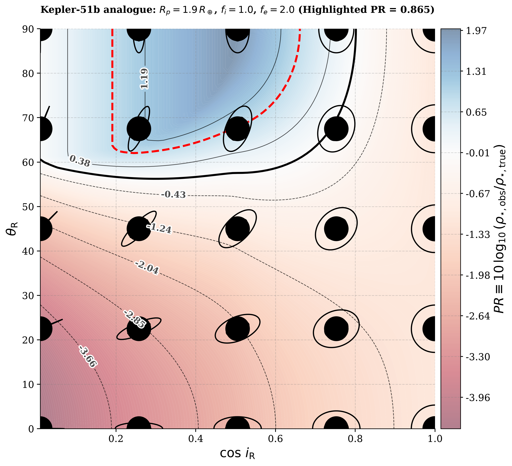
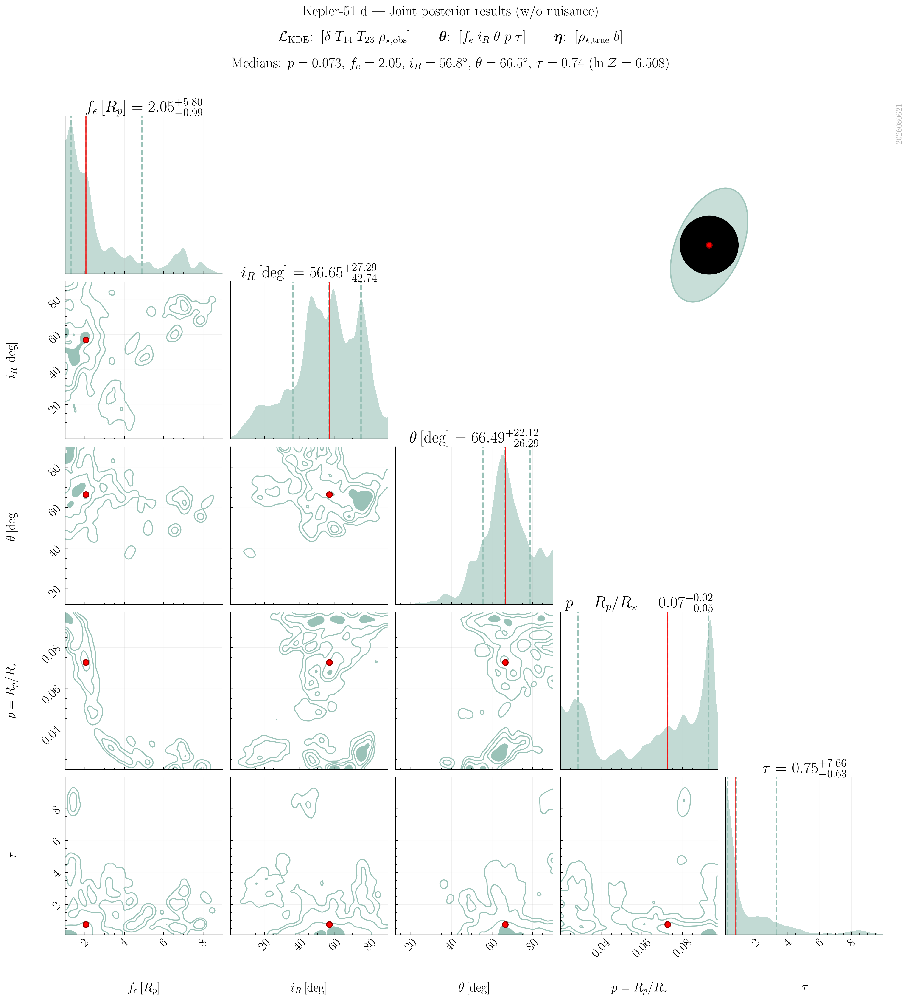
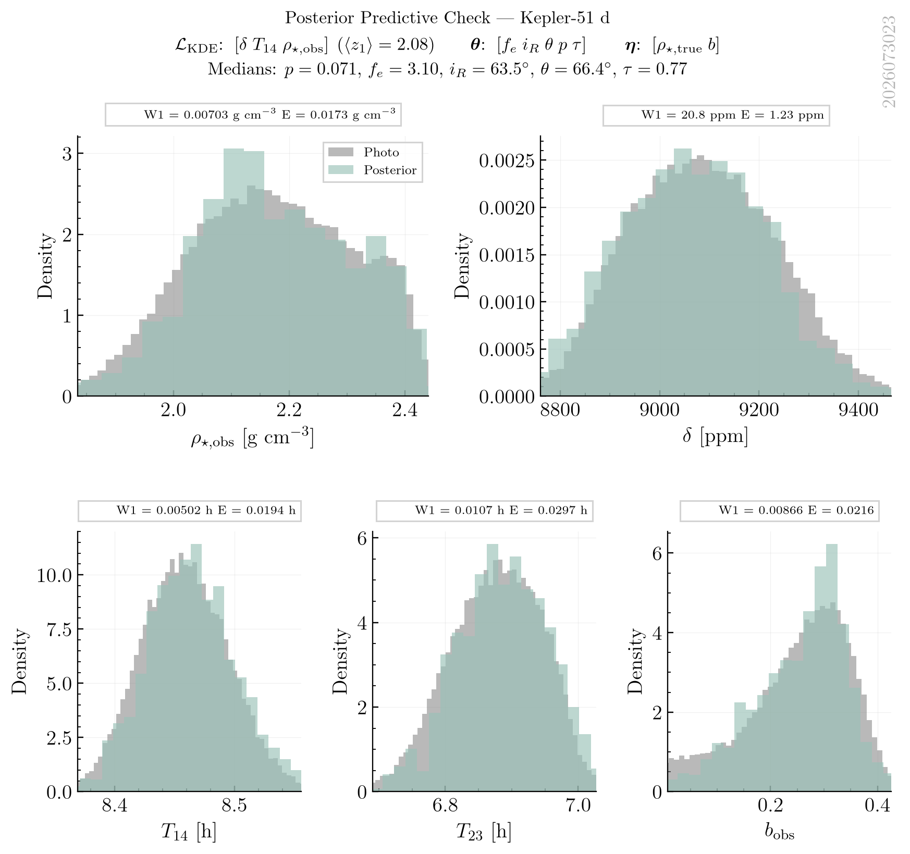

# PRisma: PhotoRing inference and modeling algorithm

**PRisma** is an open-source Bayesian pipeline for detecting and characterizing exoplanetary rings via the **PhotoRing (PR) effect** — an asterodensity-profiling signature in which unmodeled rings bias the stellar density inferred from a transit. The repository ships the full inference stack (forward models, likelihood, nested sampling) and a complete worked application to the Kepler-51 “super-puff” planets, including the notebooks, reference chains, tables, and figures that underlie the accompanying manuscript.

## Citing this work

If you use this code or results, please cite:

> Zuluaga, J. I., Numpaque, S., Kipping, D., & Alvarado-Montes, J. A. *Probing Exoplanetary Rings with Asterodensity Profiling: A PhotoRing Analysis of Kepler-51*. In preparation.

```bibtex
@misc{NumpaqueZuluaga2026PRisma,
  author        = {Zuluaga, Jorge I. and Numpaque, Sebasti{\'a}n
                   and Kipping, David and Alvarado-Montes, Jaime A.},
  title         = {Probing Exoplanetary Rings with Asterodensity Profiling:
                   A PhotoRing Analysis of Kepler-51},
  year          = {2026},
  note          = {In preparation},
  howpublished  = {\url{https://github.com/seap-udea/PRisma}}
}
```

The geometric PhotoRing framework itself was introduced in:

> Zuluaga, J. I., Kipping, D., Sucerquia, M., & Alvarado, J. A. (2015). *A novel method for identifying exoplanetary rings*. The Astrophysical Journal Letters, 803, L14.

```bibtex
@article{Zuluaga2015,
  author        = {{Zuluaga}, Jorge I. and {Kipping}, David M. and {Sucerquia}, Mario and {Alvarado}, Jaime A.},
  title         = {{A Novel Method for Identifying Exoplanetary Rings}},
  journal       = {\apjl},
  keywords      = {methods: analytical, occultations, planets and satellites: rings, techniques: photometric, Astrophysics - Earth and Planetary Astrophysics},
  year          = 2015,
  month         = apr,
  volume        = {803},
  number        = {1},
  eid           = {L14},
  pages         = {L14},
  doi           = {10.1088/2041-8205/803/1/L14},
  archiveprefix = {arXiv},
  eprint        = {1502.07818},
  primaryclass  = {astro-ph.EP},
  adsurl        = {https://ui.adsabs.harvard.edu/abs/2015ApJ...803L..14Z},
  adsnote       = {Provided by the SAO/NASA Astrophysics Data System}
}
```

---

## Scientific summary

### The PhotoRing (PR) effect

Asterodensity profiling compares the mean stellar density inferred from transit observables — depth $\delta$, durations $T_{14}$ and $T_{23}$, impact parameter, and period — with an independent estimate of the star’s true density $\rho_{\star,\mathrm{true}}$ (e.g. from isochrones). When an unmodeled phenomenon distorts the light curve, the transit-inferred density $\rho_{\star,\mathrm{obs}}$ disagrees with $\rho_{\star,\mathrm{true}}$.

Planetary rings are one such phenomenon. A ringed planet occults a larger projected area than a bare planet of the same physical size, so the fitted radius is overestimated and the contact times are shifted. These biases propagate into $\rho_{\star,\mathrm{obs}}$, producing the **PhotoRing (PR) effect** (Zuluaga et al. 2015). The PR diagnostic is conventionally written

$$
\mathrm{PR} \equiv 10\log_{10}\!\left(\frac{\rho_{\star,\mathrm{obs}}}{\rho_{\star,\mathrm{true}}}\right).
$$

Negative PR values mean the transit underestimates the true stellar density — the regime most often expected for opaque rings, and a candidate explanation for the extreme “super-puff” densities of Kepler-51 b and d.

The contour map below shows how PR varies with ring orientation ($\cos i_R$, $\theta_R$) for a Kepler-51b analogue. Icons illustrate the projected ring geometry at each location; blue (red) regions mark overestimated (underestimated) $\rho_{\star,\mathrm{obs}}$.

<p align="center">
  
</p>

<p align="center"><em>Figure — PhotoRing contour for a Kepler-51b analogue ($R_p = 1.9\,R_\oplus$, $f_i = 1$, $f_e = 2$). Color encodes PR; the highlighted contour marks $\mathrm{PR} = 0.865$.</em></p>

### Bayesian retrieval and products

PRisma turns that geometric idea into a full Bayesian retrieval. A deterministic forward model (`exorings`) maps a ringed-planet configuration — outer radius $f_e$, ring inclination $i_R$, tilt $\theta_R$, planet-to-star radius ratio $p$, optical depth $\tau$, plus optional nuisance parameters $\rho_{\star,\mathrm{true}}$ and $b$ — onto predicted transit observables. Those predictions are compared to empirical observable posteriors (from TTV photometry) through a KDE likelihood. Nested sampling (`dynesty`) explores the posterior and returns the Bayesian evidence.

Primary products of each retrieval:

1. **Posterior chains** over ring geometry (and free nuisance parameters), saved as compressed NumPy archives with sidecar metadata.
2. **Corner plots** summarizing the joint posterior, optionally with an inset of the median ring geometry.
3. **Posterior predictive checks (PPCs)** comparing predicted vs. observed distributions of $\delta$, $T_{14}$, $T_{23}$, $\rho_{\star,\mathrm{obs}}$, and $b_{\mathrm{obs}}$.

Examples for Kepler-51 d (all-free retrieval with likelihood $\mathcal{L}_{\mathrm{KDE}}[\delta,\,T_{14},\,\rho_{\star,\mathrm{obs}}]$):

<p align="center">
  
</p>

<p align="center"><em>Figure — Joint posterior (corner plot) for Kepler-51 d, with the median ring geometry inset.</em></p>

<p align="center">
  
</p>

<p align="center"><em>Figure — Posterior predictive check for Kepler-51 d. Grey: photometric (TTV) observables; teal: predictions drawn from the posterior.</em></p>

> 💡 **Explore more figures and results in the [PRisma Image Gallery](https://seap-udea.github.io/gallery/?repo=PRisma).**

---

## Repository contents

| Path | Role |
|---|---|
| [`gallery/`](gallery/) | Frozen copies of the figures embedded in this README (independent of regenerable `papers/*/figures/`). |
| [`papers/`](papers/) | Manuscript material, organized by paper. |
| [`papers/kepler51/`](papers/kepler51/) | Kepler-51 paper: LaTeX source, `PRisma-*.ipynb` notebooks, `figures/`, `reference_runs/`, and generated tables (`tab_*.tex`). Running `make notebooks` regenerates figures and tables from the versioned chains. |
| [`pipeline/`](pipeline/) | The PRisma algorithm: packages and scripts that implement the PR Bayesian pipeline. |
| [`pipeline/photoring/`](pipeline/photoring/) | Core analysis package — observables, likelihood, priors, inference, I/O, plotting. |
| [`pipeline/exorings/`](pipeline/exorings/) | Closed-form ringed-transit forward model (default). |
| [`pipeline/geotrans/`](pipeline/geotrans/) | Independent numerical ring-transit model (validation / diagrams). |
| [`pipeline/kepler_51/`](pipeline/kepler_51/) | Bundled case study: TTV inputs, observable posteriors, $\rho_{\star,\mathrm{true}}$ samples, and versioned result chains. |
| [`pipeline/run_sweep_parallel.py`](pipeline/run_sweep_parallel.py) | Parallel dynesty campaign runner (preferred). |
| [`.legacy/`](.legacy/) | Superseded exploratory material kept for provenance. |

---

## Running PRisma

All pipeline execution details are documented in [`pipeline/README.md`](pipeline/README.md).
For running analyses, generating figures, PPC ordering (`z1`/`ORDKEY`), and gallery previews, use that guide.

---

## AI assistance disclosure

Portions of the code review, refactoring, inline documentation, debugging, and repository restructuring in this project were assisted by AI language models (used as coding assistants inside Cursor and related tools).

The human authors assert that all scientific ideas, the overall project conception, the design of the numerical and scientific experiments, the interpretation of the results, and the conclusions of the accompanying manuscript are original contributions of the human authors. AI tools were used exclusively as coding and writing assistants — analogous to a spell-checker or a compiler — and bear no intellectual authorship over the scientific content of this work. AI models also assisted with translation from Spanish (the native language of several authors) into English, and with English spelling and grammar review.

---

## Authors

- **Jorge I. Zuluaga** — [jorge.zuluaga@udea.edu.co](mailto:jorge.zuluaga@udea.edu.co) · [ORCID 0000-0002-6140-3116](https://orcid.org/0000-0002-6140-3116)
- **Sebastián Numpaque** — [david.rodriguez1@udea.edu.co](mailto:david.rodriguez1@udea.edu.co) · [ORCID 0009-0000-5697-3416](https://orcid.org/0009-0000-5697-3416)

**Affiliation:** [SEAP/FACom](https://www.udea.edu.co), Instituto de Física – FCEN, Universidad de Antioquia, Calle 70 No. 52-21, Medellín, Colombia.

---

## License

MIT — see [`LICENSE`](LICENSE).
