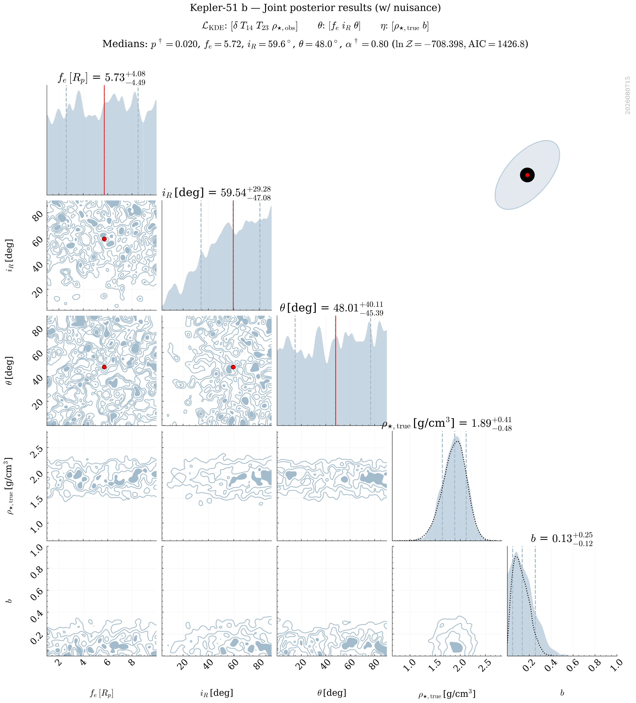
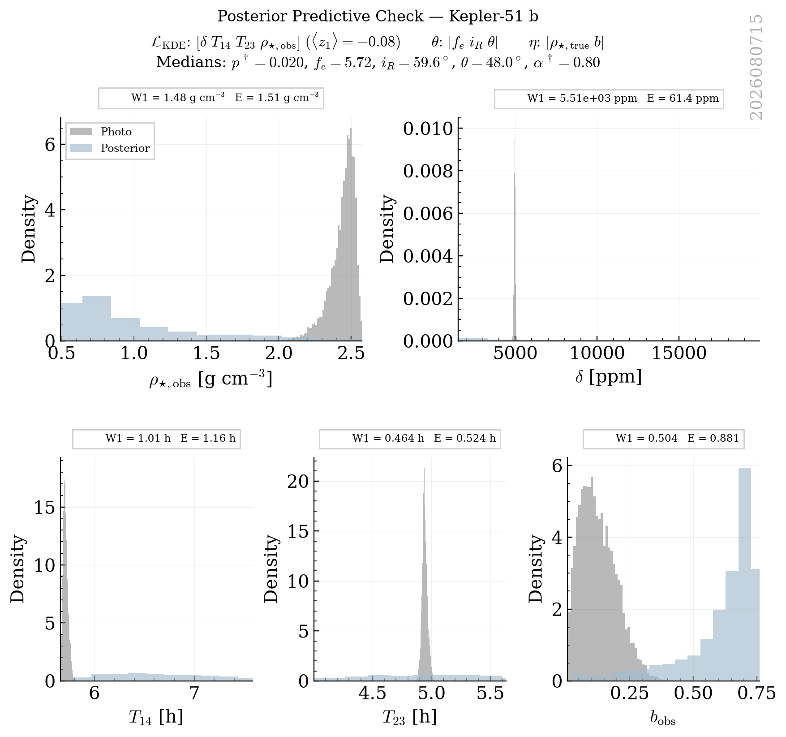

# Kepler_51 B Retrievals Classification Report

This report groups retrievals into strict physical categories based on a Decision Tree logic. Within each category, retrievals are ranked by their Bayesian Evidence ($\ln \mathcal{Z}$).

## Category Summary
- **[Excellent] Golden Sample**: 11 retrievals
- **[Acceptable] Multimodal Angles**: 3 retrievals
- **[Rejected] Poor Fit**: 1 retrievals

## Detailed Results

### Category: [Excellent] Golden Sample

| Rank | Tag | PPC (z1) | PPC (z_crit) | ln Z | max ln L | AIC | Ring fe (16%) | err(rho_true) | Angle Peaks |
|---|---|---|---|---|---|---|---|---|---|
| 1 | `kepler_51_b_NS_exorings_kde_delta-T14-T23-rho_obs_nlive1200_dlogz0.01_NKDE5000_seed2026_rhoFREE_bFREE_P1_A3` | **1.46** | **2.15** | 8.49 | 21.00 | -32.01 | 3.68 | 0.1588 | 1.5 |
| 2 | `kepler_51_b_NS_exorings_kde_delta-T14-T23-rho_obs_nlive1200_dlogz0.01_NKDE5000_seed2026_rhoFREE_bFREE_P9_A2` | **1.36** | **1.89** | 8.34 | 21.00 | -32.01 | 1.25 | 0.2207 | 1.0 |
| 3 | `kepler_51_b_NS_exorings_kde_delta-T14-T23-rho_obs_nlive1200_dlogz0.01_NKDE5000_seed2026_rhoFREE_bFREE_P9_A3` | **1.51** | **2.01** | 8.12 | 21.00 | -32.01 | 1.22 | 0.2214 | 1.0 |
| 4 | `kepler_51_b_NS_exorings_kde_delta-T14-T23-rho_obs_nlive1200_dlogz0.01_NKDE5000_seed2026_rhoFREE_bFREE_P3_A3` | **1.43** | **2.08** | 8.09 | 21.00 | -32.01 | 2.58 | 0.1500 | 1.0 |
| 5 | `kepler_51_b_NS_exorings_kde_delta-T14-T23-rho_obs_nlive1200_dlogz0.01_NKDE5000_seed2026_rhoFREE_bFREE_P9_A1` | **1.46** | **2.00** | 8.05 | 21.00 | -32.01 | 1.45 | 0.2242 | 1.0 |
| 6 | `kepler_51_b_NS_exorings_kde_delta-T14-T23-rho_obs_nlive1200_dlogz0.01_NKDE5000_seed2026_rhoFREE_bFREE_P3_A2` | **1.41** | **2.04** | 7.84 | 21.00 | -32.01 | 3.03 | 0.1938 | 1.5 |
| 7 | `kepler_51_b_NS_exorings_kde_delta-T14-T23-rho_obs_nlive1200_dlogz0.01_NKDE5000_seed2026_rhoFREE_bFREE_P7_A2` | **1.41** | **1.98** | 7.74 | 21.00 | -32.01 | 1.59 | 0.2292 | 1.5 |
| 8 | `kepler_51_b_NS_exorings_kde_delta-T14-T23-rho_obs_nlive1200_dlogz0.01_NKDE5000_seed2026_rhoFREE_bFREE_P5_A3` | **1.30** | **1.90** | 7.42 | 21.00 | -32.01 | 1.83 | 0.1839 | 1.0 |
| 9 | `kepler_51_b_NS_exorings_kde_delta-T14-T23-rho_obs_nlive1200_dlogz0.01_NKDE5000_seed2026_rhoFREE_bFREE_P5_A1` | **1.30** | **1.85** | 7.33 | 21.00 | -32.01 | 3.20 | 0.1993 | 1.5 |
| 10 | `kepler_51_b_NS_exorings_kde_delta-T14-T23-rho_obs_nlive1200_dlogz0.01_NKDE5000_seed2026_rhoFREE_bFREE_P5_A2` | **1.38** | **1.94** | 7.08 | 21.00 | -32.01 | 2.15 | 0.1819 | 1.0 |
| 11 | `kepler_51_b_NS_exorings_kde_delta-T14-T23-rho_obs_nlive1200_dlogz0.01_NKDE5000_seed2026_rhoFREE_bFREE_P7_A1` | **1.33** | **1.91** | 6.99 | 21.00 | -32.01 | 2.37 | 0.2233 | 1.0 |

#### kepler_51_b_NS_exorings_kde_delta-T14-T23-rho_obs_nlive1200_dlogz0.01_NKDE5000_seed2026_rhoFREE_bFREE_P1_A3
- **PPC (z1)**: 1.46
- **PPC (z_crit)**: 2.15
- **ln Z (Evidence)**: 8.486
- **max ln L**: 21.005
- **AIC**: -32.009
- **PPC (z1 min)**: 3.05
- **Ring fe (16th)**: 3.68
- **err(rho_true)**: 0.1588
- **Angle Peaks**: 1.5
- **Category**: [Excellent] Golden Sample

---

#### kepler_51_b_NS_exorings_kde_delta-T14-T23-rho_obs_nlive1200_dlogz0.01_NKDE5000_seed2026_rhoFREE_bFREE_P9_A2
- **PPC (z1)**: 1.36
- **PPC (z_crit)**: 1.89
- **ln Z (Evidence)**: 8.339
- **max ln L**: 21.005
- **AIC**: -32.009
- **PPC (z1 min)**: 2.69
- **Ring fe (16th)**: 1.25
- **err(rho_true)**: 0.2207
- **Angle Peaks**: 1.0
- **Category**: [Excellent] Golden Sample

---

#### kepler_51_b_NS_exorings_kde_delta-T14-T23-rho_obs_nlive1200_dlogz0.01_NKDE5000_seed2026_rhoFREE_bFREE_P9_A3
- **PPC (z1)**: 1.51
- **PPC (z_crit)**: 2.01
- **ln Z (Evidence)**: 8.124
- **max ln L**: 21.004
- **AIC**: -32.007
- **PPC (z1 min)**: 2.53
- **Ring fe (16th)**: 1.22
- **err(rho_true)**: 0.2214
- **Angle Peaks**: 1.0
- **Category**: [Excellent] Golden Sample

---

#### kepler_51_b_NS_exorings_kde_delta-T14-T23-rho_obs_nlive1200_dlogz0.01_NKDE5000_seed2026_rhoFREE_bFREE_P3_A3
- **PPC (z1)**: 1.43
- **PPC (z_crit)**: 2.08
- **ln Z (Evidence)**: 8.095
- **max ln L**: 21.004
- **AIC**: -32.008
- **PPC (z1 min)**: 2.99
- **Ring fe (16th)**: 2.58
- **err(rho_true)**: 0.1500
- **Angle Peaks**: 1.0
- **Category**: [Excellent] Golden Sample

---

#### kepler_51_b_NS_exorings_kde_delta-T14-T23-rho_obs_nlive1200_dlogz0.01_NKDE5000_seed2026_rhoFREE_bFREE_P9_A1
- **PPC (z1)**: 1.46
- **PPC (z_crit)**: 2.00
- **ln Z (Evidence)**: 8.049
- **max ln L**: 21.004
- **AIC**: -32.009
- **PPC (z1 min)**: 2.50
- **Ring fe (16th)**: 1.45
- **err(rho_true)**: 0.2242
- **Angle Peaks**: 1.0
- **Category**: [Excellent] Golden Sample

---

#### kepler_51_b_NS_exorings_kde_delta-T14-T23-rho_obs_nlive1200_dlogz0.01_NKDE5000_seed2026_rhoFREE_bFREE_P3_A2
- **PPC (z1)**: 1.41
- **PPC (z_crit)**: 2.04
- **ln Z (Evidence)**: 7.844
- **max ln L**: 21.004
- **AIC**: -32.008
- **PPC (z1 min)**: 2.89
- **Ring fe (16th)**: 3.03
- **err(rho_true)**: 0.1938
- **Angle Peaks**: 1.5
- **Category**: [Excellent] Golden Sample

---

#### kepler_51_b_NS_exorings_kde_delta-T14-T23-rho_obs_nlive1200_dlogz0.01_NKDE5000_seed2026_rhoFREE_bFREE_P7_A2
- **PPC (z1)**: 1.41
- **PPC (z_crit)**: 1.98
- **ln Z (Evidence)**: 7.742
- **max ln L**: 21.004
- **AIC**: -32.008
- **PPC (z1 min)**: 2.77
- **Ring fe (16th)**: 1.59
- **err(rho_true)**: 0.2292
- **Angle Peaks**: 1.5
- **Category**: [Excellent] Golden Sample

---

#### kepler_51_b_NS_exorings_kde_delta-T14-T23-rho_obs_nlive1200_dlogz0.01_NKDE5000_seed2026_rhoFREE_bFREE_P5_A3
- **PPC (z1)**: 1.30
- **PPC (z_crit)**: 1.90
- **ln Z (Evidence)**: 7.423
- **max ln L**: 21.004
- **AIC**: -32.009
- **PPC (z1 min)**: 2.81
- **Ring fe (16th)**: 1.83
- **err(rho_true)**: 0.1839
- **Angle Peaks**: 1.0
- **Category**: [Excellent] Golden Sample

---

#### kepler_51_b_NS_exorings_kde_delta-T14-T23-rho_obs_nlive1200_dlogz0.01_NKDE5000_seed2026_rhoFREE_bFREE_P5_A1
- **PPC (z1)**: 1.30
- **PPC (z_crit)**: 1.85
- **ln Z (Evidence)**: 7.335
- **max ln L**: 21.004
- **AIC**: -32.009
- **PPC (z1 min)**: 2.70
- **Ring fe (16th)**: 3.20
- **err(rho_true)**: 0.1993
- **Angle Peaks**: 1.5
- **Category**: [Excellent] Golden Sample

---

#### kepler_51_b_NS_exorings_kde_delta-T14-T23-rho_obs_nlive1200_dlogz0.01_NKDE5000_seed2026_rhoFREE_bFREE_P5_A2
- **PPC (z1)**: 1.38
- **PPC (z_crit)**: 1.94
- **ln Z (Evidence)**: 7.079
- **max ln L**: 21.004
- **AIC**: -32.009
- **PPC (z1 min)**: 2.78
- **Ring fe (16th)**: 2.15
- **err(rho_true)**: 0.1819
- **Angle Peaks**: 1.0
- **Category**: [Excellent] Golden Sample

---

#### kepler_51_b_NS_exorings_kde_delta-T14-T23-rho_obs_nlive1200_dlogz0.01_NKDE5000_seed2026_rhoFREE_bFREE_P7_A1
- **PPC (z1)**: 1.33
- **PPC (z_crit)**: 1.91
- **ln Z (Evidence)**: 6.992
- **max ln L**: 21.004
- **AIC**: -32.008
- **PPC (z1 min)**: 2.71
- **Ring fe (16th)**: 2.37
- **err(rho_true)**: 0.2233
- **Angle Peaks**: 1.0
- **Category**: [Excellent] Golden Sample

---

### Category: [Acceptable] Multimodal Angles

| Rank | Tag | PPC (z1) | PPC (z_crit) | ln Z | max ln L | AIC | Ring fe (16%) | err(rho_true) | Angle Peaks |
|---|---|---|---|---|---|---|---|---|---|
| 12 | `kepler_51_b_NS_exorings_kde_delta-T14-T23-rho_obs_nlive1200_dlogz0.01_NKDE5000_seed2026_rhoFREE_bFREE_P7_A3` | **1.31** | **1.89** | 8.13 | 21.00 | -32.01 | 1.41 | 0.1859 | 2.5 |
| 13 | `kepler_51_b_NS_exorings_kde_delta-T14-T23-rho_obs_nlive1200_dlogz0.01_NKDE5000_seed2026_rhoFREE_bFREE_P1_A2` | **1.30** | **1.88** | 7.91 | 21.00 | -32.01 | 4.35 | 0.1611 | 2.5 |
| 14 | `kepler_51_b_NS_exorings_kde_delta-T14-T23-rho_obs_nlive1200_dlogz0.01_NKDE5000_seed2026_rhoFREE_bFREE_P1_A1` | **1.31** | **1.89** | 7.32 | 21.00 | -32.01 | 6.67 | 0.2233 | 2.0 |

#### kepler_51_b_NS_exorings_kde_delta-T14-T23-rho_obs_nlive1200_dlogz0.01_NKDE5000_seed2026_rhoFREE_bFREE_P7_A3
- **PPC (z1)**: 1.31
- **PPC (z_crit)**: 1.89
- **ln Z (Evidence)**: 8.129
- **max ln L**: 21.004
- **AIC**: -32.008
- **PPC (z1 min)**: 2.75
- **Ring fe (16th)**: 1.41
- **err(rho_true)**: 0.1859
- **Angle Peaks**: 2.5
- **Category**: [Acceptable] Multimodal Angles

---

#### kepler_51_b_NS_exorings_kde_delta-T14-T23-rho_obs_nlive1200_dlogz0.01_NKDE5000_seed2026_rhoFREE_bFREE_P1_A2
- **PPC (z1)**: 1.30
- **PPC (z_crit)**: 1.88
- **ln Z (Evidence)**: 7.907
- **max ln L**: 21.005
- **AIC**: -32.009
- **PPC (z1 min)**: 2.75
- **Ring fe (16th)**: 4.35
- **err(rho_true)**: 0.1611
- **Angle Peaks**: 2.5
- **Category**: [Acceptable] Multimodal Angles

---

#### kepler_51_b_NS_exorings_kde_delta-T14-T23-rho_obs_nlive1200_dlogz0.01_NKDE5000_seed2026_rhoFREE_bFREE_P1_A1
- **PPC (z1)**: 1.31
- **PPC (z_crit)**: 1.89
- **ln Z (Evidence)**: 7.319
- **max ln L**: 21.004
- **AIC**: -32.008
- **PPC (z1 min)**: 2.71
- **Ring fe (16th)**: 6.67
- **err(rho_true)**: 0.2233
- **Angle Peaks**: 2.0
- **Category**: [Acceptable] Multimodal Angles

---

### Category: [Rejected] Poor Fit

| Rank | Tag | PPC (z1) | PPC (z_crit) | ln Z | max ln L | AIC | Ring fe (16%) | err(rho_true) | Angle Peaks |
|---|---|---|---|---|---|---|---|---|---|
| 15 | `kepler_51_b_NS_exorings_kde_delta-T14-T23-rho_obs_nlive1200_dlogz0.01_NKDE5000_seed2026_rhoFREE_bFREE_P3_A1` | **-0.08** | **-0.04** | -708.40 | -708.40 | 1426.79 | 2.61 | 0.0037 | 2.0 |

#### kepler_51_b_NS_exorings_kde_delta-T14-T23-rho_obs_nlive1200_dlogz0.01_NKDE5000_seed2026_rhoFREE_bFREE_P3_A1
- **PPC (z1)**: -0.08
- **PPC (z_crit)**: -0.04
- **ln Z (Evidence)**: -708.398
- **max ln L**: -708.396
- **AIC**: 1426.793
- **PPC (z1 min)**: -0.04
- **Ring fe (16th)**: 2.61
- **err(rho_true)**: 0.0037
- **Angle Peaks**: 2.0
- **Category**: [Rejected] Poor Fit

---
