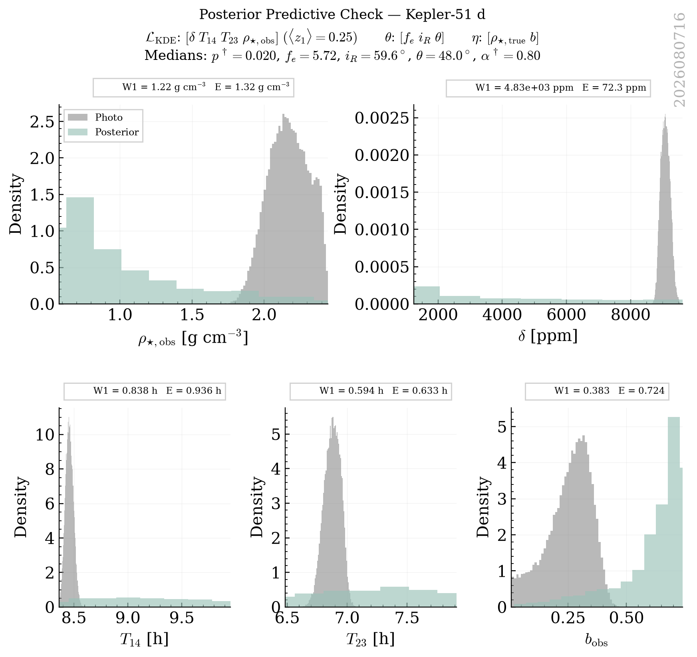
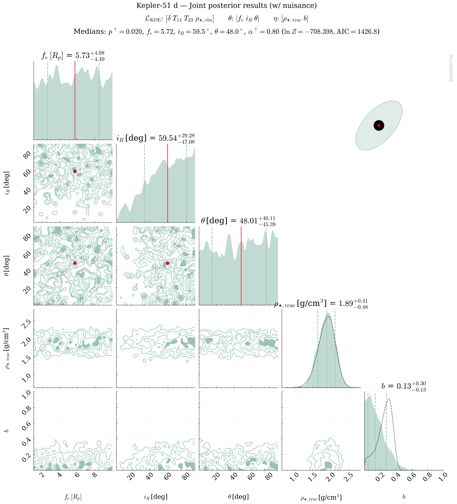
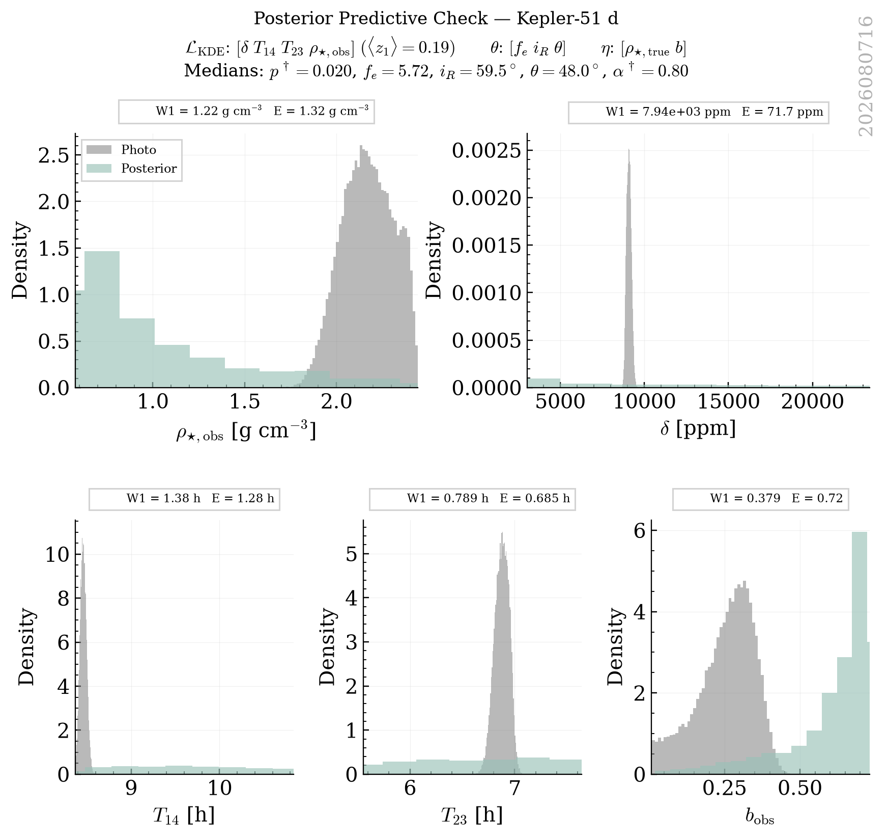
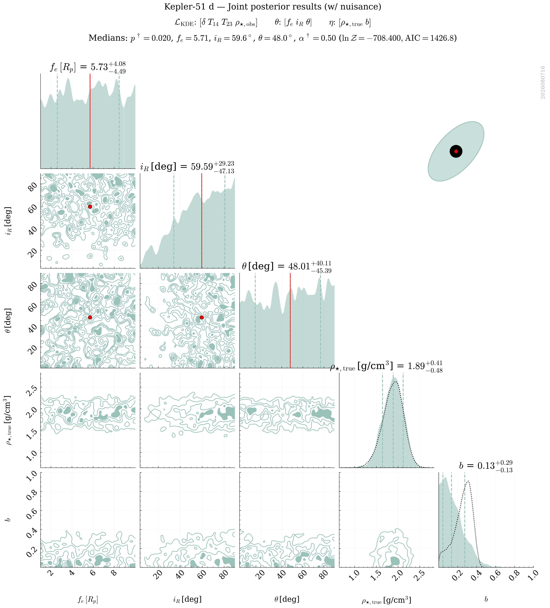
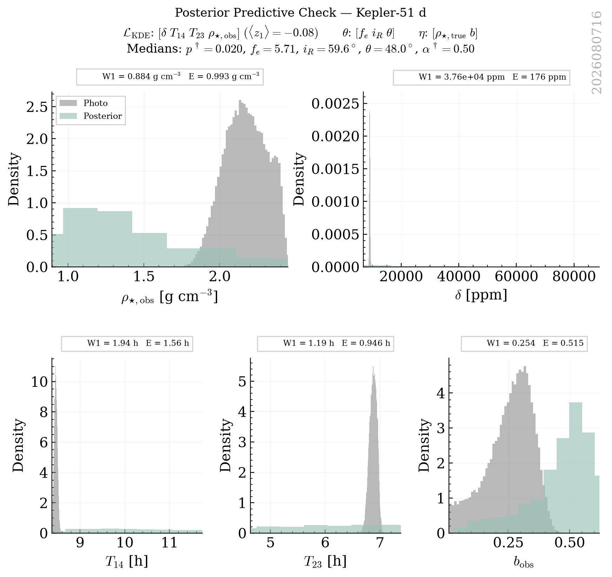

# Kepler_51 D Retrievals Classification Report

This report groups retrievals into strict physical categories based on a Decision Tree logic. Within each category, retrievals are ranked by their Bayesian Evidence ($\ln \mathcal{Z}$).

## Category Summary
- **[Excellent] Golden Sample**: 8 retrievals
- **[Acceptable] Multimodal Angles**: 3 retrievals
- **[Rejected] Poor Fit**: 3 retrievals

## Detailed Results

### Category: [Excellent] Golden Sample

| Rank | Tag | PPC (z1) | PPC (z_crit) | ln Z | max ln L | AIC | Ring fe (16%) | err(rho_true) | Angle Peaks |
|---|---|---|---|---|---|---|---|---|---|
| 1 | `kepler_51_d_NS_exorings_kde_delta-T14-T23-rho_obs_nlive1200_dlogz0.01_NKDE5000_seed2026_rhoFREE_bFREE_P9_A3` | **1.85** | **2.03** | 6.73 | 18.03 | -26.05 | 1.23 | 0.1803 | 1.0 |
| 2 | `kepler_51_d_NS_exorings_kde_delta-T14-T23-rho_obs_nlive1200_dlogz0.01_NKDE5000_seed2026_rhoFREE_bFREE_P9_A2` | **1.71** | **1.91** | 6.60 | 18.03 | -26.05 | 1.19 | 0.1812 | 1.0 |
| 3 | `kepler_51_d_NS_exorings_kde_delta-T14-T23-rho_obs_nlive1200_dlogz0.01_NKDE5000_seed2026_rhoFREE_bFREE_P3_A3` | **1.73** | **1.95** | 6.59 | 18.03 | -26.05 | 2.54 | 0.1713 | 1.5 |
| 4 | `kepler_51_d_NS_exorings_kde_delta-T14-T23-rho_obs_nlive1200_dlogz0.01_NKDE5000_seed2026_rhoFREE_bFREE_P9_A1` | **1.83** | **2.04** | 6.33 | 18.03 | -26.05 | 1.38 | 0.1841 | 1.5 |
| 5 | `kepler_51_d_NS_exorings_kde_delta-T14-T23-rho_obs_nlive1200_dlogz0.01_NKDE5000_seed2026_rhoFREE_bFREE_P3_A2` | **1.66** | **1.88** | 5.72 | 18.03 | -26.05 | 3.29 | 0.1625 | 1.5 |
| 6 | `kepler_51_d_NS_exorings_kde_delta-T14-T23-rho_obs_nlive1200_dlogz0.01_NKDE5000_seed2026_rhoFREE_bFREE_P5_A3` | **1.71** | **1.91** | 5.47 | 18.03 | -26.05 | 1.82 | 0.1546 | 1.0 |
| 7 | `kepler_51_d_NS_exorings_kde_delta-T14-T23-rho_obs_nlive1200_dlogz0.01_NKDE5000_seed2026_rhoFREE_bFREE_P5_A1` | **1.68** | **1.90** | 5.36 | 18.03 | -26.05 | 3.36 | 0.1722 | 1.5 |
| 8 | `kepler_51_d_NS_exorings_kde_delta-T14-T23-rho_obs_nlive1200_dlogz0.01_NKDE5000_seed2026_rhoFREE_bFREE_P7_A1` | **1.71** | **1.93** | 4.83 | 18.03 | -26.05 | 2.36 | 0.1540 | 1.5 |

#### kepler_51_d_NS_exorings_kde_delta-T14-T23-rho_obs_nlive1200_dlogz0.01_NKDE5000_seed2026_rhoFREE_bFREE_P9_A3
- **PPC (z1)**: 1.85
- **PPC (z_crit)**: 2.03
- **ln Z (Evidence)**: 6.731
- **max ln L**: 18.026
- **AIC**: -26.052
- **PPC (z1 min)**: 2.33
- **Ring fe (16th)**: 1.23
- **err(rho_true)**: 0.1803
- **Angle Peaks**: 1.0
- **Category**: [Excellent] Golden Sample

---

#### kepler_51_d_NS_exorings_kde_delta-T14-T23-rho_obs_nlive1200_dlogz0.01_NKDE5000_seed2026_rhoFREE_bFREE_P9_A2
- **PPC (z1)**: 1.71
- **PPC (z_crit)**: 1.91
- **ln Z (Evidence)**: 6.599
- **max ln L**: 18.026
- **AIC**: -26.051
- **PPC (z1 min)**: 2.36
- **Ring fe (16th)**: 1.19
- **err(rho_true)**: 0.1812
- **Angle Peaks**: 1.0
- **Category**: [Excellent] Golden Sample

---

#### kepler_51_d_NS_exorings_kde_delta-T14-T23-rho_obs_nlive1200_dlogz0.01_NKDE5000_seed2026_rhoFREE_bFREE_P3_A3
- **PPC (z1)**: 1.73
- **PPC (z_crit)**: 1.95
- **ln Z (Evidence)**: 6.594
- **max ln L**: 18.025
- **AIC**: -26.051
- **PPC (z1 min)**: 2.86
- **Ring fe (16th)**: 2.54
- **err(rho_true)**: 0.1713
- **Angle Peaks**: 1.5
- **Category**: [Excellent] Golden Sample

---

#### kepler_51_d_NS_exorings_kde_delta-T14-T23-rho_obs_nlive1200_dlogz0.01_NKDE5000_seed2026_rhoFREE_bFREE_P9_A1
- **PPC (z1)**: 1.83
- **PPC (z_crit)**: 2.04
- **ln Z (Evidence)**: 6.329
- **max ln L**: 18.026
- **AIC**: -26.053
- **PPC (z1 min)**: 2.35
- **Ring fe (16th)**: 1.38
- **err(rho_true)**: 0.1841
- **Angle Peaks**: 1.5
- **Category**: [Excellent] Golden Sample

---

#### kepler_51_d_NS_exorings_kde_delta-T14-T23-rho_obs_nlive1200_dlogz0.01_NKDE5000_seed2026_rhoFREE_bFREE_P3_A2
- **PPC (z1)**: 1.66
- **PPC (z_crit)**: 1.88
- **ln Z (Evidence)**: 5.720
- **max ln L**: 18.026
- **AIC**: -26.051
- **PPC (z1 min)**: 2.65
- **Ring fe (16th)**: 3.29
- **err(rho_true)**: 0.1625
- **Angle Peaks**: 1.5
- **Category**: [Excellent] Golden Sample

---

#### kepler_51_d_NS_exorings_kde_delta-T14-T23-rho_obs_nlive1200_dlogz0.01_NKDE5000_seed2026_rhoFREE_bFREE_P5_A3
- **PPC (z1)**: 1.71
- **PPC (z_crit)**: 1.91
- **ln Z (Evidence)**: 5.466
- **max ln L**: 18.026
- **AIC**: -26.052
- **PPC (z1 min)**: 2.84
- **Ring fe (16th)**: 1.82
- **err(rho_true)**: 0.1546
- **Angle Peaks**: 1.0
- **Category**: [Excellent] Golden Sample

---

#### kepler_51_d_NS_exorings_kde_delta-T14-T23-rho_obs_nlive1200_dlogz0.01_NKDE5000_seed2026_rhoFREE_bFREE_P5_A1
- **PPC (z1)**: 1.68
- **PPC (z_crit)**: 1.90
- **ln Z (Evidence)**: 5.362
- **max ln L**: 18.026
- **AIC**: -26.052
- **PPC (z1 min)**: 2.85
- **Ring fe (16th)**: 3.36
- **err(rho_true)**: 0.1722
- **Angle Peaks**: 1.5
- **Category**: [Excellent] Golden Sample

---

#### kepler_51_d_NS_exorings_kde_delta-T14-T23-rho_obs_nlive1200_dlogz0.01_NKDE5000_seed2026_rhoFREE_bFREE_P7_A1
- **PPC (z1)**: 1.71
- **PPC (z_crit)**: 1.93
- **ln Z (Evidence)**: 4.827
- **max ln L**: 18.026
- **AIC**: -26.052
- **PPC (z1 min)**: 2.77
- **Ring fe (16th)**: 2.36
- **err(rho_true)**: 0.1540
- **Angle Peaks**: 1.5
- **Category**: [Excellent] Golden Sample

---

### Category: [Acceptable] Multimodal Angles

| Rank | Tag | PPC (z1) | PPC (z_crit) | ln Z | max ln L | AIC | Ring fe (16%) | err(rho_true) | Angle Peaks |
|---|---|---|---|---|---|---|---|---|---|
| 9 | `kepler_51_d_NS_exorings_kde_delta-T14-T23-rho_obs_nlive1200_dlogz0.01_NKDE5000_seed2026_rhoFREE_bFREE_P1_A3` | **1.59** | **1.79** | 6.71 | 18.03 | -26.05 | 4.00 | 0.1571 | 2.5 |
| 10 | `kepler_51_d_NS_exorings_kde_delta-T14-T23-rho_obs_nlive1200_dlogz0.01_NKDE5000_seed2026_rhoFREE_bFREE_P1_A2` | **1.64** | **1.85** | 6.18 | 18.03 | -26.05 | 5.26 | 0.1362 | 2.0 |
| 11 | `kepler_51_d_NS_exorings_kde_delta-T14-T23-rho_obs_nlive1200_dlogz0.01_NKDE5000_seed2026_rhoFREE_bFREE_P7_A2` | **1.67** | **1.90** | 5.69 | 18.03 | -26.05 | 1.66 | 0.1756 | 2.0 |

#### kepler_51_d_NS_exorings_kde_delta-T14-T23-rho_obs_nlive1200_dlogz0.01_NKDE5000_seed2026_rhoFREE_bFREE_P1_A3
- **PPC (z1)**: 1.59
- **PPC (z_crit)**: 1.79
- **ln Z (Evidence)**: 6.709
- **max ln L**: 18.026
- **AIC**: -26.052
- **PPC (z1 min)**: 2.62
- **Ring fe (16th)**: 4.00
- **err(rho_true)**: 0.1571
- **Angle Peaks**: 2.5
- **Category**: [Acceptable] Multimodal Angles

---

#### kepler_51_d_NS_exorings_kde_delta-T14-T23-rho_obs_nlive1200_dlogz0.01_NKDE5000_seed2026_rhoFREE_bFREE_P1_A2
- **PPC (z1)**: 1.64
- **PPC (z_crit)**: 1.85
- **ln Z (Evidence)**: 6.182
- **max ln L**: 18.025
- **AIC**: -26.051
- **PPC (z1 min)**: 2.76
- **Ring fe (16th)**: 5.26
- **err(rho_true)**: 0.1362
- **Angle Peaks**: 2.0
- **Category**: [Acceptable] Multimodal Angles

---

#### kepler_51_d_NS_exorings_kde_delta-T14-T23-rho_obs_nlive1200_dlogz0.01_NKDE5000_seed2026_rhoFREE_bFREE_P7_A2
- **PPC (z1)**: 1.67
- **PPC (z_crit)**: 1.90
- **ln Z (Evidence)**: 5.694
- **max ln L**: 18.026
- **AIC**: -26.052
- **PPC (z1 min)**: 2.66
- **Ring fe (16th)**: 1.66
- **err(rho_true)**: 0.1756
- **Angle Peaks**: 2.0
- **Category**: [Acceptable] Multimodal Angles

---

### Category: [Rejected] Poor Fit

| Rank | Tag | PPC (z1) | PPC (z_crit) | ln Z | max ln L | AIC | Ring fe (16%) | err(rho_true) | Angle Peaks |
|---|---|---|---|---|---|---|---|---|---|
| 12 | `kepler_51_d_NS_exorings_kde_delta-T14-T23-rho_obs_nlive1200_dlogz0.01_NKDE5000_seed2026_rhoFREE_bFREE_P1_A1` | **0.25** | **0.25** | -708.40 | -708.40 | 1426.79 | 2.61 | 0.0078 | 1.5 |
| 13 | `kepler_51_d_NS_exorings_kde_delta-T14-T23-rho_obs_nlive1200_dlogz0.01_NKDE5000_seed2026_rhoFREE_bFREE_P3_A1` | **0.19** | **0.06** | -708.40 | -708.40 | 1426.79 | 2.61 | 0.0004 | 1.5 |
| 14 | `kepler_51_d_NS_exorings_kde_delta-T14-T23-rho_obs_nlive1200_dlogz0.01_NKDE5000_seed2026_rhoFREE_bFREE_P5_A2` | **-0.08** | **-0.62** | -708.40 | -708.40 | 1426.79 | 2.61 | 0.0001 | 2.0 |

#### kepler_51_d_NS_exorings_kde_delta-T14-T23-rho_obs_nlive1200_dlogz0.01_NKDE5000_seed2026_rhoFREE_bFREE_P1_A1
- **PPC (z1)**: 0.25
- **PPC (z_crit)**: 0.25
- **ln Z (Evidence)**: -708.398
- **max ln L**: -708.396
- **AIC**: 1426.793
- **PPC (z1 min)**: 0.27
- **Ring fe (16th)**: 2.61
- **err(rho_true)**: 0.0078
- **Angle Peaks**: 1.5
- **Category**: [Rejected] Poor Fit

---

#### kepler_51_d_NS_exorings_kde_delta-T14-T23-rho_obs_nlive1200_dlogz0.01_NKDE5000_seed2026_rhoFREE_bFREE_P3_A1
- **PPC (z1)**: 0.19
- **PPC (z_crit)**: 0.06
- **ln Z (Evidence)**: -708.398
- **max ln L**: -708.396
- **AIC**: 1426.793
- **PPC (z1 min)**: 0.06
- **Ring fe (16th)**: 2.61
- **err(rho_true)**: 0.0004
- **Angle Peaks**: 1.5
- **Category**: [Rejected] Poor Fit

---

#### kepler_51_d_NS_exorings_kde_delta-T14-T23-rho_obs_nlive1200_dlogz0.01_NKDE5000_seed2026_rhoFREE_bFREE_P5_A2
- **PPC (z1)**: -0.08
- **PPC (z_crit)**: -0.62
- **ln Z (Evidence)**: -708.400
- **max ln L**: -708.396
- **AIC**: 1426.793
- **PPC (z1 min)**: -0.62
- **Ring fe (16th)**: 2.61
- **err(rho_true)**: 0.0001
- **Angle Peaks**: 2.0
- **Category**: [Rejected] Poor Fit

---
