# Kepler_51 B Retrievals Classification Report

This report groups retrievals into strict physical categories based on a Decision Tree logic. Within each category, retrievals are ranked by their Bayesian Evidence ($\ln \mathcal{Z}$).

## Category Summary
- **[Excellent] Golden Sample**: 6 retrievals
- **[Acceptable] Multimodal Angles**: 3 retrievals
- **[Rejected] Poor Fit**: 6 retrievals

## Detailed Results

### Category: [Excellent] Golden Sample

| Rank | Tag | PPC (z1) | PPC (z_crit) | ln Z | max ln L | AIC | Ring fe (16%) | err(rho_true) | Angle Peaks |
|---|---|---|---|---|---|---|---|---|---|
| 1 | `kepler_51_b_NS_exorings_kde_delta-T14-T23-rho_obs_nlive1200_dlogz0.01_NKDE5000_seed2026_rhoFREE_bFREE_rhoMasuda_P5_A3` | **1.40** | **1.95** | 8.17 | 21.00 | -32.01 | 2.54 | 0.0362 | 1.0 |
| 2 | `kepler_51_b_NS_exorings_kde_delta-T14-T23-rho_obs_nlive1200_dlogz0.01_NKDE5000_seed2026_rhoFREE_bFREE_rhoMasuda_P7_A3` | **1.33** | **1.90** | 8.13 | 21.00 | -32.01 | 1.47 | 0.0388 | 1.5 |
| 3 | `kepler_51_b_NS_exorings_kde_delta-T14-T23-rho_obs_nlive1200_dlogz0.01_NKDE5000_seed2026_rhoFREE_bFREE_rhoMasuda_P7_A2` | **1.39** | **1.97** | 8.07 | 21.00 | -32.01 | 1.75 | 0.0243 | 1.0 |
| 4 | `kepler_51_b_NS_exorings_kde_delta-T14-T23-rho_obs_nlive1200_dlogz0.01_NKDE5000_seed2026_rhoFREE_bFREE_rhoMasuda_P3_A2` | **1.45** | **2.11** | 7.66 | 21.00 | -32.01 | 3.12 | 0.0267 | 1.5 |
| 5 | `kepler_51_b_NS_exorings_kde_delta-T14-T23-rho_obs_nlive1200_dlogz0.01_NKDE5000_seed2026_rhoFREE_bFREE_rhoMasuda_P5_A2` | **1.36** | **1.99** | 7.25 | 21.00 | -32.01 | 2.46 | 0.0280 | 1.0 |
| 6 | `kepler_51_b_NS_exorings_kde_delta-T14-T23-rho_obs_nlive1200_dlogz0.01_NKDE5000_seed2026_rhoFREE_bFREE_rhoMasuda_P7_A1` | **1.32** | **1.86** | 7.24 | 21.00 | -32.01 | 2.40 | 0.0341 | 1.0 |

#### kepler_51_b_NS_exorings_kde_delta-T14-T23-rho_obs_nlive1200_dlogz0.01_NKDE5000_seed2026_rhoFREE_bFREE_rhoMasuda_P5_A3
- **PPC (z1)**: 1.40
- **PPC (z_crit)**: 1.95
- **ln Z (Evidence)**: 8.171
- **max ln L**: 21.005
- **AIC**: -32.009
- **PPC (z1 min)**: 2.71
- **Ring fe (16th)**: 2.54
- **err(rho_true)**: 0.0362
- **Angle Peaks**: 1.0
- **Category**: [Excellent] Golden Sample

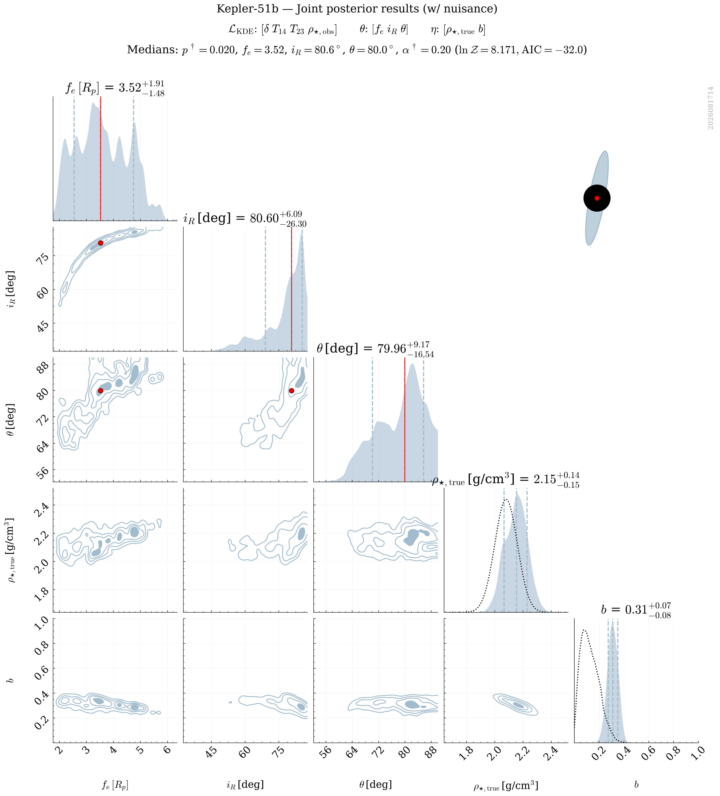

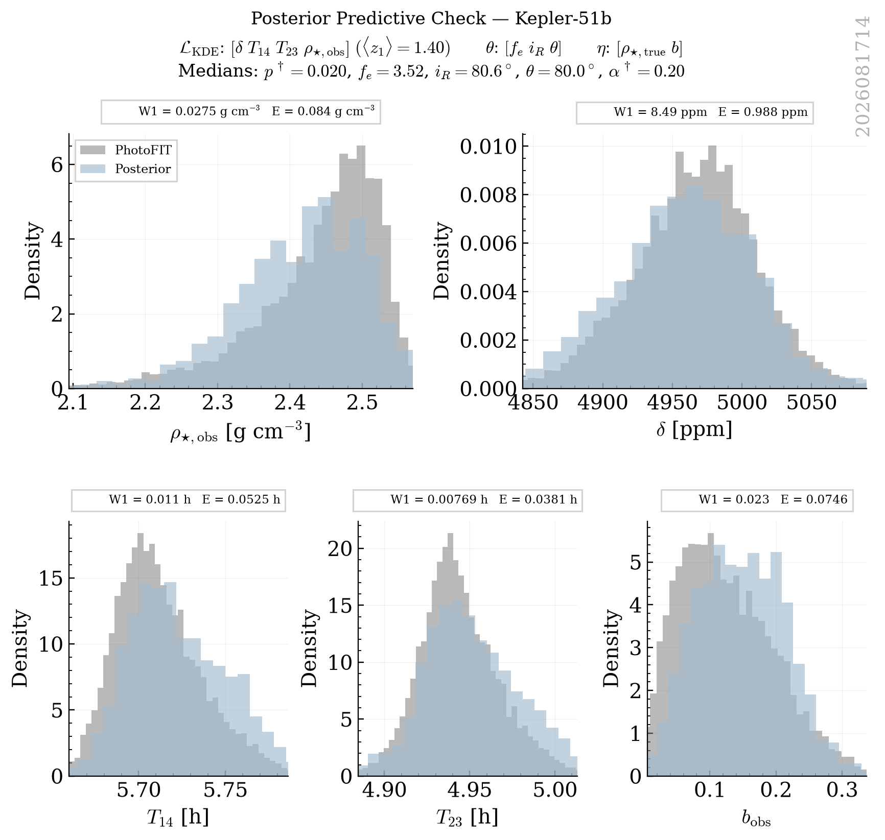

---

#### kepler_51_b_NS_exorings_kde_delta-T14-T23-rho_obs_nlive1200_dlogz0.01_NKDE5000_seed2026_rhoFREE_bFREE_rhoMasuda_P7_A3
- **PPC (z1)**: 1.33
- **PPC (z_crit)**: 1.90
- **ln Z (Evidence)**: 8.126
- **max ln L**: 21.004
- **AIC**: -32.009
- **PPC (z1 min)**: 2.73
- **Ring fe (16th)**: 1.47
- **err(rho_true)**: 0.0388
- **Angle Peaks**: 1.5
- **Category**: [Excellent] Golden Sample

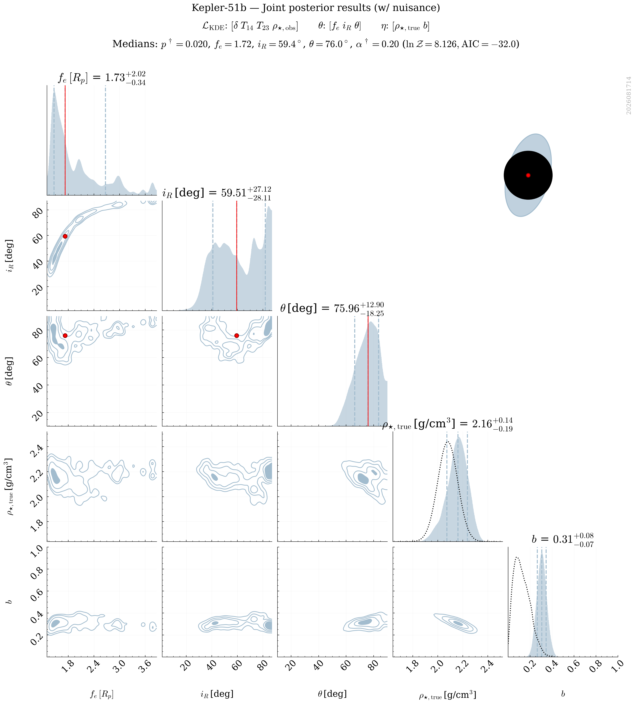

---

#### kepler_51_b_NS_exorings_kde_delta-T14-T23-rho_obs_nlive1200_dlogz0.01_NKDE5000_seed2026_rhoFREE_bFREE_rhoMasuda_P7_A2
- **PPC (z1)**: 1.39
- **PPC (z_crit)**: 1.97
- **ln Z (Evidence)**: 8.066
- **max ln L**: 21.005
- **AIC**: -32.009
- **PPC (z1 min)**: 2.78
- **Ring fe (16th)**: 1.75
- **err(rho_true)**: 0.0243
- **Angle Peaks**: 1.0
- **Category**: [Excellent] Golden Sample

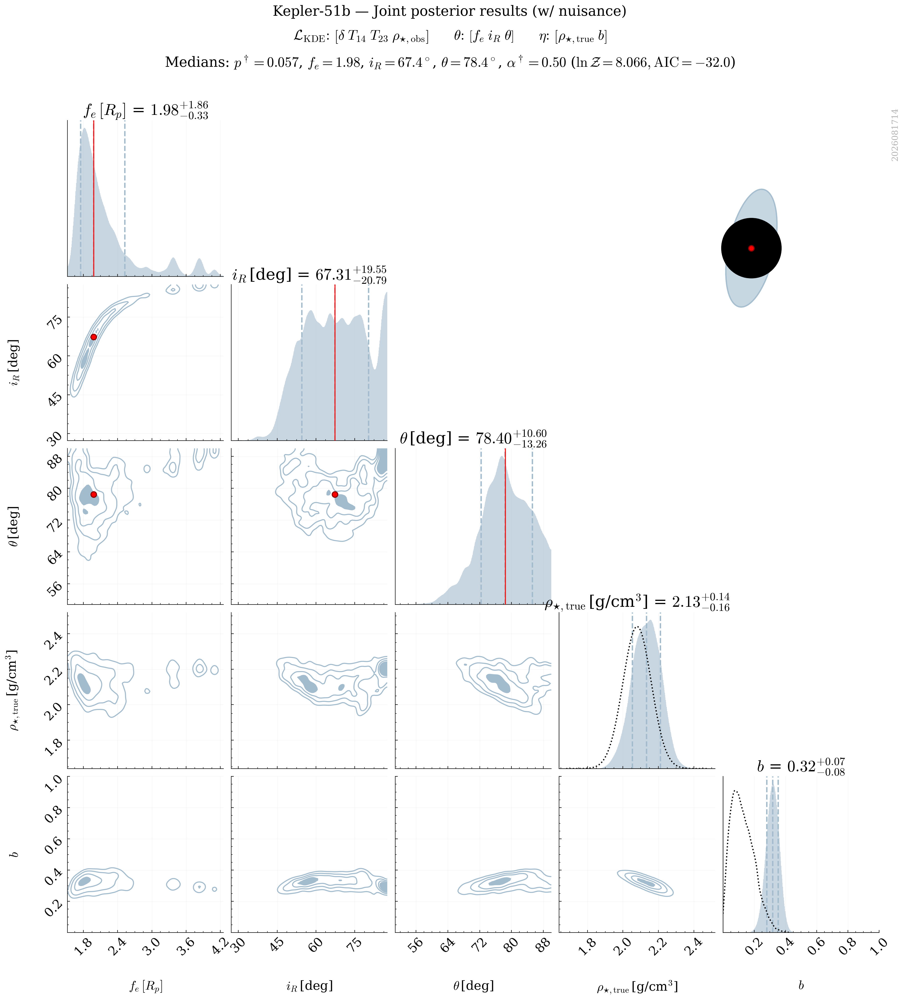

---

#### kepler_51_b_NS_exorings_kde_delta-T14-T23-rho_obs_nlive1200_dlogz0.01_NKDE5000_seed2026_rhoFREE_bFREE_rhoMasuda_P3_A2
- **PPC (z1)**: 1.45
- **PPC (z_crit)**: 2.11
- **ln Z (Evidence)**: 7.659
- **max ln L**: 21.004
- **AIC**: -32.008
- **PPC (z1 min)**: 2.98
- **Ring fe (16th)**: 3.12
- **err(rho_true)**: 0.0267
- **Angle Peaks**: 1.5
- **Category**: [Excellent] Golden Sample

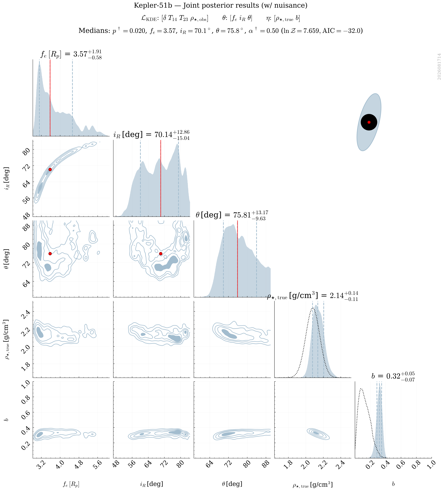

---

#### kepler_51_b_NS_exorings_kde_delta-T14-T23-rho_obs_nlive1200_dlogz0.01_NKDE5000_seed2026_rhoFREE_bFREE_rhoMasuda_P5_A2
- **PPC (z1)**: 1.36
- **PPC (z_crit)**: 1.99
- **ln Z (Evidence)**: 7.251
- **max ln L**: 21.004
- **AIC**: -32.009
- **PPC (z1 min)**: 2.84
- **Ring fe (16th)**: 2.46
- **err(rho_true)**: 0.0280
- **Angle Peaks**: 1.0
- **Category**: [Excellent] Golden Sample

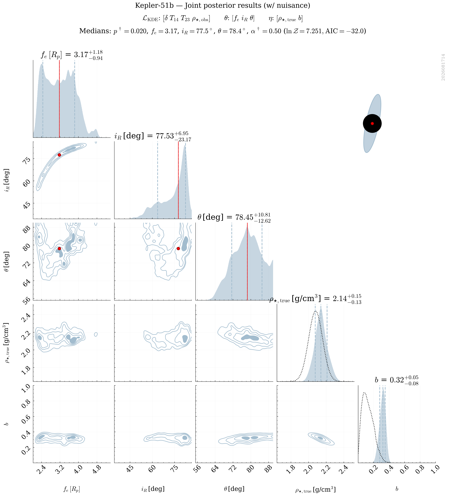

---

#### kepler_51_b_NS_exorings_kde_delta-T14-T23-rho_obs_nlive1200_dlogz0.01_NKDE5000_seed2026_rhoFREE_bFREE_rhoMasuda_P7_A1
- **PPC (z1)**: 1.32
- **PPC (z_crit)**: 1.86
- **ln Z (Evidence)**: 7.243
- **max ln L**: 21.005
- **AIC**: -32.009
- **PPC (z1 min)**: 2.67
- **Ring fe (16th)**: 2.40
- **err(rho_true)**: 0.0341
- **Angle Peaks**: 1.0
- **Category**: [Excellent] Golden Sample

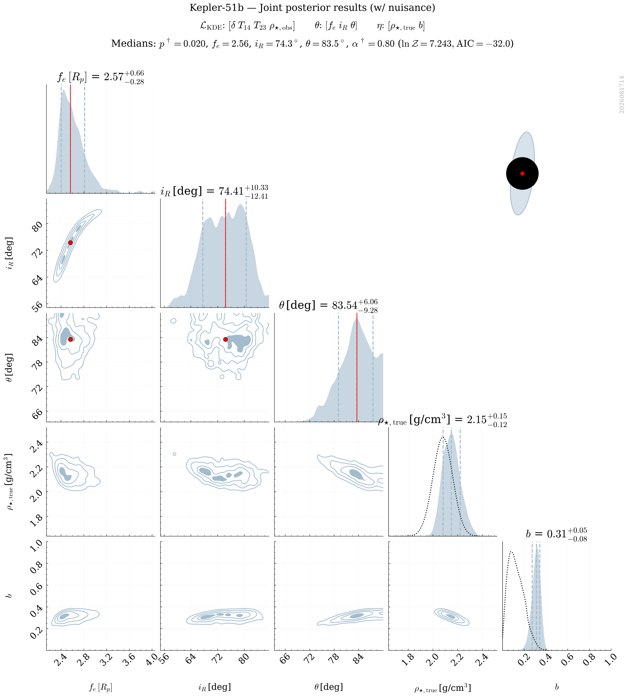

---

### Category: [Acceptable] Multimodal Angles

| Rank | Tag | PPC (z1) | PPC (z_crit) | ln Z | max ln L | AIC | Ring fe (16%) | err(rho_true) | Angle Peaks |
|---|---|---|---|---|---|---|---|---|---|
| 7 | `kepler_51_b_NS_exorings_kde_delta-T14-T23-rho_obs_nlive1200_dlogz0.01_NKDE5000_seed2026_rhoFREE_bFREE_rhoMasuda_P3_A3` | **1.48** | **2.19** | 8.77 | 21.00 | -32.01 | 2.48 | 0.0250 | 2.0 |
| 8 | `kepler_51_b_NS_exorings_kde_delta-T14-T23-rho_obs_nlive1200_dlogz0.01_NKDE5000_seed2026_rhoFREE_bFREE_rhoMasuda_P1_A3` | **1.64** | **2.56** | 8.52 | 21.00 | -32.01 | 3.63 | 0.0250 | 2.0 |
| 9 | `kepler_51_b_NS_exorings_kde_delta-T14-T23-rho_obs_nlive1200_dlogz0.01_NKDE5000_seed2026_rhoFREE_bFREE_rhoMasuda_P1_A2` | **1.37** | **1.95** | 8.07 | 21.00 | -32.01 | 4.56 | 0.0212 | 2.5 |

#### kepler_51_b_NS_exorings_kde_delta-T14-T23-rho_obs_nlive1200_dlogz0.01_NKDE5000_seed2026_rhoFREE_bFREE_rhoMasuda_P3_A3
- **PPC (z1)**: 1.48
- **PPC (z_crit)**: 2.19
- **ln Z (Evidence)**: 8.773
- **max ln L**: 21.005
- **AIC**: -32.009
- **PPC (z1 min)**: 3.10
- **Ring fe (16th)**: 2.48
- **err(rho_true)**: 0.0250
- **Angle Peaks**: 2.0
- **Category**: [Acceptable] Multimodal Angles

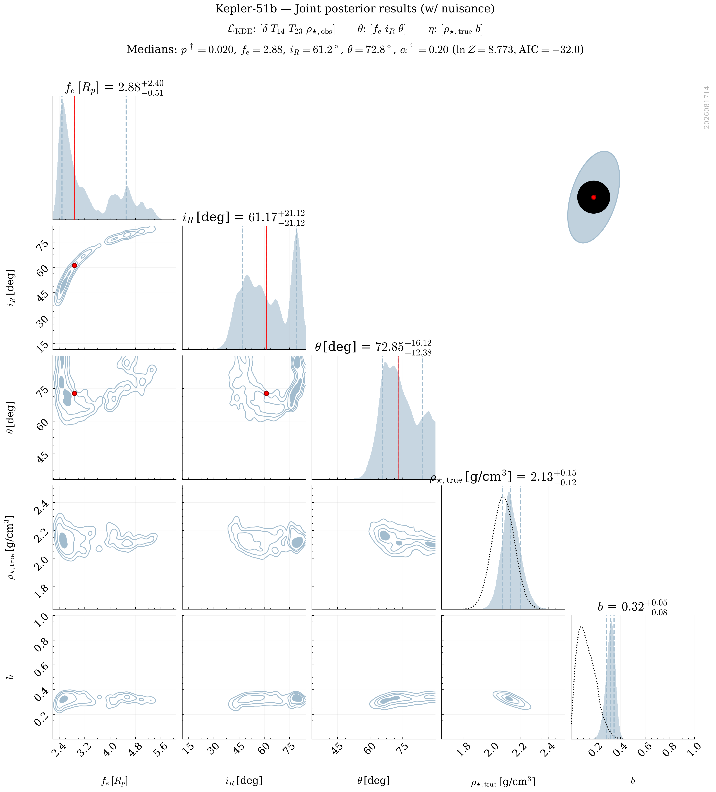

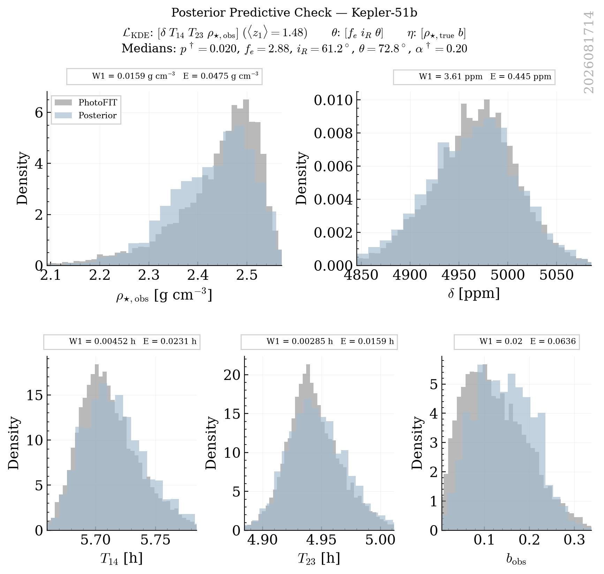

---

#### kepler_51_b_NS_exorings_kde_delta-T14-T23-rho_obs_nlive1200_dlogz0.01_NKDE5000_seed2026_rhoFREE_bFREE_rhoMasuda_P1_A3
- **PPC (z1)**: 1.64
- **PPC (z_crit)**: 2.56
- **ln Z (Evidence)**: 8.525
- **max ln L**: 21.004
- **AIC**: -32.008
- **PPC (z1 min)**: 3.32
- **Ring fe (16th)**: 3.63
- **err(rho_true)**: 0.0250
- **Angle Peaks**: 2.0
- **Category**: [Acceptable] Multimodal Angles

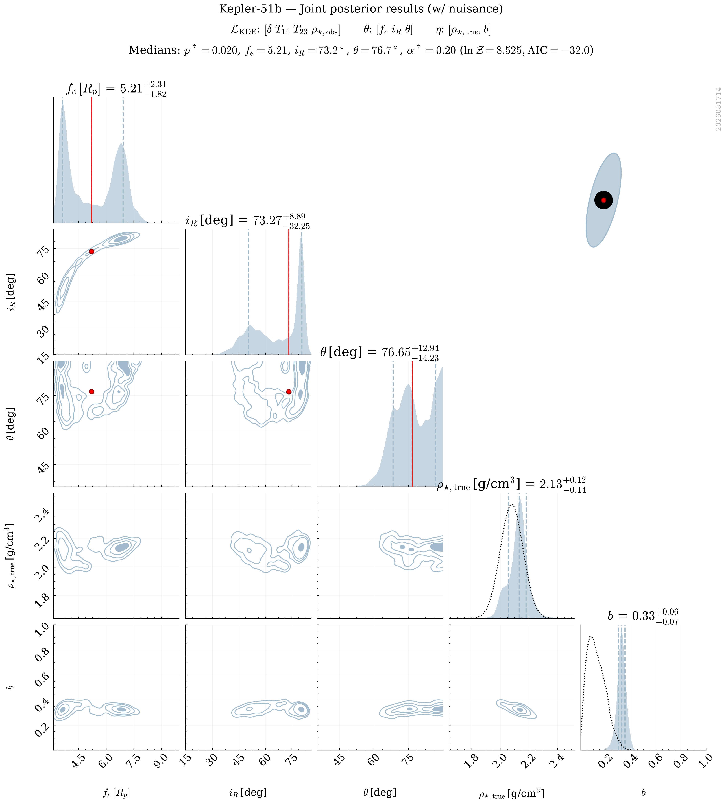

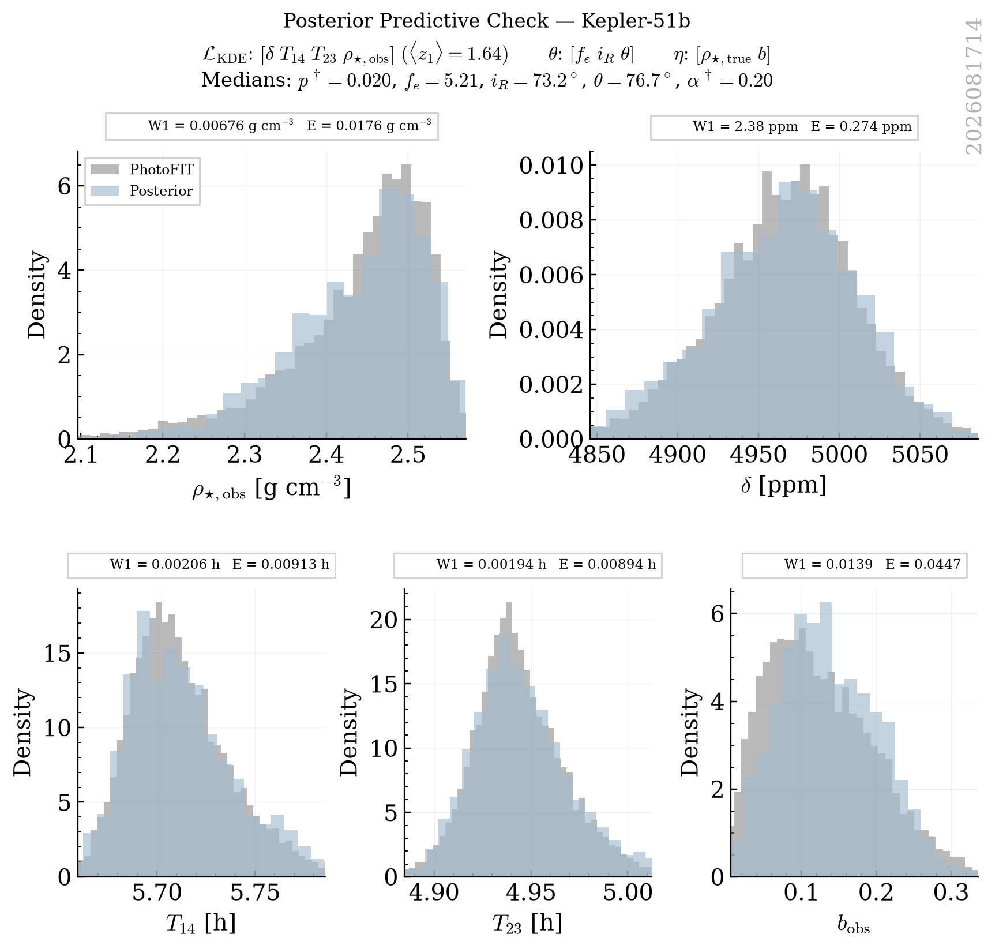

---

#### kepler_51_b_NS_exorings_kde_delta-T14-T23-rho_obs_nlive1200_dlogz0.01_NKDE5000_seed2026_rhoFREE_bFREE_rhoMasuda_P1_A2
- **PPC (z1)**: 1.37
- **PPC (z_crit)**: 1.95
- **ln Z (Evidence)**: 8.075
- **max ln L**: 21.004
- **AIC**: -32.009
- **PPC (z1 min)**: 2.79
- **Ring fe (16th)**: 4.56
- **err(rho_true)**: 0.0212
- **Angle Peaks**: 2.5
- **Category**: [Acceptable] Multimodal Angles

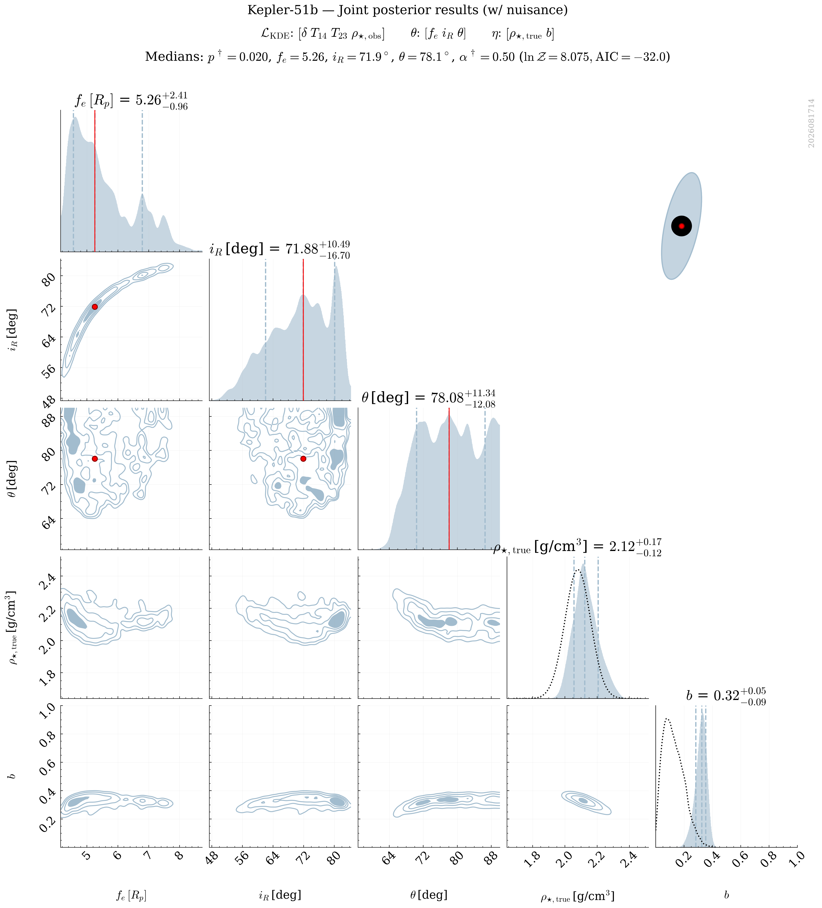

---

### Category: [Rejected] Poor Fit

| Rank | Tag | PPC (z1) | PPC (z_crit) | ln Z | max ln L | AIC | Ring fe (16%) | err(rho_true) | Angle Peaks |
|---|---|---|---|---|---|---|---|---|---|
| 10 | `kepler_51_b_NS_exorings_kde_delta-T14-T23-rho_obs_nlive1200_dlogz0.01_NKDE5000_seed2026_rhoFREE_bFREE_rhoMasuda_P9_A2` | **0.97** | **1.46** | 8.50 | 21.00 | -32.01 | 1.27 | 0.0557 | 1.0 |
| 11 | `kepler_51_b_NS_exorings_kde_delta-T14-T23-rho_obs_nlive1200_dlogz0.01_NKDE5000_seed2026_rhoFREE_bFREE_rhoMasuda_P9_A1` | **0.95** | **1.44** | 8.37 | 21.00 | -32.01 | 1.49 | 0.0559 | 1.0 |
| 12 | `kepler_51_b_NS_exorings_kde_delta-T14-T23-rho_obs_nlive1200_dlogz0.01_NKDE5000_seed2026_rhoFREE_bFREE_rhoMasuda_P9_A3` | **0.98** | **1.47** | 8.13 | 21.00 | -32.01 | 1.22 | 0.0578 | 1.0 |
| 13 | `kepler_51_b_NS_exorings_kde_delta-T14-T23-rho_obs_nlive1200_dlogz0.01_NKDE5000_seed2026_rhoFREE_bFREE_rhoMasuda_P5_A1` | **1.19** | **1.68** | 7.39 | 21.00 | -32.01 | 3.43 | 0.0426 | 1.0 |
| 14 | `kepler_51_b_NS_exorings_kde_delta-T14-T23-rho_obs_nlive1200_dlogz0.01_NKDE5000_seed2026_rhoFREE_bFREE_rhoMasuda_P3_A1` | **1.17** | **1.65** | 7.00 | 21.00 | -32.01 | 4.80 | 0.0566 | 1.5 |
| 15 | `kepler_51_b_NS_exorings_kde_delta-T14-T23-rho_obs_nlive1200_dlogz0.01_NKDE5000_seed2026_rhoFREE_bFREE_rhoMasuda_P1_A1` | **1.19** | **1.63** | 5.84 | 21.00 | -32.01 | 7.15 | 0.0611 | 1.0 |

#### kepler_51_b_NS_exorings_kde_delta-T14-T23-rho_obs_nlive1200_dlogz0.01_NKDE5000_seed2026_rhoFREE_bFREE_rhoMasuda_P9_A2
- **PPC (z1)**: 0.97
- **PPC (z_crit)**: 1.46
- **ln Z (Evidence)**: 8.502
- **max ln L**: 21.003
- **AIC**: -32.007
- **PPC (z1 min)**: 2.40
- **Ring fe (16th)**: 1.27
- **err(rho_true)**: 0.0557
- **Angle Peaks**: 1.0
- **Category**: [Rejected] Poor Fit

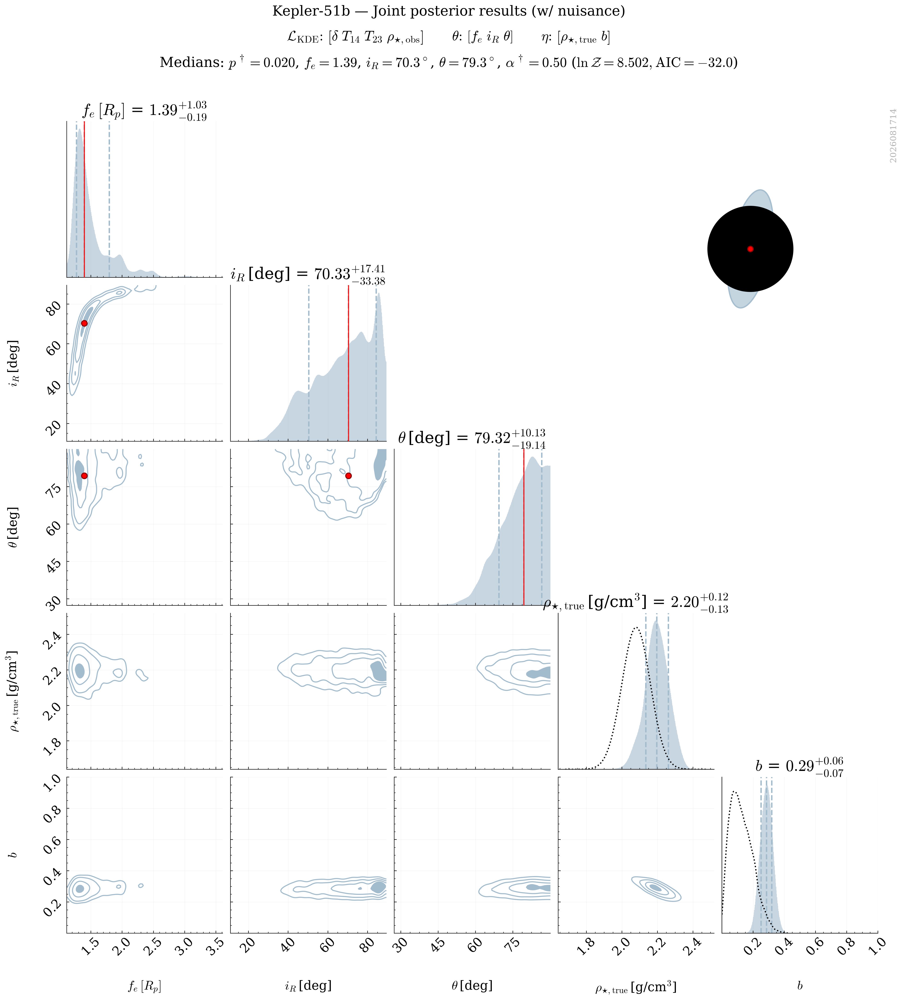

---

#### kepler_51_b_NS_exorings_kde_delta-T14-T23-rho_obs_nlive1200_dlogz0.01_NKDE5000_seed2026_rhoFREE_bFREE_rhoMasuda_P9_A1
- **PPC (z1)**: 0.95
- **PPC (z_crit)**: 1.44
- **ln Z (Evidence)**: 8.374
- **max ln L**: 21.003
- **AIC**: -32.007
- **PPC (z1 min)**: 2.38
- **Ring fe (16th)**: 1.49
- **err(rho_true)**: 0.0559
- **Angle Peaks**: 1.0
- **Category**: [Rejected] Poor Fit

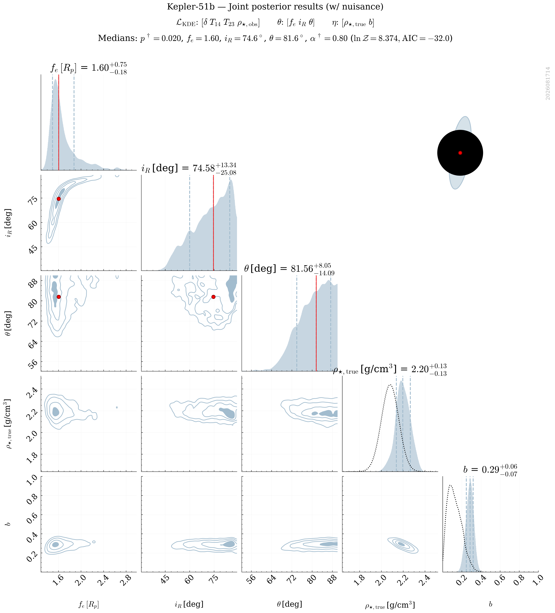

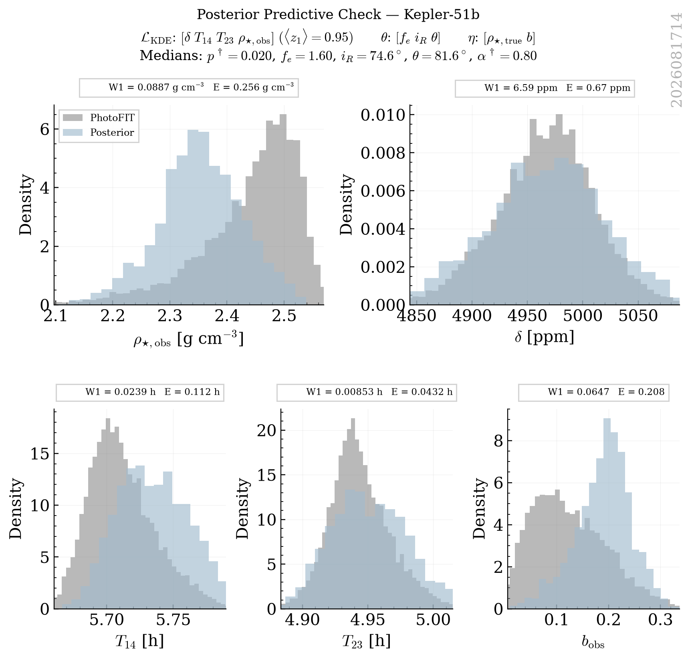

---

#### kepler_51_b_NS_exorings_kde_delta-T14-T23-rho_obs_nlive1200_dlogz0.01_NKDE5000_seed2026_rhoFREE_bFREE_rhoMasuda_P9_A3
- **PPC (z1)**: 0.98
- **PPC (z_crit)**: 1.47
- **ln Z (Evidence)**: 8.130
- **max ln L**: 21.004
- **AIC**: -32.007
- **PPC (z1 min)**: 2.38
- **Ring fe (16th)**: 1.22
- **err(rho_true)**: 0.0578
- **Angle Peaks**: 1.0
- **Category**: [Rejected] Poor Fit

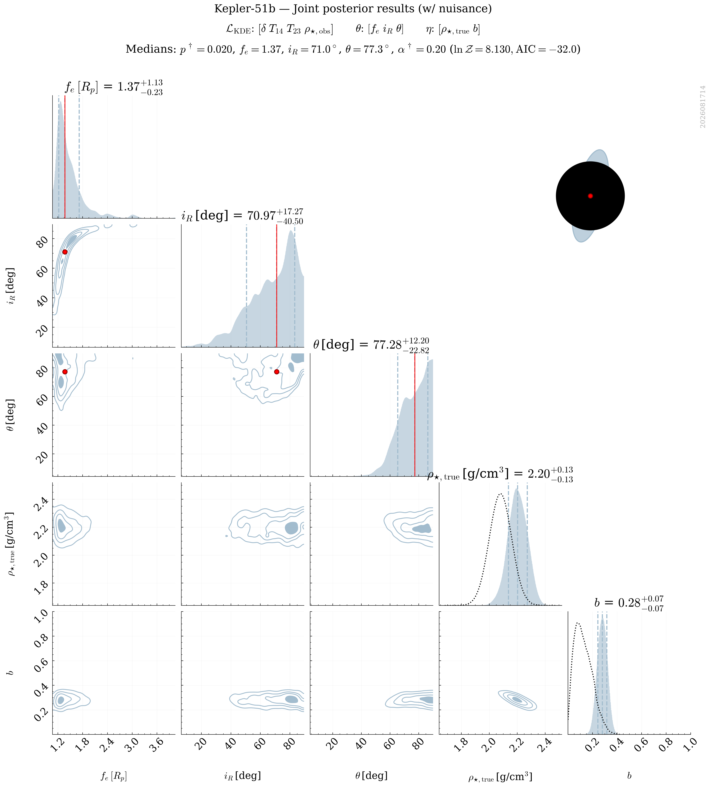

---

#### kepler_51_b_NS_exorings_kde_delta-T14-T23-rho_obs_nlive1200_dlogz0.01_NKDE5000_seed2026_rhoFREE_bFREE_rhoMasuda_P5_A1
- **PPC (z1)**: 1.19
- **PPC (z_crit)**: 1.68
- **ln Z (Evidence)**: 7.393
- **max ln L**: 21.005
- **AIC**: -32.009
- **PPC (z1 min)**: 2.51
- **Ring fe (16th)**: 3.43
- **err(rho_true)**: 0.0426
- **Angle Peaks**: 1.0
- **Category**: [Rejected] Poor Fit

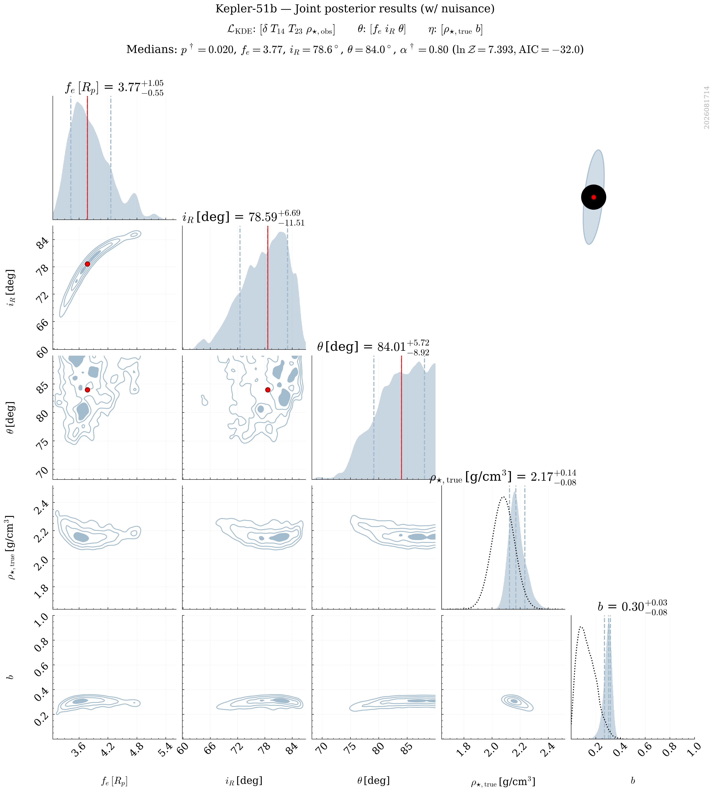

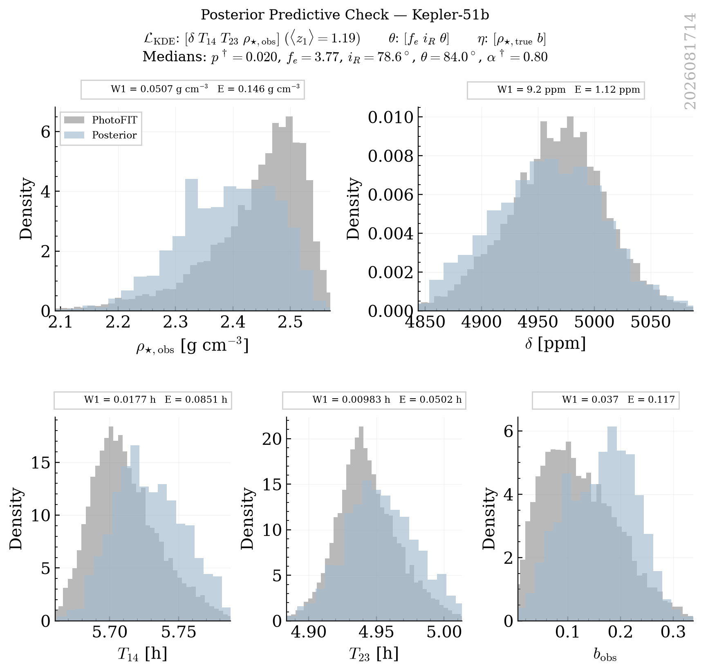

---

#### kepler_51_b_NS_exorings_kde_delta-T14-T23-rho_obs_nlive1200_dlogz0.01_NKDE5000_seed2026_rhoFREE_bFREE_rhoMasuda_P3_A1
- **PPC (z1)**: 1.17
- **PPC (z_crit)**: 1.65
- **ln Z (Evidence)**: 6.995
- **max ln L**: 21.004
- **AIC**: -32.008
- **PPC (z1 min)**: 2.45
- **Ring fe (16th)**: 4.80
- **err(rho_true)**: 0.0566
- **Angle Peaks**: 1.5
- **Category**: [Rejected] Poor Fit

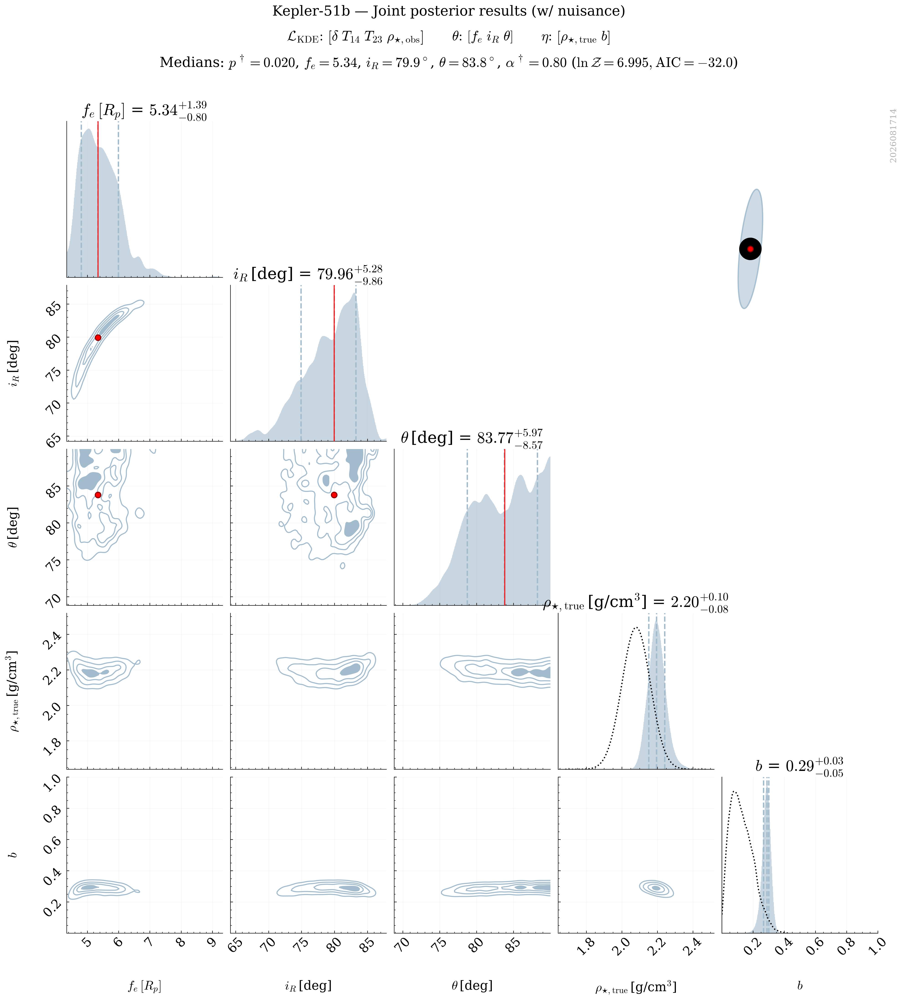

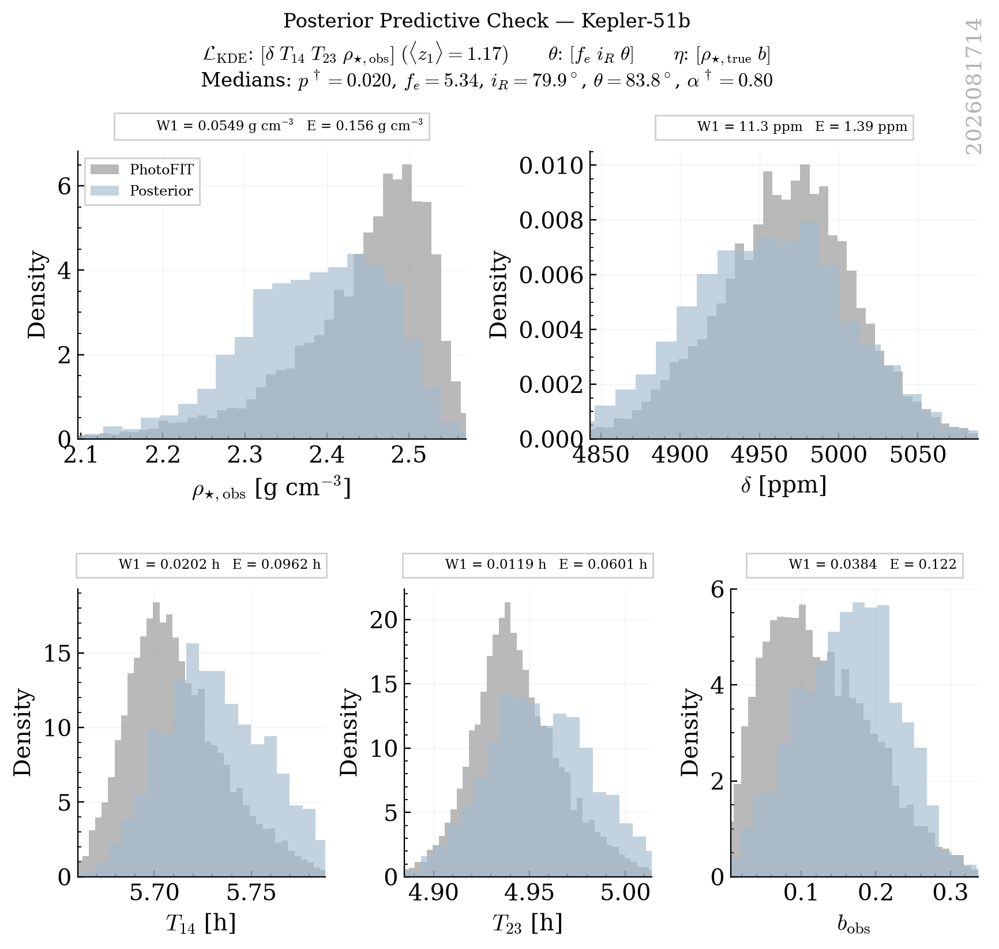

---

#### kepler_51_b_NS_exorings_kde_delta-T14-T23-rho_obs_nlive1200_dlogz0.01_NKDE5000_seed2026_rhoFREE_bFREE_rhoMasuda_P1_A1
- **PPC (z1)**: 1.19
- **PPC (z_crit)**: 1.63
- **ln Z (Evidence)**: 5.841
- **max ln L**: 21.004
- **AIC**: -32.007
- **PPC (z1 min)**: 2.37
- **Ring fe (16th)**: 7.15
- **err(rho_true)**: 0.0611
- **Angle Peaks**: 1.0
- **Category**: [Rejected] Poor Fit

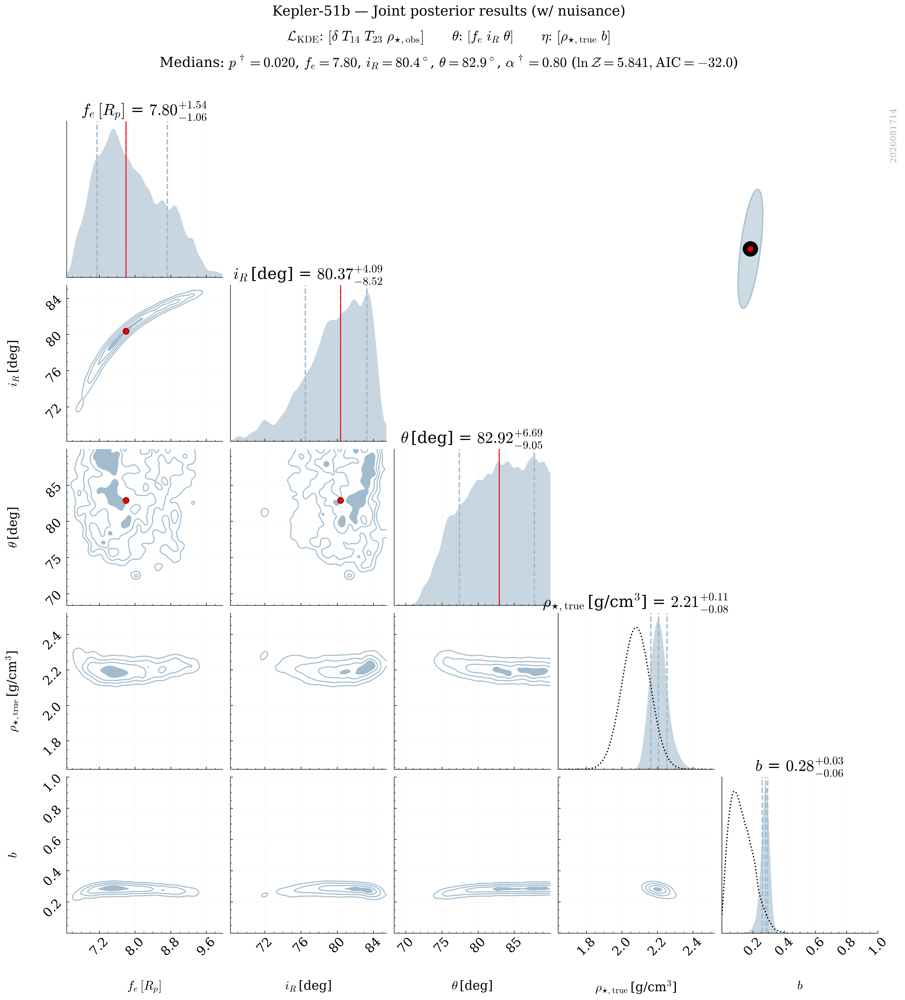

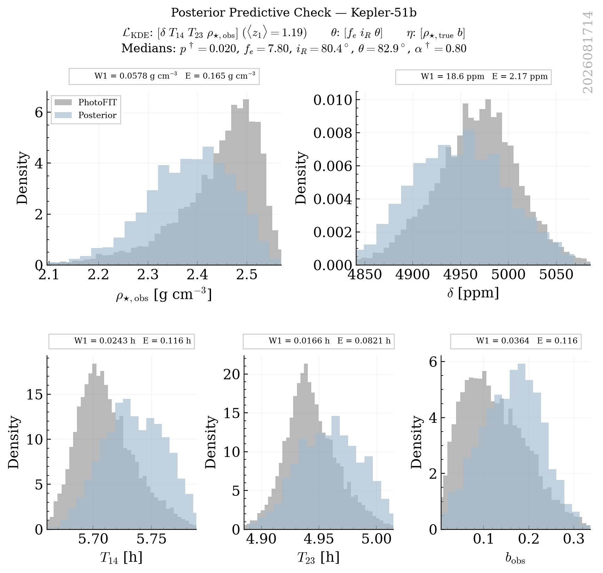

---
