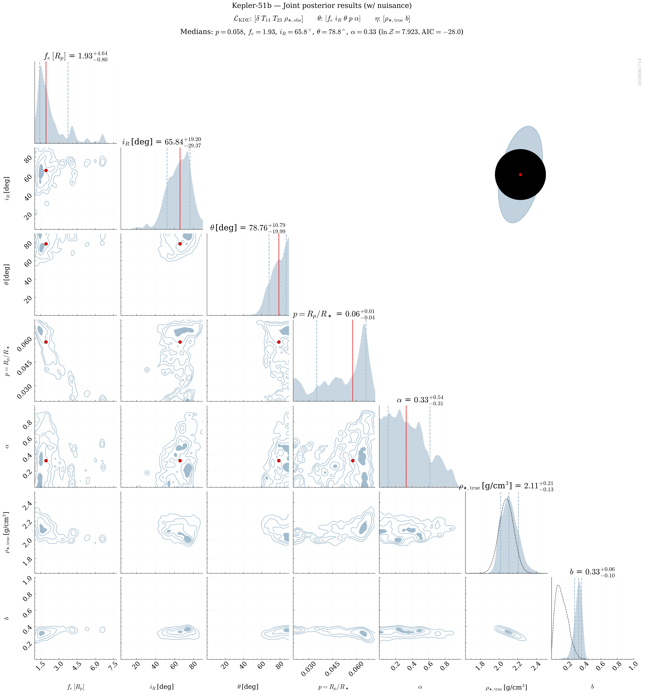
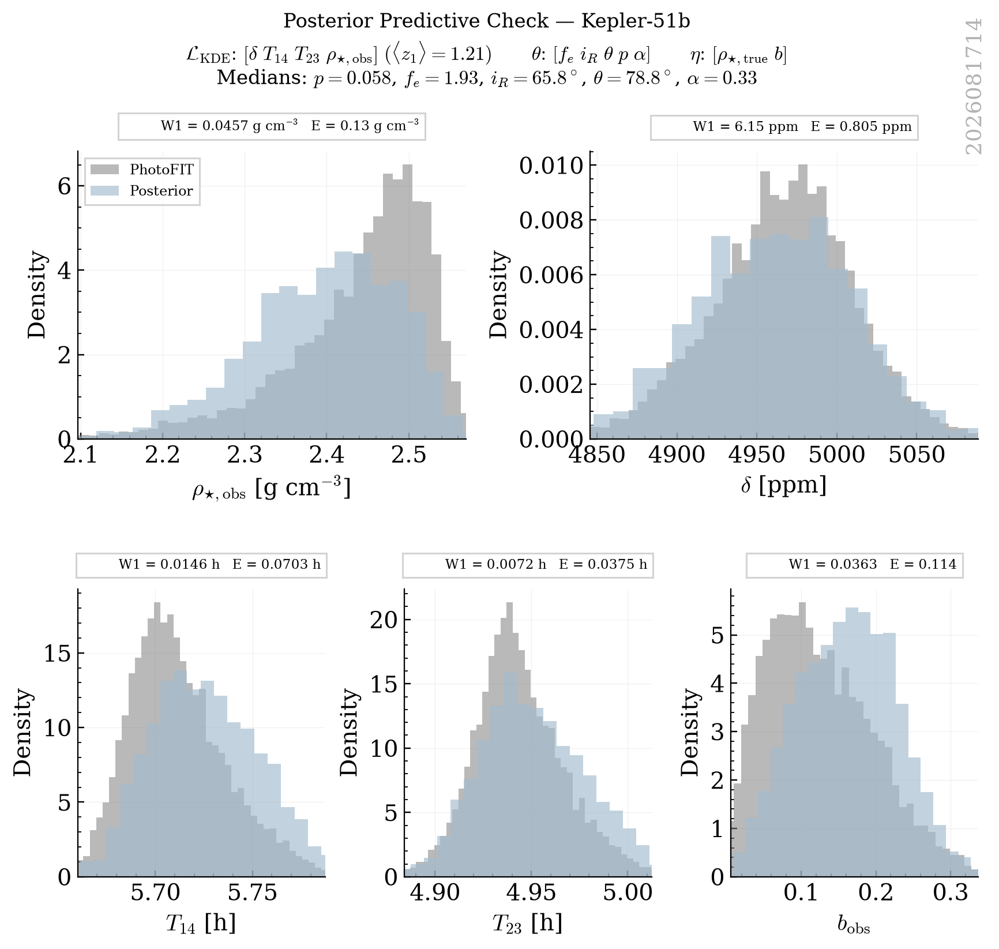

# Kepler_51 B Retrievals Classification Report

This report groups retrievals into strict physical categories based on a Decision Tree logic. Within each category, retrievals are ranked by their Bayesian Evidence ($\ln \mathcal{Z}$).

## Category Summary
- **[Rejected] Poor Fit**: 1 retrievals

## Detailed Results

### Category: [Rejected] Poor Fit

| Rank | Tag | PPC (z1) | PPC (z_crit) | ln Z | max ln L | AIC | Ring fe (16%) | err(rho_true) | Angle Peaks |
|---|---|---|---|---|---|---|---|---|---|
| 1 | `kepler_51_b_NS_exorings_kde_delta-T14-T23-rho_obs_nlive1200_dlogz0.01_NKDE5000_seed2026_rhoFREE_bFREE_alphaFREE_pFREE_rhoMasuda` | **1.21** | **1.73** | 7.92 | 21.00 | -28.01 | 1.41 | 0.0118 | 1.0 |

#### kepler_51_b_NS_exorings_kde_delta-T14-T23-rho_obs_nlive1200_dlogz0.01_NKDE5000_seed2026_rhoFREE_bFREE_alphaFREE_pFREE_rhoMasuda
- **PPC (z1)**: 1.21
- **PPC (z_crit)**: 1.73
- **ln Z (Evidence)**: 7.923
- **max ln L**: 21.004
- **AIC**: -28.008
- **PPC (z1 min)**: 2.59
- **Ring fe (16th)**: 1.41
- **err(rho_true)**: 0.0118
- **Angle Peaks**: 1.0
- **Category**: [Rejected] Poor Fit

---
