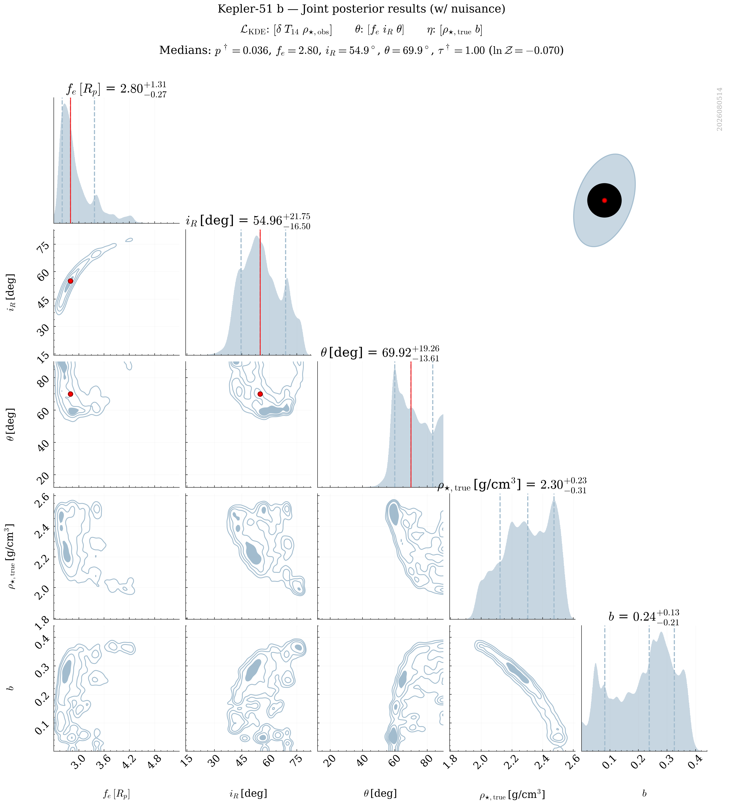
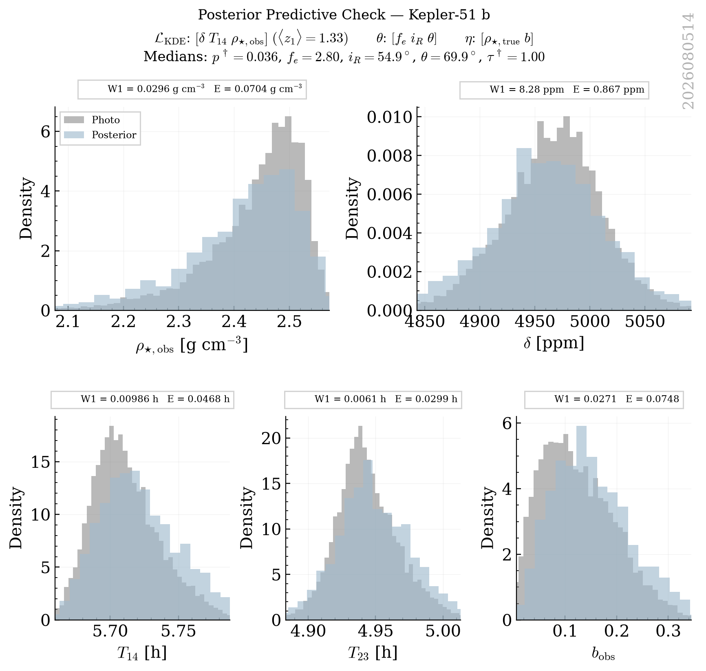
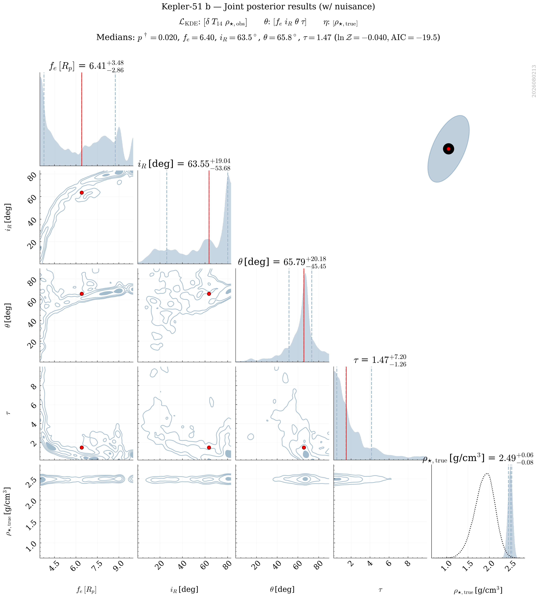
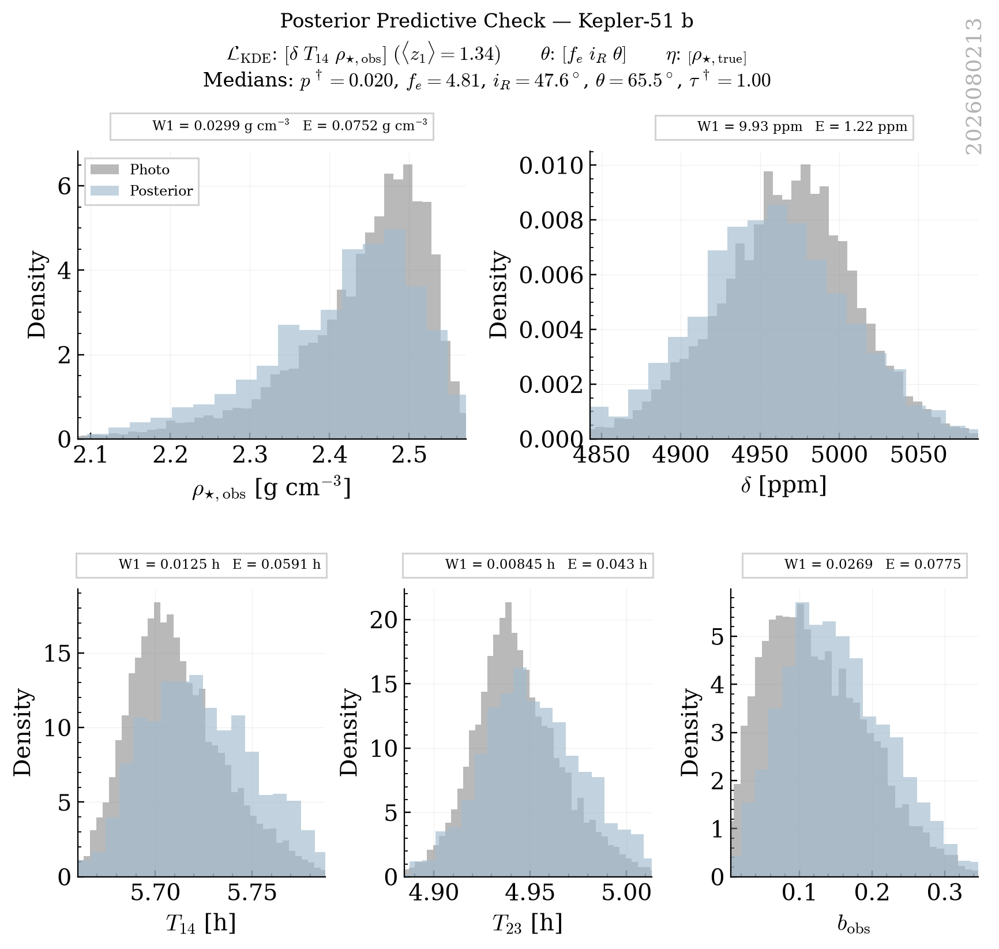
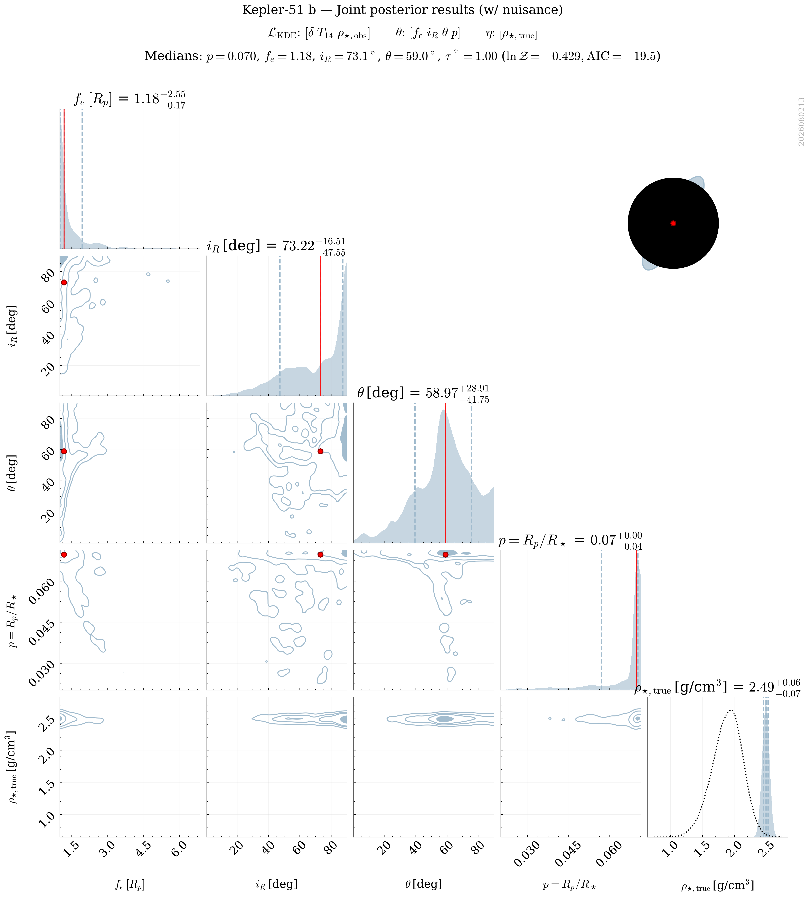
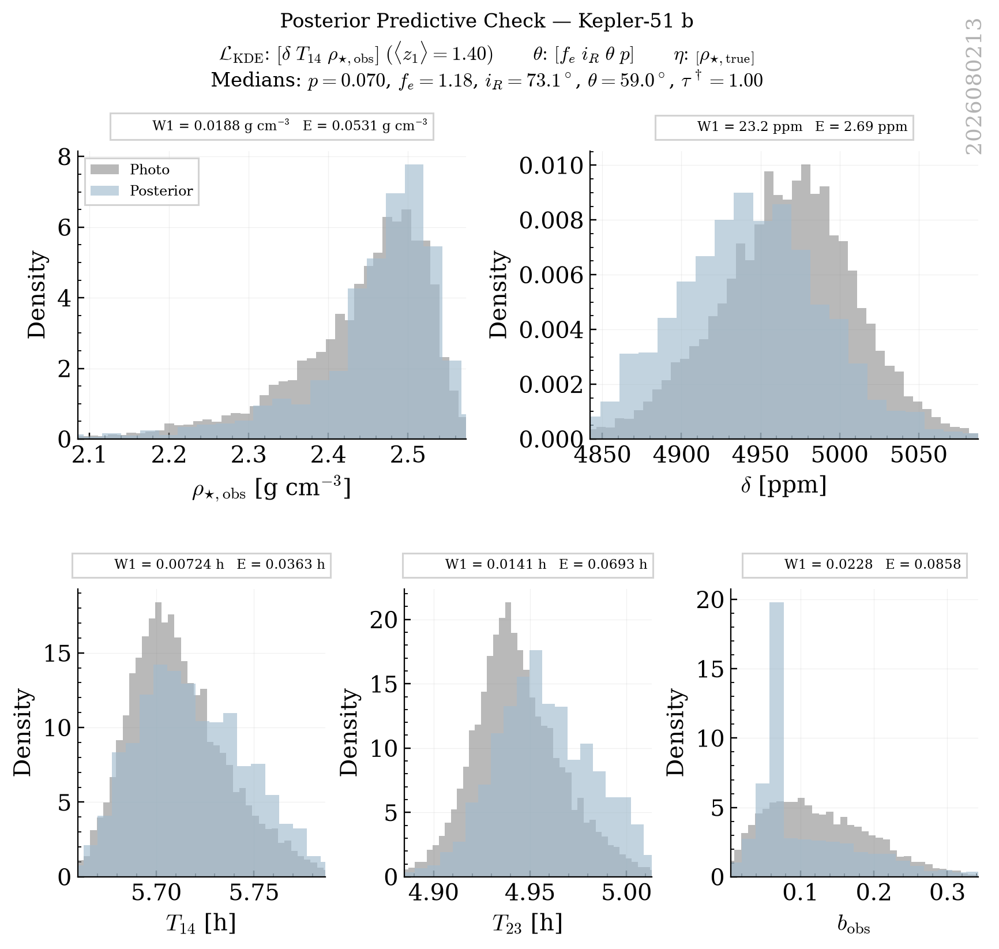
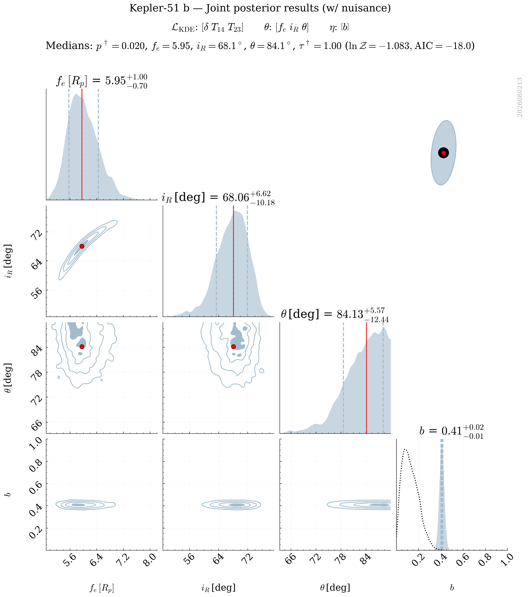
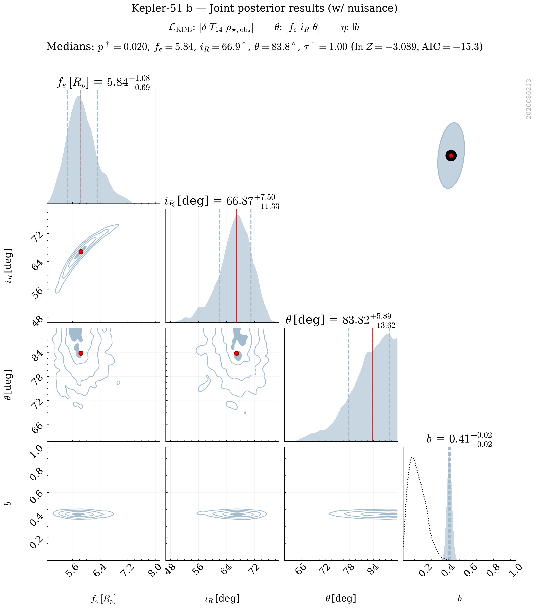
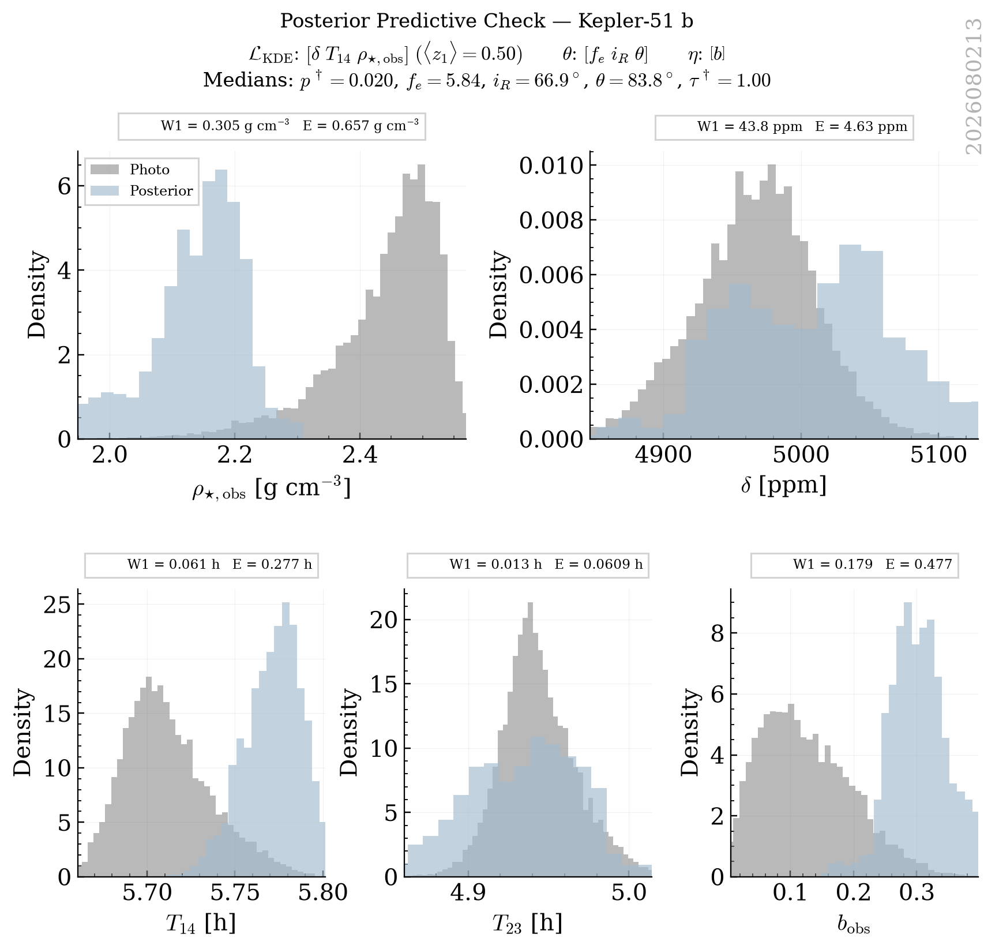

# Kepler_51 B Retrievals Classification Report

This report groups retrievals into strict physical categories based on a Decision Tree logic. Within each category, retrievals are ranked by their Bayesian Evidence ($\ln \mathcal{Z}$).

## Category Summary
- **[Excellent] Golden Sample**: 18 retrievals
- **[Acceptable] Low Bayesian Evidence**: 1 retrievals
- **[Acceptable] Multimodal Angles**: 7 retrievals
- **[Rejected] Unphysical Nuisance**: 8 retrievals
- **[Rejected] Poor Fit**: 26 retrievals

## Detailed Results

### Category: [Excellent] Golden Sample

| Rank | Tag | PPC (z1) | PPC (z_crit) | ln Z | max ln L | AIC | Ring fe (16%) | err(rho_true) | Angle Peaks |
|---|---|---|---|---|---|---|---|---|---|
| 1 | `kepler_51_b_NS_exorings_kde_delta-T14-T23-rho_obs_nlive1200_dlogz0.01_NKDE5000_seed2026_rhoFREE_bFREE_tauFREE_pFREE` | **1.34** | **1.92** | 9.00 | 21.00 | -28.01 | 1.13 | 0.2313 | 1.0 |
| 2 | `kepler_51_b_NS_exorings_kde_delta-T14-T23_nlive1200_dlogz0.01_NKDE5000_seed2026_rhoFREE_bFREE_tauFREE_pFREE` | **1.43** | **2.12** | 3.36 | 16.20 | -18.40 | 1.13 | 0.2472 | 1.0 |
| 3 | `kepler_51_b_NS_exorings_kde_delta-T14-T23_nlive1200_dlogz0.01_NKDE5000_seed2026_rhoFREE_bFREE_pFREE` | **1.51** | **2.38** | 2.49 | 16.20 | -20.40 | 1.09 | 0.2388 | 1.0 |
| 4 | `kepler_51_b_NS_exorings_kde_delta-T14-rho_obs_nlive1200_dlogz0.01_NKDE5000_seed2026_rhoFREE_bFREE_tauFREE` | **1.33** | **2.03** | 2.01 | 14.73 | -17.46 | 4.00 | 0.1812 | 1.5 |
| 5 | `kepler_51_b_NS_exorings_kde_delta-T14-rho_obs_nlive1200_dlogz0.01_NKDE5000_seed2026_rhoFREE_bFREE_P9_T1` | **1.41** | **2.03** | 1.95 | 14.73 | -19.46 | 1.29 | 0.2229 | 1.0 |
| 6 | `kepler_51_b_NS_exorings_kde_delta-T14-rho_obs_nlive1200_dlogz0.01_NKDE5000_seed2026_rhoFREE_bFREE_P2_T3` | **1.32** | **1.96** | 1.93 | 14.73 | -19.46 | 2.68 | 0.1653 | 1.5 |
| 7 | `kepler_51_b_NS_exorings_kde_delta-T14-rho_obs_nlive1200_dlogz0.01_NKDE5000_seed2026_rhoFREE_bFREE_P8_T3` | **1.43** | **2.14** | 1.84 | 14.73 | -19.46 | 1.31 | 0.1926 | 1.0 |
| 8 | `kepler_51_b_NS_exorings_kde_delta-T14-rho_obs_nlive1200_dlogz0.01_NKDE5000_seed2026_rhoFREE_bFREE_P9_T3` | **1.42** | **2.06** | 1.71 | 14.73 | -19.46 | 1.18 | 0.2201 | 1.0 |
| 9 | `kepler_51_b_NS_exorings_kde_delta-T14-rho_obs_nlive1200_dlogz0.01_NKDE5000_seed2026_rhoFREE_bFREE_P8_T1` | **1.49** | **2.24** | 1.63 | 14.73 | -19.46 | 1.59 | 0.1973 | 1.5 |
| 10 | `kepler_51_b_NS_exorings_kde_delta-T14-rho_obs_nlive1200_dlogz0.01_NKDE5000_seed2026_rhoFREE_bFREE_P9_T2` | **1.42** | **2.06** | 1.61 | 14.73 | -19.46 | 1.22 | 0.2190 | 1.0 |
| 11 | `kepler_51_b_NS_exorings_kde_delta-T14-rho_obs_nlive1200_dlogz0.01_NKDE5000_seed2026_rhoFREE_bFREE_P3_T1` | **1.40** | **2.09** | 1.18 | 14.73 | -19.46 | 3.35 | 0.1569 | 1.5 |
| 12 | `kepler_51_b_NS_exorings_kde_delta-T14-rho_obs_nlive1200_dlogz0.01_NKDE5000_seed2026_rhoFREE_bFREE_P7_T3` | **1.43** | **2.10** | 1.12 | 14.73 | -19.46 | 1.44 | 0.1917 | 1.0 |
| 13 | `kepler_51_b_NS_exorings_kde_delta-T14-rho_obs_nlive1200_dlogz0.01_NKDE5000_seed2026_rhoFREE_bFREE_P8_T2` | **1.58** | **2.40** | 0.95 | 14.73 | -19.46 | 1.45 | 0.1809 | 1.5 |
| 14 | `kepler_51_b_NS_exorings_kde_delta-T14-rho_obs_nlive1200_dlogz0.01_NKDE5000_seed2026_rhoFREE_bFREE_P5_T2` | **1.46** | **2.19** | 0.81 | 14.73 | -19.46 | 2.19 | 0.1446 | 1.5 |
| 15 | `kepler_51_b_NS_exorings_kde_delta-T14-rho_obs_nlive1200_dlogz0.01_NKDE5000_seed2026_rhoFREE_bFREE_P4_T1` | **1.36** | **2.01** | 0.69 | 14.73 | -19.46 | 2.77 | 0.2340 | 1.0 |
| 16 | `kepler_51_b_NS_exorings_kde_delta-T14-rho_obs_nlive1200_dlogz0.01_NKDE5000_seed2026_rhoFREE_bFREE_P6_T3` | **1.33** | **1.98** | 0.61 | 14.73 | -19.46 | 1.82 | 0.2017 | 1.5 |
| 17 | `kepler_51_b_NS_exorings_kde_delta-T14-rho_obs_nlive1200_dlogz0.01_NKDE5000_seed2026_rhoFREE_bFREE_P2_T1` | **1.30** | **1.90** | 0.50 | 14.73 | -19.46 | 3.86 | 0.2151 | 1.5 |
| 18 | `kepler_51_b_NS_exorings_kde_delta-T14-rho_obs_nlive1200_dlogz0.01_NKDE5000_seed2026_rhoFREE_bFREE_P4_T2` | **1.37** | **2.00** | 0.33 | 14.73 | -19.46 | 2.29 | 0.1977 | 1.5 |

#### kepler_51_b_NS_exorings_kde_delta-T14-T23-rho_obs_nlive1200_dlogz0.01_NKDE5000_seed2026_rhoFREE_bFREE_tauFREE_pFREE
- **PPC (z1)**: 1.34
- **PPC (z_crit)**: 1.92
- **ln Z (Evidence)**: 9.002
- **max ln L**: 21.004
- **AIC**: -28.009
- **PPC (z1 min)**: 2.75
- **Ring fe (16th)**: 1.13
- **err(rho_true)**: 0.2313
- **Angle Peaks**: 1.0
- **Category**: [Excellent] Golden Sample

---

#### kepler_51_b_NS_exorings_kde_delta-T14-T23_nlive1200_dlogz0.01_NKDE5000_seed2026_rhoFREE_bFREE_tauFREE_pFREE
- **PPC (z1)**: 1.43
- **PPC (z_crit)**: 2.12
- **ln Z (Evidence)**: 3.360
- **max ln L**: 16.200
- **AIC**: -18.400
- **PPC (z1 min)**: 2.94
- **Ring fe (16th)**: 1.13
- **err(rho_true)**: 0.2472
- **Angle Peaks**: 1.0
- **Category**: [Excellent] Golden Sample

---

#### kepler_51_b_NS_exorings_kde_delta-T14-T23_nlive1200_dlogz0.01_NKDE5000_seed2026_rhoFREE_bFREE_pFREE
- **PPC (z1)**: 1.51
- **PPC (z_crit)**: 2.38
- **ln Z (Evidence)**: 2.492
- **max ln L**: 16.199
- **AIC**: -20.399
- **PPC (z1 min)**: 2.85
- **Ring fe (16th)**: 1.09
- **err(rho_true)**: 0.2388
- **Angle Peaks**: 1.0
- **Category**: [Excellent] Golden Sample

---

#### kepler_51_b_NS_exorings_kde_delta-T14-rho_obs_nlive1200_dlogz0.01_NKDE5000_seed2026_rhoFREE_bFREE_tauFREE
- **PPC (z1)**: 1.33
- **PPC (z_crit)**: 2.03
- **ln Z (Evidence)**: 2.008
- **max ln L**: 14.731
- **AIC**: -17.463
- **PPC (z1 min)**: 2.89
- **Ring fe (16th)**: 4.00
- **err(rho_true)**: 0.1812
- **Angle Peaks**: 1.5
- **Category**: [Excellent] Golden Sample

---

#### kepler_51_b_NS_exorings_kde_delta-T14-rho_obs_nlive1200_dlogz0.01_NKDE5000_seed2026_rhoFREE_bFREE_P9_T1
- **PPC (z1)**: 1.41
- **PPC (z_crit)**: 2.03
- **ln Z (Evidence)**: 1.949
- **max ln L**: 14.730
- **AIC**: -19.461
- **PPC (z1 min)**: 2.70
- **Ring fe (16th)**: 1.29
- **err(rho_true)**: 0.2229
- **Angle Peaks**: 1.0
- **Category**: [Excellent] Golden Sample

---

#### kepler_51_b_NS_exorings_kde_delta-T14-rho_obs_nlive1200_dlogz0.01_NKDE5000_seed2026_rhoFREE_bFREE_P2_T3
- **PPC (z1)**: 1.32
- **PPC (z_crit)**: 1.96
- **ln Z (Evidence)**: 1.931
- **max ln L**: 14.732
- **AIC**: -19.463
- **PPC (z1 min)**: 2.87
- **Ring fe (16th)**: 2.68
- **err(rho_true)**: 0.1653
- **Angle Peaks**: 1.5
- **Category**: [Excellent] Golden Sample

---

#### kepler_51_b_NS_exorings_kde_delta-T14-rho_obs_nlive1200_dlogz0.01_NKDE5000_seed2026_rhoFREE_bFREE_P8_T3
- **PPC (z1)**: 1.43
- **PPC (z_crit)**: 2.14
- **ln Z (Evidence)**: 1.839
- **max ln L**: 14.732
- **AIC**: -19.464
- **PPC (z1 min)**: 2.80
- **Ring fe (16th)**: 1.31
- **err(rho_true)**: 0.1926
- **Angle Peaks**: 1.0
- **Category**: [Excellent] Golden Sample

---

#### kepler_51_b_NS_exorings_kde_delta-T14-rho_obs_nlive1200_dlogz0.01_NKDE5000_seed2026_rhoFREE_bFREE_P9_T3
- **PPC (z1)**: 1.42
- **PPC (z_crit)**: 2.06
- **ln Z (Evidence)**: 1.710
- **max ln L**: 14.732
- **AIC**: -19.464
- **PPC (z1 min)**: 2.68
- **Ring fe (16th)**: 1.18
- **err(rho_true)**: 0.2201
- **Angle Peaks**: 1.0
- **Category**: [Excellent] Golden Sample

---

#### kepler_51_b_NS_exorings_kde_delta-T14-rho_obs_nlive1200_dlogz0.01_NKDE5000_seed2026_rhoFREE_bFREE_P8_T1
- **PPC (z1)**: 1.49
- **PPC (z_crit)**: 2.24
- **ln Z (Evidence)**: 1.627
- **max ln L**: 14.730
- **AIC**: -19.460
- **PPC (z1 min)**: 2.80
- **Ring fe (16th)**: 1.59
- **err(rho_true)**: 0.1973
- **Angle Peaks**: 1.5
- **Category**: [Excellent] Golden Sample

---

#### kepler_51_b_NS_exorings_kde_delta-T14-rho_obs_nlive1200_dlogz0.01_NKDE5000_seed2026_rhoFREE_bFREE_P9_T2
- **PPC (z1)**: 1.42
- **PPC (z_crit)**: 2.06
- **ln Z (Evidence)**: 1.615
- **max ln L**: 14.732
- **AIC**: -19.463
- **PPC (z1 min)**: 2.70
- **Ring fe (16th)**: 1.22
- **err(rho_true)**: 0.2190
- **Angle Peaks**: 1.0
- **Category**: [Excellent] Golden Sample

---

#### kepler_51_b_NS_exorings_kde_delta-T14-rho_obs_nlive1200_dlogz0.01_NKDE5000_seed2026_rhoFREE_bFREE_P3_T1
- **PPC (z1)**: 1.40
- **PPC (z_crit)**: 2.09
- **ln Z (Evidence)**: 1.178
- **max ln L**: 14.731
- **AIC**: -19.462
- **PPC (z1 min)**: 2.98
- **Ring fe (16th)**: 3.35
- **err(rho_true)**: 0.1569
- **Angle Peaks**: 1.5
- **Category**: [Excellent] Golden Sample

---

#### kepler_51_b_NS_exorings_kde_delta-T14-rho_obs_nlive1200_dlogz0.01_NKDE5000_seed2026_rhoFREE_bFREE_P7_T3
- **PPC (z1)**: 1.43
- **PPC (z_crit)**: 2.10
- **ln Z (Evidence)**: 1.116
- **max ln L**: 14.732
- **AIC**: -19.464
- **PPC (z1 min)**: 2.89
- **Ring fe (16th)**: 1.44
- **err(rho_true)**: 0.1917
- **Angle Peaks**: 1.0
- **Category**: [Excellent] Golden Sample

---

#### kepler_51_b_NS_exorings_kde_delta-T14-rho_obs_nlive1200_dlogz0.01_NKDE5000_seed2026_rhoFREE_bFREE_P8_T2
- **PPC (z1)**: 1.58
- **PPC (z_crit)**: 2.40
- **ln Z (Evidence)**: 0.951
- **max ln L**: 14.731
- **AIC**: -19.461
- **PPC (z1 min)**: 2.80
- **Ring fe (16th)**: 1.45
- **err(rho_true)**: 0.1809
- **Angle Peaks**: 1.5
- **Category**: [Excellent] Golden Sample

---

#### kepler_51_b_NS_exorings_kde_delta-T14-rho_obs_nlive1200_dlogz0.01_NKDE5000_seed2026_rhoFREE_bFREE_P5_T2
- **PPC (z1)**: 1.46
- **PPC (z_crit)**: 2.19
- **ln Z (Evidence)**: 0.811
- **max ln L**: 14.732
- **AIC**: -19.464
- **PPC (z1 min)**: 3.01
- **Ring fe (16th)**: 2.19
- **err(rho_true)**: 0.1446
- **Angle Peaks**: 1.5
- **Category**: [Excellent] Golden Sample

---

#### kepler_51_b_NS_exorings_kde_delta-T14-rho_obs_nlive1200_dlogz0.01_NKDE5000_seed2026_rhoFREE_bFREE_P4_T1
- **PPC (z1)**: 1.36
- **PPC (z_crit)**: 2.01
- **ln Z (Evidence)**: 0.690
- **max ln L**: 14.731
- **AIC**: -19.462
- **PPC (z1 min)**: 2.87
- **Ring fe (16th)**: 2.77
- **err(rho_true)**: 0.2340
- **Angle Peaks**: 1.0
- **Category**: [Excellent] Golden Sample

---

#### kepler_51_b_NS_exorings_kde_delta-T14-rho_obs_nlive1200_dlogz0.01_NKDE5000_seed2026_rhoFREE_bFREE_P6_T3
- **PPC (z1)**: 1.33
- **PPC (z_crit)**: 1.98
- **ln Z (Evidence)**: 0.610
- **max ln L**: 14.731
- **AIC**: -19.463
- **PPC (z1 min)**: 2.88
- **Ring fe (16th)**: 1.82
- **err(rho_true)**: 0.2017
- **Angle Peaks**: 1.5
- **Category**: [Excellent] Golden Sample

---

#### kepler_51_b_NS_exorings_kde_delta-T14-rho_obs_nlive1200_dlogz0.01_NKDE5000_seed2026_rhoFREE_bFREE_P2_T1
- **PPC (z1)**: 1.30
- **PPC (z_crit)**: 1.90
- **ln Z (Evidence)**: 0.498
- **max ln L**: 14.732
- **AIC**: -19.464
- **PPC (z1 min)**: 2.74
- **Ring fe (16th)**: 3.86
- **err(rho_true)**: 0.2151
- **Angle Peaks**: 1.5
- **Category**: [Excellent] Golden Sample

---

#### kepler_51_b_NS_exorings_kde_delta-T14-rho_obs_nlive1200_dlogz0.01_NKDE5000_seed2026_rhoFREE_bFREE_P4_T2
- **PPC (z1)**: 1.37
- **PPC (z_crit)**: 2.00
- **ln Z (Evidence)**: 0.328
- **max ln L**: 14.732
- **AIC**: -19.463
- **PPC (z1 min)**: 2.88
- **Ring fe (16th)**: 2.29
- **err(rho_true)**: 0.1977
- **Angle Peaks**: 1.5
- **Category**: [Excellent] Golden Sample

---

### Category: [Acceptable] Low Bayesian Evidence

| Rank | Tag | PPC (z1) | PPC (z_crit) | ln Z | max ln L | AIC | Ring fe (16%) | err(rho_true) | Angle Peaks |
|---|---|---|---|---|---|---|---|---|---|
| 19 | `kepler_51_b_NS_exorings_kde_delta-T14-rho_obs_nlive1200_dlogz0.01_NKDE5000_seed2026_rhoFREE_bFREE_P3_T2` | **1.33** | **1.92** | -0.07 | 14.73 | -19.46 | 2.61 | 0.2218 | 1.0 |

#### kepler_51_b_NS_exorings_kde_delta-T14-rho_obs_nlive1200_dlogz0.01_NKDE5000_seed2026_rhoFREE_bFREE_P3_T2
- **PPC (z1)**: 1.33
- **PPC (z_crit)**: 1.92
- **ln Z (Evidence)**: -0.070
- **max ln L**: 14.730
- **AIC**: -19.461
- **PPC (z1 min)**: 2.76
- **Ring fe (16th)**: 2.61
- **err(rho_true)**: 0.2218
- **Angle Peaks**: 1.0
- **Category**: [Acceptable] Low Bayesian Evidence

---

### Category: [Acceptable] Multimodal Angles

| Rank | Tag | PPC (z1) | PPC (z_crit) | ln Z | max ln L | AIC | Ring fe (16%) | err(rho_true) | Angle Peaks |
|---|---|---|---|---|---|---|---|---|---|
| 20 | `kepler_51_b_NS_exorings_kde_delta-T14-T23_nlive1200_dlogz0.01_NKDE5000_seed2026_rhoFREE_bFREE` | **1.33** | **1.97** | 2.74 | 16.20 | -22.40 | 4.75 | 0.2113 | 2.5 |
| 21 | `kepler_51_b_NS_exorings_kde_delta-T14-rho_obs_nlive1200_dlogz0.01_NKDE5000_seed2026_rhoFREE_bFREE_P1_T2` | **1.36** | **2.03** | 2.29 | 14.73 | -19.46 | 3.86 | 0.1638 | 2.0 |
| 22 | `kepler_51_b_NS_exorings_kde_delta-T14-rho_obs_nlive1200_dlogz0.01_NKDE5000_seed2026_rhoFREE_bFREE_P6_T2` | **1.38** | **2.00** | 0.88 | 14.73 | -19.46 | 1.69 | 0.2398 | 2.0 |
| 23 | `kepler_51_b_NS_exorings_kde_delta-T14-rho_obs_nlive1200_dlogz0.01_NKDE5000_seed2026_rhoFREE_bFREE_P1_T1` | **1.38** | **2.05** | 0.64 | 14.73 | -19.46 | 4.80 | 0.1966 | 2.0 |
| 24 | `kepler_51_b_NS_exorings_kde_delta-T14-rho_obs_nlive1200_dlogz0.01_NKDE5000_seed2026_rhoFREE_bFREE_P7_T1` | **1.36** | **2.01** | 0.60 | 14.73 | -19.46 | 1.80 | 0.1986 | 2.0 |
| 25 | `kepler_51_b_NS_exorings_kde_delta-T14-rho_obs_nlive1200_dlogz0.01_NKDE5000_seed2026_rhoFREE_bFREE_P2_T2` | **1.32** | **1.97** | 0.55 | 14.73 | -19.46 | 3.13 | 0.1823 | 2.0 |
| 26 | `kepler_51_b_NS_exorings_kde_delta-T14-rho_obs_nlive1200_dlogz0.01_NKDE5000_seed2026_rhoFREE_bFREE_P7_T2` | **1.33** | **1.95** | 0.31 | 14.73 | -19.46 | 1.49 | 0.2278 | 2.0 |

#### kepler_51_b_NS_exorings_kde_delta-T14-T23_nlive1200_dlogz0.01_NKDE5000_seed2026_rhoFREE_bFREE
- **PPC (z1)**: 1.33
- **PPC (z_crit)**: 1.97
- **ln Z (Evidence)**: 2.738
- **max ln L**: 16.200
- **AIC**: -22.401
- **PPC (z1 min)**: 2.88
- **Ring fe (16th)**: 4.75
- **err(rho_true)**: 0.2113
- **Angle Peaks**: 2.5
- **Category**: [Acceptable] Multimodal Angles

---

#### kepler_51_b_NS_exorings_kde_delta-T14-rho_obs_nlive1200_dlogz0.01_NKDE5000_seed2026_rhoFREE_bFREE_P1_T2
- **PPC (z1)**: 1.36
- **PPC (z_crit)**: 2.03
- **ln Z (Evidence)**: 2.290
- **max ln L**: 14.731
- **AIC**: -19.462
- **PPC (z1 min)**: 2.93
- **Ring fe (16th)**: 3.86
- **err(rho_true)**: 0.1638
- **Angle Peaks**: 2.0
- **Category**: [Acceptable] Multimodal Angles

---

#### kepler_51_b_NS_exorings_kde_delta-T14-rho_obs_nlive1200_dlogz0.01_NKDE5000_seed2026_rhoFREE_bFREE_P6_T2
- **PPC (z1)**: 1.38
- **PPC (z_crit)**: 2.00
- **ln Z (Evidence)**: 0.884
- **max ln L**: 14.731
- **AIC**: -19.463
- **PPC (z1 min)**: 2.78
- **Ring fe (16th)**: 1.69
- **err(rho_true)**: 0.2398
- **Angle Peaks**: 2.0
- **Category**: [Acceptable] Multimodal Angles

---

#### kepler_51_b_NS_exorings_kde_delta-T14-rho_obs_nlive1200_dlogz0.01_NKDE5000_seed2026_rhoFREE_bFREE_P1_T1
- **PPC (z1)**: 1.38
- **PPC (z_crit)**: 2.05
- **ln Z (Evidence)**: 0.645
- **max ln L**: 14.732
- **AIC**: -19.463
- **PPC (z1 min)**: 2.87
- **Ring fe (16th)**: 4.80
- **err(rho_true)**: 0.1966
- **Angle Peaks**: 2.0
- **Category**: [Acceptable] Multimodal Angles

---

#### kepler_51_b_NS_exorings_kde_delta-T14-rho_obs_nlive1200_dlogz0.01_NKDE5000_seed2026_rhoFREE_bFREE_P7_T1
- **PPC (z1)**: 1.36
- **PPC (z_crit)**: 2.01
- **ln Z (Evidence)**: 0.603
- **max ln L**: 14.731
- **AIC**: -19.462
- **PPC (z1 min)**: 2.87
- **Ring fe (16th)**: 1.80
- **err(rho_true)**: 0.1986
- **Angle Peaks**: 2.0
- **Category**: [Acceptable] Multimodal Angles

---

#### kepler_51_b_NS_exorings_kde_delta-T14-rho_obs_nlive1200_dlogz0.01_NKDE5000_seed2026_rhoFREE_bFREE_P2_T2
- **PPC (z1)**: 1.32
- **PPC (z_crit)**: 1.97
- **ln Z (Evidence)**: 0.554
- **max ln L**: 14.731
- **AIC**: -19.462
- **PPC (z1 min)**: 2.87
- **Ring fe (16th)**: 3.13
- **err(rho_true)**: 0.1823
- **Angle Peaks**: 2.0
- **Category**: [Acceptable] Multimodal Angles

---

#### kepler_51_b_NS_exorings_kde_delta-T14-rho_obs_nlive1200_dlogz0.01_NKDE5000_seed2026_rhoFREE_bFREE_P7_T2
- **PPC (z1)**: 1.33
- **PPC (z_crit)**: 1.95
- **ln Z (Evidence)**: 0.308
- **max ln L**: 14.730
- **AIC**: -19.461
- **PPC (z1 min)**: 2.82
- **Ring fe (16th)**: 1.49
- **err(rho_true)**: 0.2278
- **Angle Peaks**: 2.0
- **Category**: [Acceptable] Multimodal Angles

---

### Category: [Rejected] Unphysical Nuisance

| Rank | Tag | PPC (z1) | PPC (z_crit) | ln Z | max ln L | AIC | Ring fe (16%) | err(rho_true) | Angle Peaks |
|---|---|---|---|---|---|---|---|---|---|
| 27 | `kepler_51_b_NS_exorings_kde_delta-T14-T23_nlive1200_dlogz0.01_NKDE5000_seed2026_rhoFREE_tauFREE` | **1.46** | **2.02** | 1.57 | 16.20 | -22.40 | 3.68 | 0.3175 | 1.5 |
| 28 | `kepler_51_b_NS_exorings_kde_delta-T14-T23_nlive1200_dlogz0.01_NKDE5000_seed2026_rhoFREE` | **1.33** | **1.85** | 1.35 | 16.20 | -24.40 | 4.65 | 0.3188 | 1.0 |
| 29 | `kepler_51_b_NS_exorings_kde_delta-T14-T23_nlive1200_dlogz0.01_NKDE5000_seed2026_rhoFREE_tauFREE_pFREE` | **1.88** | **2.43** | 1.17 | 16.20 | -20.40 | 1.19 | 0.3210 | 2.0 |
| 30 | `kepler_51_b_NS_exorings_kde_delta-T14-rho_obs_nlive1200_dlogz0.01_NKDE5000_seed2026_rhoFREE_bFREE_pFREE` | **1.49** | **2.10** | 0.88 | 14.73 | -17.46 | 1.05 | 0.2555 | 1.0 |
| 31 | `kepler_51_b_NS_exorings_kde_delta-T14-rho_obs_nlive1200_dlogz0.01_NKDE5000_seed2026_rhoFREE_tauFREE_pFREE` | **1.94** | **2.39** | 0.03 | 14.73 | -17.46 | 1.10 | 0.3186 | 1.5 |
| 32 | `kepler_51_b_NS_exorings_kde_delta-T14-rho_obs_nlive1200_dlogz0.01_NKDE5000_seed2026_rhoFREE_tauFREE` | **1.49** | **2.09** | -0.04 | 14.73 | -19.46 | 3.77 | 0.3229 | 1.5 |
| 33 | `kepler_51_b_NS_exorings_kde_delta-T14-rho_obs_nlive1200_dlogz0.01_NKDE5000_seed2026_rhoFREE` | **1.34** | **1.91** | -0.23 | 14.73 | -21.46 | 4.66 | 0.3211 | 1.0 |
| 34 | `kepler_51_b_NS_exorings_kde_delta-T14-rho_obs_nlive1200_dlogz0.01_NKDE5000_seed2026_rhoFREE_pFREE` | **1.40** | **2.11** | -0.43 | 14.73 | -19.45 | 1.03 | 0.3218 | 1.0 |

#### kepler_51_b_NS_exorings_kde_delta-T14-T23_nlive1200_dlogz0.01_NKDE5000_seed2026_rhoFREE_tauFREE
- **PPC (z1)**: 1.46
- **PPC (z_crit)**: 2.02
- **ln Z (Evidence)**: 1.570
- **max ln L**: 16.200
- **AIC**: -22.400
- **PPC (z1 min)**: 2.48
- **Ring fe (16th)**: 3.68
- **err(rho_true)**: 0.3175
- **Angle Peaks**: 1.5
- **Category**: [Rejected] Unphysical Nuisance

---

#### kepler_51_b_NS_exorings_kde_delta-T14-T23_nlive1200_dlogz0.01_NKDE5000_seed2026_rhoFREE
- **PPC (z1)**: 1.33
- **PPC (z_crit)**: 1.85
- **ln Z (Evidence)**: 1.353
- **max ln L**: 16.201
- **AIC**: -24.401
- **PPC (z1 min)**: 2.54
- **Ring fe (16th)**: 4.65
- **err(rho_true)**: 0.3188
- **Angle Peaks**: 1.0
- **Category**: [Rejected] Unphysical Nuisance

---

#### kepler_51_b_NS_exorings_kde_delta-T14-T23_nlive1200_dlogz0.01_NKDE5000_seed2026_rhoFREE_tauFREE_pFREE
- **PPC (z1)**: 1.88
- **PPC (z_crit)**: 2.43
- **ln Z (Evidence)**: 1.168
- **max ln L**: 16.199
- **AIC**: -20.399
- **PPC (z1 min)**: 2.43
- **Ring fe (16th)**: 1.19
- **err(rho_true)**: 0.3210
- **Angle Peaks**: 2.0
- **Category**: [Rejected] Unphysical Nuisance

---

#### kepler_51_b_NS_exorings_kde_delta-T14-rho_obs_nlive1200_dlogz0.01_NKDE5000_seed2026_rhoFREE_bFREE_pFREE
- **PPC (z1)**: 1.49
- **PPC (z_crit)**: 2.10
- **ln Z (Evidence)**: 0.878
- **max ln L**: 14.732
- **AIC**: -17.463
- **PPC (z1 min)**: 2.65
- **Ring fe (16th)**: 1.05
- **err(rho_true)**: 0.2555
- **Angle Peaks**: 1.0
- **Category**: [Rejected] Unphysical Nuisance

---

#### kepler_51_b_NS_exorings_kde_delta-T14-rho_obs_nlive1200_dlogz0.01_NKDE5000_seed2026_rhoFREE_tauFREE_pFREE
- **PPC (z1)**: 1.94
- **PPC (z_crit)**: 2.39
- **ln Z (Evidence)**: 0.029
- **max ln L**: 14.731
- **AIC**: -17.462
- **PPC (z1 min)**: 2.39
- **Ring fe (16th)**: 1.10
- **err(rho_true)**: 0.3186
- **Angle Peaks**: 1.5
- **Category**: [Rejected] Unphysical Nuisance

---

#### kepler_51_b_NS_exorings_kde_delta-T14-rho_obs_nlive1200_dlogz0.01_NKDE5000_seed2026_rhoFREE_tauFREE
- **PPC (z1)**: 1.49
- **PPC (z_crit)**: 2.09
- **ln Z (Evidence)**: -0.040
- **max ln L**: 14.731
- **AIC**: -19.463
- **PPC (z1 min)**: 2.61
- **Ring fe (16th)**: 3.77
- **err(rho_true)**: 0.3229
- **Angle Peaks**: 1.5
- **Category**: [Rejected] Unphysical Nuisance

---

#### kepler_51_b_NS_exorings_kde_delta-T14-rho_obs_nlive1200_dlogz0.01_NKDE5000_seed2026_rhoFREE
- **PPC (z1)**: 1.34
- **PPC (z_crit)**: 1.91
- **ln Z (Evidence)**: -0.228
- **max ln L**: 14.732
- **AIC**: -21.464
- **PPC (z1 min)**: 2.66
- **Ring fe (16th)**: 4.66
- **err(rho_true)**: 0.3211
- **Angle Peaks**: 1.0
- **Category**: [Rejected] Unphysical Nuisance

---

#### kepler_51_b_NS_exorings_kde_delta-T14-rho_obs_nlive1200_dlogz0.01_NKDE5000_seed2026_rhoFREE_pFREE
- **PPC (z1)**: 1.40
- **PPC (z_crit)**: 2.11
- **ln Z (Evidence)**: -0.429
- **max ln L**: 14.726
- **AIC**: -19.452
- **PPC (z1 min)**: 2.33
- **Ring fe (16th)**: 1.03
- **err(rho_true)**: 0.3218
- **Angle Peaks**: 1.0
- **Category**: [Rejected] Unphysical Nuisance

---

### Category: [Rejected] Poor Fit

| Rank | Tag | PPC (z1) | PPC (z_crit) | ln Z | max ln L | AIC | Ring fe (16%) | err(rho_true) | Angle Peaks |
|---|---|---|---|---|---|---|---|---|---|
| 35 | `kepler_51_b_NS_exorings_kde_delta-T14-T23_nlive1200_dlogz0.01_NKDE5000_seed2026_rhoFREE_bFREE_tauFREE` | **1.28** | **1.94** | 3.35 | 16.20 | -20.40 | 3.71 | 0.2085 | 1.0 |
| 36 | `kepler_51_b_NS_exorings_kde_delta-rho_obs_nlive1200_dlogz0.01_NKDE5000_seed2026_bFREE` | **0.91** | **2.23** | 2.41 | 11.00 | -14.00 | 5.16 | N/A | 1.5 |
| 37 | `kepler_51_b_NS_exorings_kde_delta-rho_obs_nlive1200_dlogz0.01_NKDE5000_seed2026_rhoFREE_pFREE` | **1.08** | **2.10** | 2.10 | 11.00 | -12.00 | 1.56 | 0.0447 | 2.0 |
| 38 | `kepler_51_b_NS_exorings_kde_delta-rho_obs_nlive1200_dlogz0.01_NKDE5000_seed2026_rhoFREE_bFREE` | **0.91** | **2.16** | 2.09 | 11.00 | -12.00 | 5.07 | 0.0237 | 1.5 |
| 39 | `kepler_51_b_NS_exorings_kde_delta-rho_obs_nlive1200_dlogz0.01_NKDE5000_seed2026_rhoFREE_bFREE_tauFREE` | **0.91** | **2.19** | 2.06 | 11.00 | -10.00 | 4.24 | 0.0504 | 1.0 |
| 40 | `kepler_51_b_NS_exorings_kde_delta-rho_obs_nlive1200_dlogz0.01_NKDE5000_seed2026_rhoFREE_bFREE_tauFREE_pFREE` | **0.89** | **1.90** | 2.02 | 11.00 | -8.00 | 1.61 | 0.0385 | 1.5 |
| 41 | `kepler_51_b_NS_exorings_kde_delta-rho_obs_nlive1200_dlogz0.01_NKDE5000_seed2026_rhoFREE` | **1.07** | **2.20** | 1.95 | 11.00 | -14.00 | 4.96 | 0.0427 | 1.5 |
| 42 | `kepler_51_b_NS_exorings_kde_delta-T14-rho_obs_nlive1200_dlogz0.01_NKDE5000_seed2026_rhoFREE_bFREE_tauFREE_pFREE` | **1.21** | **1.77** | 1.94 | 14.73 | -15.46 | 1.12 | 0.2255 | 1.0 |
| 43 | `kepler_51_b_NS_exorings_kde_delta-rho_obs_nlive1200_dlogz0.01_NKDE5000_seed2026_bFREE_pFREE` | **1.08** | **1.95** | 1.90 | 11.00 | -12.00 | 1.79 | N/A | 1.5 |
| 44 | `kepler_51_b_NS_exorings_kde_delta-rho_obs_nlive1200_dlogz0.01_NKDE5000_seed2026_tauFREE` | **0.80** | **2.14** | 1.85 | 11.00 | -14.00 | 4.28 | N/A | 2.0 |
| 45 | `kepler_51_b_NS_exorings_kde_delta-rho_obs_nlive1200_dlogz0.01_NKDE5000_seed2026_tauFREE_pFREE` | **1.28** | **2.01** | 1.79 | 11.00 | -12.00 | 1.75 | N/A | 1.5 |
| 46 | `kepler_51_b_NS_exorings_kde_delta-rho_obs_nlive1200_dlogz0.01_NKDE5000_seed2026_rhoFREE_tauFREE_pFREE` | **1.17** | **1.96** | 1.76 | 11.00 | -10.00 | 1.61 | 0.0599 | 1.0 |
| 47 | `kepler_51_b_NS_exorings_kde_delta-rho_obs_nlive1200_dlogz0.01_NKDE5000_seed2026_pFREE` | **0.79** | **1.99** | 1.74 | 11.00 | -14.00 | 1.75 | N/A | 1.5 |
| 48 | `kepler_51_b_NS_exorings_kde_delta-rho_obs_nlive1200_dlogz0.01_NKDE5000_seed2026` | **1.29** | **2.24** | 1.70 | 11.00 | -16.00 | 5.08 | N/A | 1.0 |
| 49 | `kepler_51_b_NS_exorings_kde_delta-rho_obs_nlive1200_dlogz0.01_NKDE5000_seed2026_bFREE_tauFREE` | **0.96** | **2.09** | 1.63 | 11.00 | -12.00 | 4.45 | N/A | 1.5 |
| 50 | `kepler_51_b_NS_exorings_kde_delta-rho_obs_nlive1200_dlogz0.01_NKDE5000_seed2026_rhoFREE_tauFREE` | **1.10** | **2.08** | 1.59 | 11.00 | -12.00 | 4.04 | 0.0294 | 1.5 |
| 51 | `kepler_51_b_NS_exorings_kde_delta-rho_obs_nlive1200_dlogz0.01_NKDE5000_seed2026_rhoFREE_bFREE_pFREE` | **0.95** | **1.80** | 1.52 | 11.00 | -10.00 | 1.24 | 0.0773 | 1.0 |
| 52 | `kepler_51_b_NS_exorings_kde_delta-T14-rho_obs_nlive1200_dlogz0.01_NKDE5000_seed2026_rhoFREE_bFREE_P3_T3` | **1.28** | **1.92** | 1.42 | 14.73 | -19.46 | 2.29 | 0.1463 | 2.5 |
| 53 | `kepler_51_b_NS_exorings_kde_delta-rho_obs_nlive1200_dlogz0.01_NKDE5000_seed2026_bFREE_tauFREE_pFREE` | **0.94** | **1.87** | 1.40 | 11.00 | -10.00 | 1.93 | N/A | 2.5 |
| 54 | `kepler_51_b_NS_exorings_kde_delta-T14-rho_obs_nlive1200_dlogz0.01_NKDE5000_seed2026_rhoFREE_bFREE_P1_T3` | **1.28** | **1.90** | 1.00 | 14.73 | -19.46 | 3.30 | 0.1480 | 1.5 |
| 55 | `kepler_51_b_NS_exorings_kde_delta-T14-rho_obs_nlive1200_dlogz0.01_NKDE5000_seed2026_rhoFREE_bFREE` | **1.25** | **1.84** | 0.90 | 14.73 | -19.46 | 4.77 | 0.2001 | 2.0 |
| 56 | `kepler_51_b_NS_exorings_kde_delta-T14-rho_obs_nlive1200_dlogz0.01_NKDE5000_seed2026_rhoFREE_bFREE_P5_T3` | **1.26** | **1.91** | 0.63 | 14.73 | -19.46 | 1.72 | 0.1957 | 1.5 |
| 57 | `kepler_51_b_NS_exorings_kde_delta-T14-rho_obs_nlive1200_dlogz0.01_NKDE5000_seed2026_rhoFREE_bFREE_P5_T1` | **1.30** | **1.91** | 0.42 | 14.73 | -19.46 | 2.38 | 0.1889 | 2.0 |
| 58 | `kepler_51_b_NS_exorings_kde_delta-T14-rho_obs_nlive1200_dlogz0.01_NKDE5000_seed2026_rhoFREE_bFREE_P4_T3` | **1.29** | **1.95** | 0.12 | 14.73 | -19.46 | 1.96 | 0.2043 | 1.5 |
| 59 | `kepler_51_b_NS_exorings_kde_delta-T14-T23_nlive1200_dlogz0.01_NKDE5000_seed2026_bFREE` | **0.52** | **0.92** | -1.08 | 13.01 | -18.01 | 5.56 | N/A | 1.0 |
| 60 | `kepler_51_b_NS_exorings_kde_delta-T14-rho_obs_nlive1200_dlogz0.01_NKDE5000_seed2026_bFREE` | **0.50** | **0.90** | -3.09 | 11.67 | -15.34 | 5.46 | N/A | 1.0 |

#### kepler_51_b_NS_exorings_kde_delta-T14-T23_nlive1200_dlogz0.01_NKDE5000_seed2026_rhoFREE_bFREE_tauFREE
- **PPC (z1)**: 1.28
- **PPC (z_crit)**: 1.94
- **ln Z (Evidence)**: 3.346
- **max ln L**: 16.200
- **AIC**: -20.401
- **PPC (z1 min)**: 2.88
- **Ring fe (16th)**: 3.71
- **err(rho_true)**: 0.2085
- **Angle Peaks**: 1.0
- **Category**: [Rejected] Poor Fit

---

#### kepler_51_b_NS_exorings_kde_delta-rho_obs_nlive1200_dlogz0.01_NKDE5000_seed2026_bFREE
- **PPC (z1)**: 0.91
- **PPC (z_crit)**: 2.23
- **ln Z (Evidence)**: 2.406
- **max ln L**: 11.000
- **AIC**: -13.999
- **PPC (z1 min)**: 1.02
- **Ring fe (16th)**: 5.16
- **err(rho_true)**: N/A
- **Angle Peaks**: 1.5
- **Category**: [Rejected] Poor Fit

---

#### kepler_51_b_NS_exorings_kde_delta-rho_obs_nlive1200_dlogz0.01_NKDE5000_seed2026_rhoFREE_pFREE
- **PPC (z1)**: 1.08
- **PPC (z_crit)**: 2.10
- **ln Z (Evidence)**: 2.096
- **max ln L**: 11.000
- **AIC**: -11.999
- **PPC (z1 min)**: 1.02
- **Ring fe (16th)**: 1.56
- **err(rho_true)**: 0.0447
- **Angle Peaks**: 2.0
- **Category**: [Rejected] Poor Fit

---

#### kepler_51_b_NS_exorings_kde_delta-rho_obs_nlive1200_dlogz0.01_NKDE5000_seed2026_rhoFREE_bFREE
- **PPC (z1)**: 0.91
- **PPC (z_crit)**: 2.16
- **ln Z (Evidence)**: 2.087
- **max ln L**: 11.000
- **AIC**: -11.999
- **PPC (z1 min)**: 1.05
- **Ring fe (16th)**: 5.07
- **err(rho_true)**: 0.0237
- **Angle Peaks**: 1.5
- **Category**: [Rejected] Poor Fit

---

#### kepler_51_b_NS_exorings_kde_delta-rho_obs_nlive1200_dlogz0.01_NKDE5000_seed2026_rhoFREE_bFREE_tauFREE
- **PPC (z1)**: 0.91
- **PPC (z_crit)**: 2.19
- **ln Z (Evidence)**: 2.062
- **max ln L**: 11.000
- **AIC**: -9.999
- **PPC (z1 min)**: 1.07
- **Ring fe (16th)**: 4.24
- **err(rho_true)**: 0.0504
- **Angle Peaks**: 1.0
- **Category**: [Rejected] Poor Fit

---

#### kepler_51_b_NS_exorings_kde_delta-rho_obs_nlive1200_dlogz0.01_NKDE5000_seed2026_rhoFREE_bFREE_tauFREE_pFREE
- **PPC (z1)**: 0.89
- **PPC (z_crit)**: 1.90
- **ln Z (Evidence)**: 2.021
- **max ln L**: 11.000
- **AIC**: -7.999
- **PPC (z1 min)**: 1.07
- **Ring fe (16th)**: 1.61
- **err(rho_true)**: 0.0385
- **Angle Peaks**: 1.5
- **Category**: [Rejected] Poor Fit

---

#### kepler_51_b_NS_exorings_kde_delta-rho_obs_nlive1200_dlogz0.01_NKDE5000_seed2026_rhoFREE
- **PPC (z1)**: 1.07
- **PPC (z_crit)**: 2.20
- **ln Z (Evidence)**: 1.947
- **max ln L**: 11.000
- **AIC**: -13.999
- **PPC (z1 min)**: 1.00
- **Ring fe (16th)**: 4.96
- **err(rho_true)**: 0.0427
- **Angle Peaks**: 1.5
- **Category**: [Rejected] Poor Fit

---

#### kepler_51_b_NS_exorings_kde_delta-T14-rho_obs_nlive1200_dlogz0.01_NKDE5000_seed2026_rhoFREE_bFREE_tauFREE_pFREE
- **PPC (z1)**: 1.21
- **PPC (z_crit)**: 1.77
- **ln Z (Evidence)**: 1.939
- **max ln L**: 14.732
- **AIC**: -15.464
- **PPC (z1 min)**: 2.68
- **Ring fe (16th)**: 1.12
- **err(rho_true)**: 0.2255
- **Angle Peaks**: 1.0
- **Category**: [Rejected] Poor Fit

---

#### kepler_51_b_NS_exorings_kde_delta-rho_obs_nlive1200_dlogz0.01_NKDE5000_seed2026_bFREE_pFREE
- **PPC (z1)**: 1.08
- **PPC (z_crit)**: 1.95
- **ln Z (Evidence)**: 1.902
- **max ln L**: 11.000
- **AIC**: -11.999
- **PPC (z1 min)**: 0.99
- **Ring fe (16th)**: 1.79
- **err(rho_true)**: N/A
- **Angle Peaks**: 1.5
- **Category**: [Rejected] Poor Fit

---

#### kepler_51_b_NS_exorings_kde_delta-rho_obs_nlive1200_dlogz0.01_NKDE5000_seed2026_tauFREE
- **PPC (z1)**: 0.80
- **PPC (z_crit)**: 2.14
- **ln Z (Evidence)**: 1.854
- **max ln L**: 11.000
- **AIC**: -13.999
- **PPC (z1 min)**: 0.95
- **Ring fe (16th)**: 4.28
- **err(rho_true)**: N/A
- **Angle Peaks**: 2.0
- **Category**: [Rejected] Poor Fit

---

#### kepler_51_b_NS_exorings_kde_delta-rho_obs_nlive1200_dlogz0.01_NKDE5000_seed2026_tauFREE_pFREE
- **PPC (z1)**: 1.28
- **PPC (z_crit)**: 2.01
- **ln Z (Evidence)**: 1.793
- **max ln L**: 11.000
- **AIC**: -11.999
- **PPC (z1 min)**: 0.95
- **Ring fe (16th)**: 1.75
- **err(rho_true)**: N/A
- **Angle Peaks**: 1.5
- **Category**: [Rejected] Poor Fit

---

#### kepler_51_b_NS_exorings_kde_delta-rho_obs_nlive1200_dlogz0.01_NKDE5000_seed2026_rhoFREE_tauFREE_pFREE
- **PPC (z1)**: 1.17
- **PPC (z_crit)**: 1.96
- **ln Z (Evidence)**: 1.762
- **max ln L**: 11.000
- **AIC**: -9.999
- **PPC (z1 min)**: 1.01
- **Ring fe (16th)**: 1.61
- **err(rho_true)**: 0.0599
- **Angle Peaks**: 1.0
- **Category**: [Rejected] Poor Fit

---

#### kepler_51_b_NS_exorings_kde_delta-rho_obs_nlive1200_dlogz0.01_NKDE5000_seed2026_pFREE
- **PPC (z1)**: 0.79
- **PPC (z_crit)**: 1.99
- **ln Z (Evidence)**: 1.735
- **max ln L**: 11.000
- **AIC**: -13.999
- **PPC (z1 min)**: 0.95
- **Ring fe (16th)**: 1.75
- **err(rho_true)**: N/A
- **Angle Peaks**: 1.5
- **Category**: [Rejected] Poor Fit

---

#### kepler_51_b_NS_exorings_kde_delta-rho_obs_nlive1200_dlogz0.01_NKDE5000_seed2026
- **PPC (z1)**: 1.29
- **PPC (z_crit)**: 2.24
- **ln Z (Evidence)**: 1.700
- **max ln L**: 11.000
- **AIC**: -15.999
- **PPC (z1 min)**: 0.95
- **Ring fe (16th)**: 5.08
- **err(rho_true)**: N/A
- **Angle Peaks**: 1.0
- **Category**: [Rejected] Poor Fit

---

#### kepler_51_b_NS_exorings_kde_delta-rho_obs_nlive1200_dlogz0.01_NKDE5000_seed2026_bFREE_tauFREE
- **PPC (z1)**: 0.96
- **PPC (z_crit)**: 2.09
- **ln Z (Evidence)**: 1.633
- **max ln L**: 11.000
- **AIC**: -11.999
- **PPC (z1 min)**: 1.00
- **Ring fe (16th)**: 4.45
- **err(rho_true)**: N/A
- **Angle Peaks**: 1.5
- **Category**: [Rejected] Poor Fit

---

#### kepler_51_b_NS_exorings_kde_delta-rho_obs_nlive1200_dlogz0.01_NKDE5000_seed2026_rhoFREE_tauFREE
- **PPC (z1)**: 1.10
- **PPC (z_crit)**: 2.08
- **ln Z (Evidence)**: 1.589
- **max ln L**: 11.000
- **AIC**: -11.999
- **PPC (z1 min)**: 0.97
- **Ring fe (16th)**: 4.04
- **err(rho_true)**: 0.0294
- **Angle Peaks**: 1.5
- **Category**: [Rejected] Poor Fit

---

#### kepler_51_b_NS_exorings_kde_delta-rho_obs_nlive1200_dlogz0.01_NKDE5000_seed2026_rhoFREE_bFREE_pFREE
- **PPC (z1)**: 0.95
- **PPC (z_crit)**: 1.80
- **ln Z (Evidence)**: 1.524
- **max ln L**: 11.000
- **AIC**: -9.999
- **PPC (z1 min)**: 1.08
- **Ring fe (16th)**: 1.24
- **err(rho_true)**: 0.0773
- **Angle Peaks**: 1.0
- **Category**: [Rejected] Poor Fit

---

#### kepler_51_b_NS_exorings_kde_delta-T14-rho_obs_nlive1200_dlogz0.01_NKDE5000_seed2026_rhoFREE_bFREE_P3_T3
- **PPC (z1)**: 1.28
- **PPC (z_crit)**: 1.92
- **ln Z (Evidence)**: 1.423
- **max ln L**: 14.732
- **AIC**: -19.464
- **PPC (z1 min)**: 2.91
- **Ring fe (16th)**: 2.29
- **err(rho_true)**: 0.1463
- **Angle Peaks**: 2.5
- **Category**: [Rejected] Poor Fit

---

#### kepler_51_b_NS_exorings_kde_delta-rho_obs_nlive1200_dlogz0.01_NKDE5000_seed2026_bFREE_tauFREE_pFREE
- **PPC (z1)**: 0.94
- **PPC (z_crit)**: 1.87
- **ln Z (Evidence)**: 1.404
- **max ln L**: 11.000
- **AIC**: -9.999
- **PPC (z1 min)**: 1.00
- **Ring fe (16th)**: 1.93
- **err(rho_true)**: N/A
- **Angle Peaks**: 2.5
- **Category**: [Rejected] Poor Fit

---

#### kepler_51_b_NS_exorings_kde_delta-T14-rho_obs_nlive1200_dlogz0.01_NKDE5000_seed2026_rhoFREE_bFREE_P1_T3
- **PPC (z1)**: 1.28
- **PPC (z_crit)**: 1.90
- **ln Z (Evidence)**: 1.003
- **max ln L**: 14.731
- **AIC**: -19.463
- **PPC (z1 min)**: 2.83
- **Ring fe (16th)**: 3.30
- **err(rho_true)**: 0.1480
- **Angle Peaks**: 1.5
- **Category**: [Rejected] Poor Fit

---

#### kepler_51_b_NS_exorings_kde_delta-T14-rho_obs_nlive1200_dlogz0.01_NKDE5000_seed2026_rhoFREE_bFREE
- **PPC (z1)**: 1.25
- **PPC (z_crit)**: 1.84
- **ln Z (Evidence)**: 0.900
- **max ln L**: 14.732
- **AIC**: -19.464
- **PPC (z1 min)**: 2.77
- **Ring fe (16th)**: 4.77
- **err(rho_true)**: 0.2001
- **Angle Peaks**: 2.0
- **Category**: [Rejected] Poor Fit

---

#### kepler_51_b_NS_exorings_kde_delta-T14-rho_obs_nlive1200_dlogz0.01_NKDE5000_seed2026_rhoFREE_bFREE_P5_T3
- **PPC (z1)**: 1.26
- **PPC (z_crit)**: 1.91
- **ln Z (Evidence)**: 0.628
- **max ln L**: 14.731
- **AIC**: -19.463
- **PPC (z1 min)**: 2.88
- **Ring fe (16th)**: 1.72
- **err(rho_true)**: 0.1957
- **Angle Peaks**: 1.5
- **Category**: [Rejected] Poor Fit

---

#### kepler_51_b_NS_exorings_kde_delta-T14-rho_obs_nlive1200_dlogz0.01_NKDE5000_seed2026_rhoFREE_bFREE_P5_T1
- **PPC (z1)**: 1.30
- **PPC (z_crit)**: 1.91
- **ln Z (Evidence)**: 0.416
- **max ln L**: 14.732
- **AIC**: -19.464
- **PPC (z1 min)**: 2.78
- **Ring fe (16th)**: 2.38
- **err(rho_true)**: 0.1889
- **Angle Peaks**: 2.0
- **Category**: [Rejected] Poor Fit

---

#### kepler_51_b_NS_exorings_kde_delta-T14-rho_obs_nlive1200_dlogz0.01_NKDE5000_seed2026_rhoFREE_bFREE_P4_T3
- **PPC (z1)**: 1.29
- **PPC (z_crit)**: 1.95
- **ln Z (Evidence)**: 0.123
- **max ln L**: 14.731
- **AIC**: -19.462
- **PPC (z1 min)**: 2.86
- **Ring fe (16th)**: 1.96
- **err(rho_true)**: 0.2043
- **Angle Peaks**: 1.5
- **Category**: [Rejected] Poor Fit

---

#### kepler_51_b_NS_exorings_kde_delta-T14-T23_nlive1200_dlogz0.01_NKDE5000_seed2026_bFREE
- **PPC (z1)**: 0.52
- **PPC (z_crit)**: 0.92
- **ln Z (Evidence)**: -1.083
- **max ln L**: 13.007
- **AIC**: -18.015
- **PPC (z1 min)**: 1.97
- **Ring fe (16th)**: 5.56
- **err(rho_true)**: N/A
- **Angle Peaks**: 1.0
- **Category**: [Rejected] Poor Fit

---

#### kepler_51_b_NS_exorings_kde_delta-T14-rho_obs_nlive1200_dlogz0.01_NKDE5000_seed2026_bFREE
- **PPC (z1)**: 0.50
- **PPC (z_crit)**: 0.90
- **ln Z (Evidence)**: -3.089
- **max ln L**: 11.670
- **AIC**: -15.340
- **PPC (z1 min)**: 1.97
- **Ring fe (16th)**: 5.46
- **err(rho_true)**: N/A
- **Angle Peaks**: 1.0
- **Category**: [Rejected] Poor Fit

---
