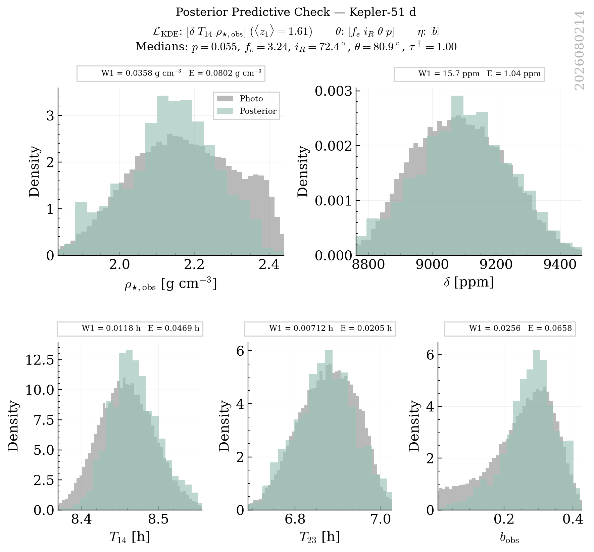
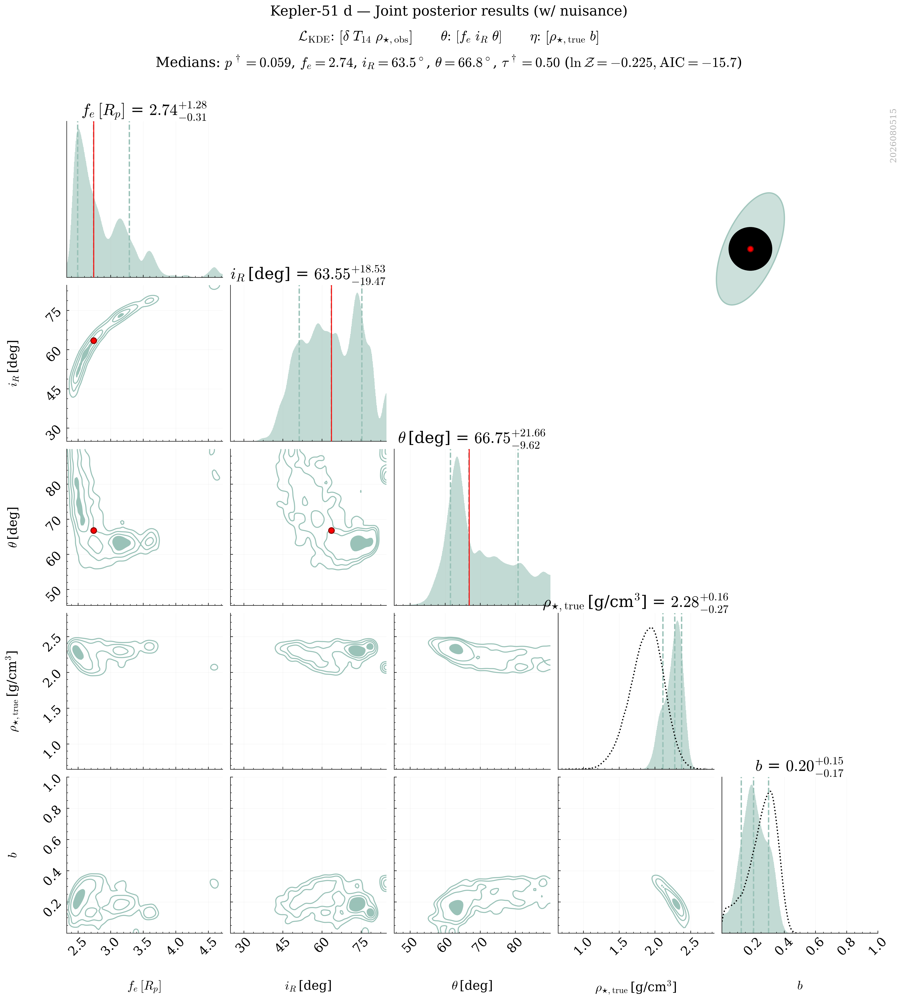
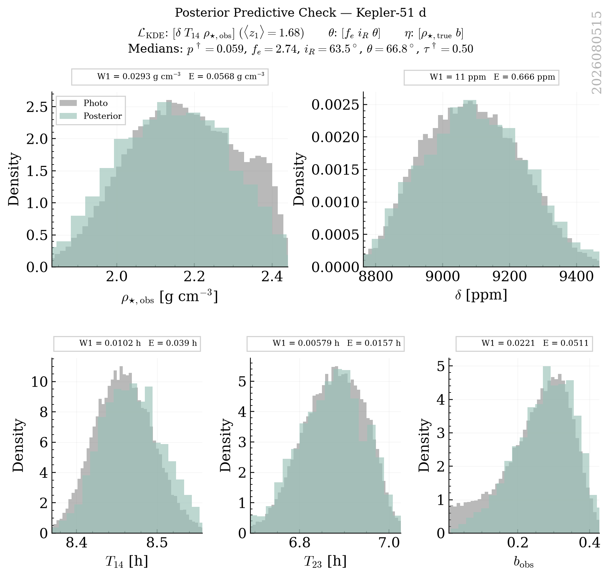
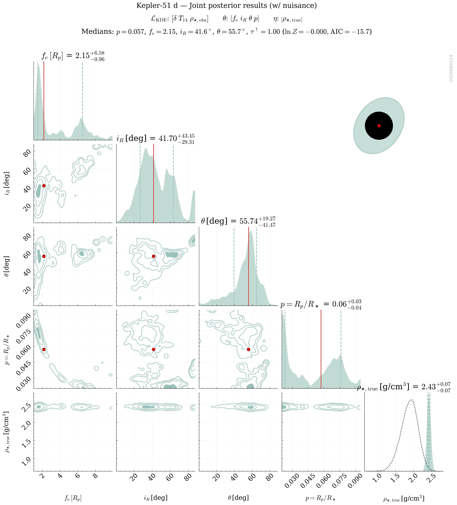
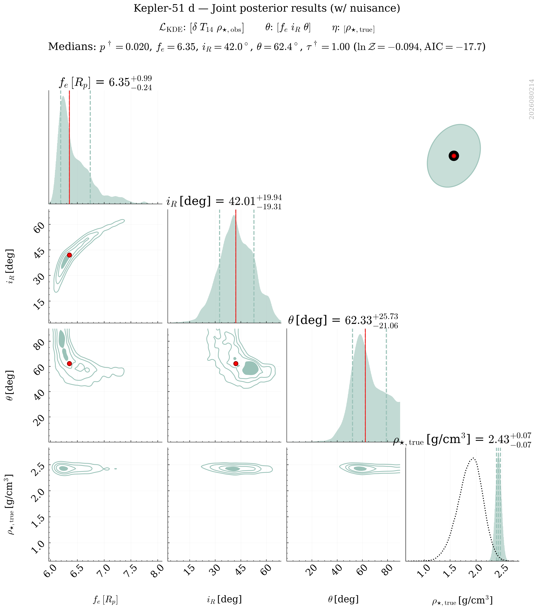
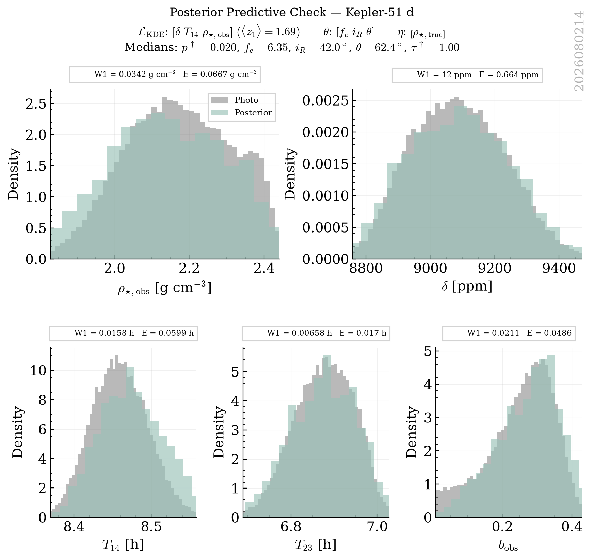
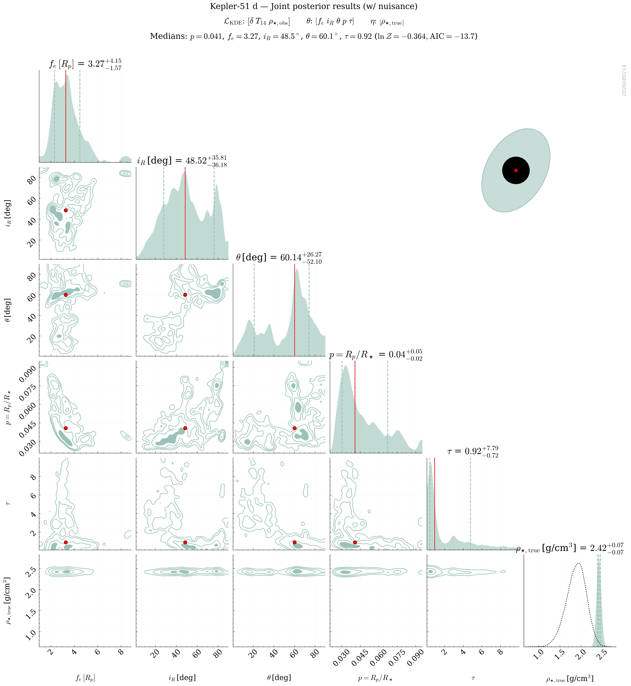
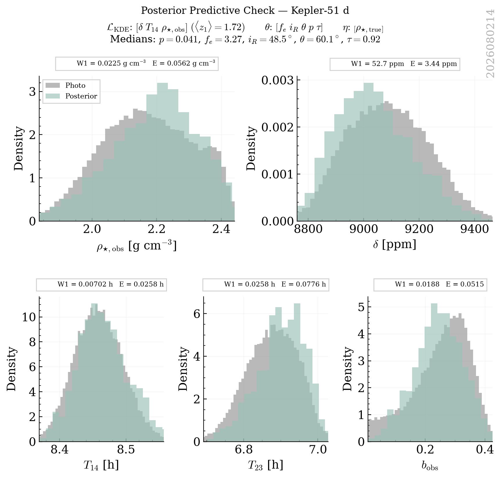

# Kepler_51 D Retrievals Classification Report

This report groups retrievals into strict physical categories based on a Decision Tree logic. Within each category, retrievals are ranked by their Bayesian Evidence ($\ln \mathcal{Z}$).

## Category Summary
- **[Excellent] Golden Sample**: 22 retrievals
- **[Acceptable] Low Bayesian Evidence**: 2 retrievals
- **[Acceptable] Multimodal Angles**: 9 retrievals
- **[Rejected] Unphysical Nuisance**: 4 retrievals
- **[Rejected] Poor Individual Fit**: 1 retrievals
- **[Rejected] Poor Fit**: 16 retrievals

## Detailed Results

### Category: [Excellent] Golden Sample

| Rank | Tag | PPC (z1) | PPC (z_crit) | ln Z | max ln L | AIC | Ring fe (16%) | err(rho_true) | Angle Peaks |
|---|---|---|---|---|---|---|---|---|---|
| 1 | `kepler_51_d_NS_exorings_kde_delta-T14-T23-rho_obs_nlive1200_dlogz0.01_NKDE5000_seed2026_rhoFREE_bFREE_tauFREE_pFREE` | **1.67** | **1.88** | 6.51 | 18.03 | -22.05 | 1.29 | 0.1614 | 1.5 |
| 2 | `kepler_51_d_NS_exorings_kde_delta-T14-T23_nlive1200_dlogz0.01_NKDE5000_seed2026_rhoFREE_bFREE_tauFREE` | **1.90** | **2.30** | 2.30 | 13.46 | -14.92 | 5.21 | 0.1708 | 1.5 |
| 3 | `kepler_51_d_NS_exorings_kde_delta-T14-rho_obs_nlive1200_dlogz0.01_NKDE5000_seed2026_rhoFREE_bFREE_P9_T1` | **1.70** | **1.81** | 2.07 | 12.86 | -15.71 | 1.24 | 0.1792 | 1.0 |
| 4 | `kepler_51_d_NS_exorings_kde_delta-T14-rho_obs_nlive1200_dlogz0.01_NKDE5000_seed2026_rhoFREE_bFREE_P3_T3` | **2.15** | **2.40** | 1.92 | 12.86 | -15.71 | 2.47 | 0.1315 | 1.5 |
| 5 | `kepler_51_d_NS_exorings_kde_delta-T14-T23_nlive1200_dlogz0.01_NKDE5000_seed2026_rhoFREE_bFREE_tauFREE_pFREE` | **2.23** | **2.38** | 1.82 | 13.46 | -12.93 | 1.40 | 0.1484 | 1.5 |
| 6 | `kepler_51_d_NS_exorings_kde_delta-T14-rho_obs_nlive1200_dlogz0.01_NKDE5000_seed2026_rhoFREE_bFREE_P9_T2` | **2.03** | **2.32** | 1.82 | 12.86 | -15.71 | 1.19 | 0.1882 | 1.5 |
| 7 | `kepler_51_d_NS_exorings_kde_delta-T14-rho_obs_nlive1200_dlogz0.01_NKDE5000_seed2026_rhoFREE_bFREE_P9_T3` | **1.78** | **1.87** | 1.80 | 12.86 | -15.71 | 1.16 | 0.1685 | 1.5 |
| 8 | `kepler_51_d_NS_exorings_kde_delta-T14-rho_obs_nlive1200_dlogz0.01_NKDE5000_seed2026_rhoFREE_bFREE_tauFREE_pFREE` | **1.88** | **2.19** | 1.71 | 12.86 | -11.71 | 1.17 | 0.1461 | 1.5 |
| 9 | `kepler_51_d_NS_exorings_kde_delta-T14-rho_obs_nlive1200_dlogz0.01_NKDE5000_seed2026_rhoFREE_bFREE_P8_T1` | **2.16** | **2.66** | 1.65 | 12.86 | -15.71 | 1.70 | 0.1753 | 1.5 |
| 10 | `kepler_51_d_NS_exorings_kde_delta-T14-rho_obs_nlive1200_dlogz0.01_NKDE5000_seed2026_rhoFREE_bFREE_tauFREE` | **1.60** | **1.81** | 1.64 | 12.86 | -13.71 | 5.12 | 0.1677 | 1.5 |
| 11 | `kepler_51_d_NS_exorings_kde_delta-T14-rho_obs_nlive1200_dlogz0.01_NKDE5000_seed2026_rhoFREE_bFREE_P3_T2` | **1.66** | **1.87** | 1.60 | 12.86 | -15.71 | 2.84 | 0.1648 | 1.0 |
| 12 | `kepler_51_d_NS_exorings_kde_delta-T14-rho_obs_nlive1200_dlogz0.01_NKDE5000_seed2026_rhoFREE_bFREE_P1_T2` | **1.66** | **1.89** | 1.35 | 12.86 | -15.71 | 4.75 | 0.1731 | 1.5 |
| 13 | `kepler_51_d_NS_exorings_kde_delta-T14-rho_obs_nlive1200_dlogz0.01_NKDE5000_seed2026_rhoFREE_bFREE_P6_T3` | **1.67** | **1.91** | 1.31 | 12.86 | -15.71 | 1.54 | 0.1423 | 1.5 |
| 14 | `kepler_51_d_NS_exorings_kde_delta-T14-rho_obs_nlive1200_dlogz0.01_NKDE5000_seed2026_rhoFREE_bFREE_P6_T2` | **1.75** | **2.02** | 1.26 | 12.86 | -15.71 | 1.69 | 0.2125 | 1.5 |
| 15 | `kepler_51_d_NS_exorings_kde_delta-T14-rho_obs_nlive1200_dlogz0.01_NKDE5000_seed2026_rhoFREE_bFREE_P4_T2` | **1.65** | **1.80** | 1.16 | 12.86 | -15.71 | 2.38 | 0.1609 | 1.5 |
| 16 | `kepler_51_d_NS_exorings_kde_delta-T14-rho_obs_nlive1200_dlogz0.01_NKDE5000_seed2026_rhoFREE_bFREE_P2_T2` | **1.75** | **2.02** | 1.12 | 12.86 | -15.71 | 3.52 | 0.1622 | 1.5 |
| 17 | `kepler_51_d_NS_exorings_kde_delta-T14-rho_obs_nlive1200_dlogz0.01_NKDE5000_seed2026_rhoFREE_bFREE_P8_T2` | **1.68** | **1.90** | 1.01 | 12.86 | -15.71 | 1.47 | 0.1769 | 1.5 |
| 18 | `kepler_51_d_NS_exorings_kde_delta-T14-rho_obs_nlive1200_dlogz0.01_NKDE5000_seed2026_rhoFREE_bFREE_P1_T3` | **1.60** | **1.77** | 0.98 | 12.86 | -15.71 | 3.79 | 0.1754 | 1.5 |
| 19 | `kepler_51_d_NS_exorings_kde_delta-T14-rho_obs_nlive1200_dlogz0.01_NKDE5000_seed2026_rhoFREE_bFREE_P7_T2` | **1.66** | **1.86** | 0.90 | 12.86 | -15.71 | 1.53 | 0.1257 | 1.0 |
| 20 | `kepler_51_d_NS_exorings_kde_delta-T14-rho_obs_nlive1200_dlogz0.01_NKDE5000_seed2026_rhoFREE_bFREE_P5_T3` | **2.14** | **2.69** | 0.62 | 12.86 | -15.71 | 1.77 | 0.1470 | 1.5 |
| 21 | `kepler_51_d_NS_exorings_kde_delta-T14-rho_obs_nlive1200_dlogz0.01_NKDE5000_seed2026_rhoFREE_bFREE_P7_T3` | **1.67** | **1.83** | 0.41 | 12.86 | -15.71 | 1.32 | 0.1743 | 1.5 |
| 22 | `kepler_51_d_NS_exorings_kde_delta-T14-rho_obs_nlive1200_dlogz0.01_NKDE5000_seed2026_rhoFREE_bFREE_P2_T1` | **1.64** | **1.84** | 0.37 | 12.86 | -15.71 | 4.59 | 0.1104 | 1.5 |

#### kepler_51_d_NS_exorings_kde_delta-T14-T23-rho_obs_nlive1200_dlogz0.01_NKDE5000_seed2026_rhoFREE_bFREE_tauFREE_pFREE
- **PPC (z1)**: 1.67
- **PPC (z_crit)**: 1.88
- **ln Z (Evidence)**: 6.508
- **max ln L**: 18.026
- **AIC**: -22.051
- **PPC (z1 min)**: 2.75
- **Ring fe (16th)**: 1.29
- **err(rho_true)**: 0.1614
- **Angle Peaks**: 1.5
- **Category**: [Excellent] Golden Sample

---

#### kepler_51_d_NS_exorings_kde_delta-T14-T23_nlive1200_dlogz0.01_NKDE5000_seed2026_rhoFREE_bFREE_tauFREE
- **PPC (z1)**: 1.90
- **PPC (z_crit)**: 2.30
- **ln Z (Evidence)**: 2.299
- **max ln L**: 13.462
- **AIC**: -14.924
- **PPC (z1 min)**: 2.63
- **Ring fe (16th)**: 5.21
- **err(rho_true)**: 0.1708
- **Angle Peaks**: 1.5
- **Category**: [Excellent] Golden Sample

---

#### kepler_51_d_NS_exorings_kde_delta-T14-rho_obs_nlive1200_dlogz0.01_NKDE5000_seed2026_rhoFREE_bFREE_P9_T1
- **PPC (z1)**: 1.70
- **PPC (z_crit)**: 1.81
- **ln Z (Evidence)**: 2.065
- **max ln L**: 12.856
- **AIC**: -15.711
- **PPC (z1 min)**: 2.21
- **Ring fe (16th)**: 1.24
- **err(rho_true)**: 0.1792
- **Angle Peaks**: 1.0
- **Category**: [Excellent] Golden Sample

---

#### kepler_51_d_NS_exorings_kde_delta-T14-rho_obs_nlive1200_dlogz0.01_NKDE5000_seed2026_rhoFREE_bFREE_P3_T3
- **PPC (z1)**: 2.15
- **PPC (z_crit)**: 2.40
- **ln Z (Evidence)**: 1.920
- **max ln L**: 12.856
- **AIC**: -15.713
- **PPC (z1 min)**: 2.67
- **Ring fe (16th)**: 2.47
- **err(rho_true)**: 0.1315
- **Angle Peaks**: 1.5
- **Category**: [Excellent] Golden Sample

---

#### kepler_51_d_NS_exorings_kde_delta-T14-T23_nlive1200_dlogz0.01_NKDE5000_seed2026_rhoFREE_bFREE_tauFREE_pFREE
- **PPC (z1)**: 2.23
- **PPC (z_crit)**: 2.38
- **ln Z (Evidence)**: 1.822
- **max ln L**: 13.463
- **AIC**: -12.925
- **PPC (z1 min)**: 2.65
- **Ring fe (16th)**: 1.40
- **err(rho_true)**: 0.1484
- **Angle Peaks**: 1.5
- **Category**: [Excellent] Golden Sample

---

#### kepler_51_d_NS_exorings_kde_delta-T14-rho_obs_nlive1200_dlogz0.01_NKDE5000_seed2026_rhoFREE_bFREE_P9_T2
- **PPC (z1)**: 2.03
- **PPC (z_crit)**: 2.32
- **ln Z (Evidence)**: 1.821
- **max ln L**: 12.856
- **AIC**: -15.712
- **PPC (z1 min)**: 2.46
- **Ring fe (16th)**: 1.19
- **err(rho_true)**: 0.1882
- **Angle Peaks**: 1.5
- **Category**: [Excellent] Golden Sample

---

#### kepler_51_d_NS_exorings_kde_delta-T14-rho_obs_nlive1200_dlogz0.01_NKDE5000_seed2026_rhoFREE_bFREE_P9_T3
- **PPC (z1)**: 1.78
- **PPC (z_crit)**: 1.87
- **ln Z (Evidence)**: 1.805
- **max ln L**: 12.857
- **AIC**: -15.714
- **PPC (z1 min)**: 2.28
- **Ring fe (16th)**: 1.16
- **err(rho_true)**: 0.1685
- **Angle Peaks**: 1.5
- **Category**: [Excellent] Golden Sample

---

#### kepler_51_d_NS_exorings_kde_delta-T14-rho_obs_nlive1200_dlogz0.01_NKDE5000_seed2026_rhoFREE_bFREE_tauFREE_pFREE
- **PPC (z1)**: 1.88
- **PPC (z_crit)**: 2.19
- **ln Z (Evidence)**: 1.711
- **max ln L**: 12.857
- **AIC**: -11.714
- **PPC (z1 min)**: 3.12
- **Ring fe (16th)**: 1.17
- **err(rho_true)**: 0.1461
- **Angle Peaks**: 1.5
- **Category**: [Excellent] Golden Sample

---

#### kepler_51_d_NS_exorings_kde_delta-T14-rho_obs_nlive1200_dlogz0.01_NKDE5000_seed2026_rhoFREE_bFREE_P8_T1
- **PPC (z1)**: 2.16
- **PPC (z_crit)**: 2.66
- **ln Z (Evidence)**: 1.654
- **max ln L**: 12.855
- **AIC**: -15.711
- **PPC (z1 min)**: 3.08
- **Ring fe (16th)**: 1.70
- **err(rho_true)**: 0.1753
- **Angle Peaks**: 1.5
- **Category**: [Excellent] Golden Sample

---

#### kepler_51_d_NS_exorings_kde_delta-T14-rho_obs_nlive1200_dlogz0.01_NKDE5000_seed2026_rhoFREE_bFREE_tauFREE
- **PPC (z1)**: 1.60
- **PPC (z_crit)**: 1.81
- **ln Z (Evidence)**: 1.641
- **max ln L**: 12.857
- **AIC**: -13.713
- **PPC (z1 min)**: 2.67
- **Ring fe (16th)**: 5.12
- **err(rho_true)**: 0.1677
- **Angle Peaks**: 1.5
- **Category**: [Excellent] Golden Sample

---

#### kepler_51_d_NS_exorings_kde_delta-T14-rho_obs_nlive1200_dlogz0.01_NKDE5000_seed2026_rhoFREE_bFREE_P3_T2
- **PPC (z1)**: 1.66
- **PPC (z_crit)**: 1.87
- **ln Z (Evidence)**: 1.596
- **max ln L**: 12.857
- **AIC**: -15.714
- **PPC (z1 min)**: 2.78
- **Ring fe (16th)**: 2.84
- **err(rho_true)**: 0.1648
- **Angle Peaks**: 1.0
- **Category**: [Excellent] Golden Sample

---

#### kepler_51_d_NS_exorings_kde_delta-T14-rho_obs_nlive1200_dlogz0.01_NKDE5000_seed2026_rhoFREE_bFREE_P1_T2
- **PPC (z1)**: 1.66
- **PPC (z_crit)**: 1.89
- **ln Z (Evidence)**: 1.345
- **max ln L**: 12.857
- **AIC**: -15.713
- **PPC (z1 min)**: 2.83
- **Ring fe (16th)**: 4.75
- **err(rho_true)**: 0.1731
- **Angle Peaks**: 1.5
- **Category**: [Excellent] Golden Sample

---

#### kepler_51_d_NS_exorings_kde_delta-T14-rho_obs_nlive1200_dlogz0.01_NKDE5000_seed2026_rhoFREE_bFREE_P6_T3
- **PPC (z1)**: 1.67
- **PPC (z_crit)**: 1.91
- **ln Z (Evidence)**: 1.307
- **max ln L**: 12.856
- **AIC**: -15.712
- **PPC (z1 min)**: 2.69
- **Ring fe (16th)**: 1.54
- **err(rho_true)**: 0.1423
- **Angle Peaks**: 1.5
- **Category**: [Excellent] Golden Sample

---

#### kepler_51_d_NS_exorings_kde_delta-T14-rho_obs_nlive1200_dlogz0.01_NKDE5000_seed2026_rhoFREE_bFREE_P6_T2
- **PPC (z1)**: 1.75
- **PPC (z_crit)**: 2.02
- **ln Z (Evidence)**: 1.256
- **max ln L**: 12.857
- **AIC**: -15.714
- **PPC (z1 min)**: 2.90
- **Ring fe (16th)**: 1.69
- **err(rho_true)**: 0.2125
- **Angle Peaks**: 1.5
- **Category**: [Excellent] Golden Sample

---

#### kepler_51_d_NS_exorings_kde_delta-T14-rho_obs_nlive1200_dlogz0.01_NKDE5000_seed2026_rhoFREE_bFREE_P4_T2
- **PPC (z1)**: 1.65
- **PPC (z_crit)**: 1.80
- **ln Z (Evidence)**: 1.161
- **max ln L**: 12.857
- **AIC**: -15.714
- **PPC (z1 min)**: 2.71
- **Ring fe (16th)**: 2.38
- **err(rho_true)**: 0.1609
- **Angle Peaks**: 1.5
- **Category**: [Excellent] Golden Sample

---

#### kepler_51_d_NS_exorings_kde_delta-T14-rho_obs_nlive1200_dlogz0.01_NKDE5000_seed2026_rhoFREE_bFREE_P2_T2
- **PPC (z1)**: 1.75
- **PPC (z_crit)**: 2.02
- **ln Z (Evidence)**: 1.118
- **max ln L**: 12.856
- **AIC**: -15.712
- **PPC (z1 min)**: 2.89
- **Ring fe (16th)**: 3.52
- **err(rho_true)**: 0.1622
- **Angle Peaks**: 1.5
- **Category**: [Excellent] Golden Sample

---

#### kepler_51_d_NS_exorings_kde_delta-T14-rho_obs_nlive1200_dlogz0.01_NKDE5000_seed2026_rhoFREE_bFREE_P8_T2
- **PPC (z1)**: 1.68
- **PPC (z_crit)**: 1.90
- **ln Z (Evidence)**: 1.013
- **max ln L**: 12.856
- **AIC**: -15.711
- **PPC (z1 min)**: 2.82
- **Ring fe (16th)**: 1.47
- **err(rho_true)**: 0.1769
- **Angle Peaks**: 1.5
- **Category**: [Excellent] Golden Sample

---

#### kepler_51_d_NS_exorings_kde_delta-T14-rho_obs_nlive1200_dlogz0.01_NKDE5000_seed2026_rhoFREE_bFREE_P1_T3
- **PPC (z1)**: 1.60
- **PPC (z_crit)**: 1.77
- **ln Z (Evidence)**: 0.984
- **max ln L**: 12.856
- **AIC**: -15.711
- **PPC (z1 min)**: 2.71
- **Ring fe (16th)**: 3.79
- **err(rho_true)**: 0.1754
- **Angle Peaks**: 1.5
- **Category**: [Excellent] Golden Sample

---

#### kepler_51_d_NS_exorings_kde_delta-T14-rho_obs_nlive1200_dlogz0.01_NKDE5000_seed2026_rhoFREE_bFREE_P7_T2
- **PPC (z1)**: 1.66
- **PPC (z_crit)**: 1.86
- **ln Z (Evidence)**: 0.898
- **max ln L**: 12.856
- **AIC**: -15.712
- **PPC (z1 min)**: 2.77
- **Ring fe (16th)**: 1.53
- **err(rho_true)**: 0.1257
- **Angle Peaks**: 1.0
- **Category**: [Excellent] Golden Sample

---

#### kepler_51_d_NS_exorings_kde_delta-T14-rho_obs_nlive1200_dlogz0.01_NKDE5000_seed2026_rhoFREE_bFREE_P5_T3
- **PPC (z1)**: 2.14
- **PPC (z_crit)**: 2.69
- **ln Z (Evidence)**: 0.624
- **max ln L**: 12.857
- **AIC**: -15.713
- **PPC (z1 min)**: 2.89
- **Ring fe (16th)**: 1.77
- **err(rho_true)**: 0.1470
- **Angle Peaks**: 1.5
- **Category**: [Excellent] Golden Sample

---

#### kepler_51_d_NS_exorings_kde_delta-T14-rho_obs_nlive1200_dlogz0.01_NKDE5000_seed2026_rhoFREE_bFREE_P7_T3
- **PPC (z1)**: 1.67
- **PPC (z_crit)**: 1.83
- **ln Z (Evidence)**: 0.414
- **max ln L**: 12.855
- **AIC**: -15.711
- **PPC (z1 min)**: 2.29
- **Ring fe (16th)**: 1.32
- **err(rho_true)**: 0.1743
- **Angle Peaks**: 1.5
- **Category**: [Excellent] Golden Sample

---

#### kepler_51_d_NS_exorings_kde_delta-T14-rho_obs_nlive1200_dlogz0.01_NKDE5000_seed2026_rhoFREE_bFREE_P2_T1
- **PPC (z1)**: 1.64
- **PPC (z_crit)**: 1.84
- **ln Z (Evidence)**: 0.368
- **max ln L**: 12.857
- **AIC**: -15.713
- **PPC (z1 min)**: 2.71
- **Ring fe (16th)**: 4.59
- **err(rho_true)**: 0.1104
- **Angle Peaks**: 1.5
- **Category**: [Excellent] Golden Sample

---

### Category: [Acceptable] Low Bayesian Evidence

| Rank | Tag | PPC (z1) | PPC (z_crit) | ln Z | max ln L | AIC | Ring fe (16%) | err(rho_true) | Angle Peaks |
|---|---|---|---|---|---|---|---|---|---|
| 23 | `kepler_51_d_NS_exorings_kde_delta-T14-rho_obs_nlive1200_dlogz0.01_NKDE5000_seed2026_bFREE_pFREE` | **1.61** | **1.78** | -0.04 | 12.86 | -15.71 | 2.42 | N/A | 1.5 |
| 24 | `kepler_51_d_NS_exorings_kde_delta-T14-rho_obs_nlive1200_dlogz0.01_NKDE5000_seed2026_rhoFREE_bFREE_P5_T1` | **1.68** | **1.87** | -0.23 | 12.86 | -15.71 | 2.49 | 0.2092 | 1.5 |

#### kepler_51_d_NS_exorings_kde_delta-T14-rho_obs_nlive1200_dlogz0.01_NKDE5000_seed2026_bFREE_pFREE
- **PPC (z1)**: 1.61
- **PPC (z_crit)**: 1.78
- **ln Z (Evidence)**: -0.039
- **max ln L**: 12.857
- **AIC**: -15.714
- **PPC (z1 min)**: 2.76
- **Ring fe (16th)**: 2.42
- **err(rho_true)**: N/A
- **Angle Peaks**: 1.5
- **Category**: [Acceptable] Low Bayesian Evidence

---

#### kepler_51_d_NS_exorings_kde_delta-T14-rho_obs_nlive1200_dlogz0.01_NKDE5000_seed2026_rhoFREE_bFREE_P5_T1
- **PPC (z1)**: 1.68
- **PPC (z_crit)**: 1.87
- **ln Z (Evidence)**: -0.225
- **max ln L**: 12.857
- **AIC**: -15.714
- **PPC (z1 min)**: 2.92
- **Ring fe (16th)**: 2.49
- **err(rho_true)**: 0.2092
- **Angle Peaks**: 1.5
- **Category**: [Acceptable] Low Bayesian Evidence

---

### Category: [Acceptable] Multimodal Angles

| Rank | Tag | PPC (z1) | PPC (z_crit) | ln Z | max ln L | AIC | Ring fe (16%) | err(rho_true) | Angle Peaks |
|---|---|---|---|---|---|---|---|---|---|
| 25 | `kepler_51_d_NS_exorings_kde_delta-T14-T23_nlive1200_dlogz0.01_NKDE5000_seed2026_rhoFREE_bFREE_pFREE` | **1.65** | **1.86** | 2.01 | 13.46 | -14.93 | 1.07 | 0.1298 | 2.0 |
| 26 | `kepler_51_d_NS_exorings_kde_delta-T14-rho_obs_nlive1200_dlogz0.01_NKDE5000_seed2026_rhoFREE_bFREE_pFREE` | **1.75** | **2.01** | 1.93 | 12.86 | -13.71 | 1.06 | 0.1483 | 2.0 |
| 27 | `kepler_51_d_NS_exorings_kde_delta-T14-T23_nlive1200_dlogz0.01_NKDE5000_seed2026_rhoFREE_bFREE` | **1.65** | **1.88** | 1.62 | 13.46 | -16.93 | 6.29 | 0.1912 | 2.5 |
| 28 | `kepler_51_d_NS_exorings_kde_delta-T14-rho_obs_nlive1200_dlogz0.01_NKDE5000_seed2026_rhoFREE_bFREE_P8_T3` | **1.89** | **2.21** | 1.30 | 12.86 | -15.71 | 1.37 | 0.1996 | 2.0 |
| 29 | `kepler_51_d_NS_exorings_kde_delta-T14-rho_obs_nlive1200_dlogz0.01_NKDE5000_seed2026_rhoFREE_bFREE_P4_T3` | **1.65** | **1.84** | 1.22 | 12.86 | -15.71 | 2.03 | 0.1806 | 2.0 |
| 30 | `kepler_51_d_NS_exorings_kde_delta-T14-rho_obs_nlive1200_dlogz0.01_NKDE5000_seed2026_rhoFREE_bFREE_P2_T3` | **1.75** | **2.02** | 0.70 | 12.86 | -15.71 | 2.97 | 0.1602 | 2.0 |
| 31 | `kepler_51_d_NS_exorings_kde_delta-T14-rho_obs_nlive1200_dlogz0.01_NKDE5000_seed2026_rhoFREE_bFREE_P3_T1` | **1.57** | **1.76** | 0.65 | 12.86 | -15.71 | 3.63 | 0.1434 | 2.0 |
| 32 | `kepler_51_d_NS_exorings_kde_delta-T14-rho_obs_nlive1200_dlogz0.01_NKDE5000_seed2026_rhoFREE_bFREE_P6_T1` | **1.83** | **2.13** | 0.61 | 12.86 | -15.71 | 2.12 | 0.1645 | 2.0 |
| 33 | `kepler_51_d_NS_exorings_kde_delta-T14-rho_obs_nlive1200_dlogz0.01_NKDE5000_seed2026_rhoFREE_bFREE_P7_T1` | **1.61** | **1.78** | 0.27 | 12.86 | -15.71 | 1.82 | 0.1471 | 2.0 |

#### kepler_51_d_NS_exorings_kde_delta-T14-T23_nlive1200_dlogz0.01_NKDE5000_seed2026_rhoFREE_bFREE_pFREE
- **PPC (z1)**: 1.65
- **PPC (z_crit)**: 1.86
- **ln Z (Evidence)**: 2.009
- **max ln L**: 13.463
- **AIC**: -14.926
- **PPC (z1 min)**: 2.89
- **Ring fe (16th)**: 1.07
- **err(rho_true)**: 0.1298
- **Angle Peaks**: 2.0
- **Category**: [Acceptable] Multimodal Angles

---

#### kepler_51_d_NS_exorings_kde_delta-T14-rho_obs_nlive1200_dlogz0.01_NKDE5000_seed2026_rhoFREE_bFREE_pFREE
- **PPC (z1)**: 1.75
- **PPC (z_crit)**: 2.01
- **ln Z (Evidence)**: 1.928
- **max ln L**: 12.857
- **AIC**: -13.713
- **PPC (z1 min)**: 2.98
- **Ring fe (16th)**: 1.06
- **err(rho_true)**: 0.1483
- **Angle Peaks**: 2.0
- **Category**: [Acceptable] Multimodal Angles

---

#### kepler_51_d_NS_exorings_kde_delta-T14-T23_nlive1200_dlogz0.01_NKDE5000_seed2026_rhoFREE_bFREE
- **PPC (z1)**: 1.65
- **PPC (z_crit)**: 1.88
- **ln Z (Evidence)**: 1.624
- **max ln L**: 13.463
- **AIC**: -16.926
- **PPC (z1 min)**: 2.76
- **Ring fe (16th)**: 6.29
- **err(rho_true)**: 0.1912
- **Angle Peaks**: 2.5
- **Category**: [Acceptable] Multimodal Angles

---

#### kepler_51_d_NS_exorings_kde_delta-T14-rho_obs_nlive1200_dlogz0.01_NKDE5000_seed2026_rhoFREE_bFREE_P8_T3
- **PPC (z1)**: 1.89
- **PPC (z_crit)**: 2.21
- **ln Z (Evidence)**: 1.298
- **max ln L**: 12.857
- **AIC**: -15.714
- **PPC (z1 min)**: 2.47
- **Ring fe (16th)**: 1.37
- **err(rho_true)**: 0.1996
- **Angle Peaks**: 2.0
- **Category**: [Acceptable] Multimodal Angles

---

#### kepler_51_d_NS_exorings_kde_delta-T14-rho_obs_nlive1200_dlogz0.01_NKDE5000_seed2026_rhoFREE_bFREE_P4_T3
- **PPC (z1)**: 1.65
- **PPC (z_crit)**: 1.84
- **ln Z (Evidence)**: 1.221
- **max ln L**: 12.856
- **AIC**: -15.712
- **PPC (z1 min)**: 2.91
- **Ring fe (16th)**: 2.03
- **err(rho_true)**: 0.1806
- **Angle Peaks**: 2.0
- **Category**: [Acceptable] Multimodal Angles

---

#### kepler_51_d_NS_exorings_kde_delta-T14-rho_obs_nlive1200_dlogz0.01_NKDE5000_seed2026_rhoFREE_bFREE_P2_T3
- **PPC (z1)**: 1.75
- **PPC (z_crit)**: 2.02
- **ln Z (Evidence)**: 0.695
- **max ln L**: 12.857
- **AIC**: -15.714
- **PPC (z1 min)**: 2.96
- **Ring fe (16th)**: 2.97
- **err(rho_true)**: 0.1602
- **Angle Peaks**: 2.0
- **Category**: [Acceptable] Multimodal Angles

---

#### kepler_51_d_NS_exorings_kde_delta-T14-rho_obs_nlive1200_dlogz0.01_NKDE5000_seed2026_rhoFREE_bFREE_P3_T1
- **PPC (z1)**: 1.57
- **PPC (z_crit)**: 1.76
- **ln Z (Evidence)**: 0.652
- **max ln L**: 12.856
- **AIC**: -15.713
- **PPC (z1 min)**: 2.70
- **Ring fe (16th)**: 3.63
- **err(rho_true)**: 0.1434
- **Angle Peaks**: 2.0
- **Category**: [Acceptable] Multimodal Angles

---

#### kepler_51_d_NS_exorings_kde_delta-T14-rho_obs_nlive1200_dlogz0.01_NKDE5000_seed2026_rhoFREE_bFREE_P6_T1
- **PPC (z1)**: 1.83
- **PPC (z_crit)**: 2.13
- **ln Z (Evidence)**: 0.607
- **max ln L**: 12.857
- **AIC**: -15.713
- **PPC (z1 min)**: 2.99
- **Ring fe (16th)**: 2.12
- **err(rho_true)**: 0.1645
- **Angle Peaks**: 2.0
- **Category**: [Acceptable] Multimodal Angles

---

#### kepler_51_d_NS_exorings_kde_delta-T14-rho_obs_nlive1200_dlogz0.01_NKDE5000_seed2026_rhoFREE_bFREE_P7_T1
- **PPC (z1)**: 1.61
- **PPC (z_crit)**: 1.78
- **ln Z (Evidence)**: 0.267
- **max ln L**: 12.857
- **AIC**: -15.714
- **PPC (z1 min)**: 2.68
- **Ring fe (16th)**: 1.82
- **err(rho_true)**: 0.1471
- **Angle Peaks**: 2.0
- **Category**: [Acceptable] Multimodal Angles

---

### Category: [Rejected] Unphysical Nuisance

| Rank | Tag | PPC (z1) | PPC (z_crit) | ln Z | max ln L | AIC | Ring fe (16%) | err(rho_true) | Angle Peaks |
|---|---|---|---|---|---|---|---|---|---|
| 34 | `kepler_51_d_NS_exorings_kde_delta-T14-T23_nlive1200_dlogz0.01_NKDE5000_seed2026_rhoFREE` | **1.97** | **2.32** | 0.78 | 13.46 | -18.92 | 6.22 | 0.2871 | 1.5 |
| 35 | `kepler_51_d_NS_exorings_kde_delta-T14-rho_obs_nlive1200_dlogz0.01_NKDE5000_seed2026_rhoFREE_pFREE` | **1.94** | **2.13** | -0.00 | 12.86 | -15.71 | 1.47 | 0.2880 | 1.5 |
| 36 | `kepler_51_d_NS_exorings_kde_delta-T14-rho_obs_nlive1200_dlogz0.01_NKDE5000_seed2026_rhoFREE` | **1.69** | **1.80** | -0.09 | 12.86 | -17.71 | 6.19 | 0.2893 | 1.0 |
| 37 | `kepler_51_d_NS_exorings_kde_delta-T14-rho_obs_nlive1200_dlogz0.01_NKDE5000_seed2026_rhoFREE_tauFREE_pFREE` | **1.72** | **1.99** | -0.36 | 12.86 | -13.71 | 2.30 | 0.2838 | 2.0 |

#### kepler_51_d_NS_exorings_kde_delta-T14-T23_nlive1200_dlogz0.01_NKDE5000_seed2026_rhoFREE
- **PPC (z1)**: 1.97
- **PPC (z_crit)**: 2.32
- **ln Z (Evidence)**: 0.777
- **max ln L**: 13.462
- **AIC**: -18.923
- **PPC (z1 min)**: 2.56
- **Ring fe (16th)**: 6.22
- **err(rho_true)**: 0.2871
- **Angle Peaks**: 1.5
- **Category**: [Rejected] Unphysical Nuisance

---

#### kepler_51_d_NS_exorings_kde_delta-T14-rho_obs_nlive1200_dlogz0.01_NKDE5000_seed2026_rhoFREE_pFREE
- **PPC (z1)**: 1.94
- **PPC (z_crit)**: 2.13
- **ln Z (Evidence)**: -0.000
- **max ln L**: 12.856
- **AIC**: -15.713
- **PPC (z1 min)**: 2.69
- **Ring fe (16th)**: 1.47
- **err(rho_true)**: 0.2880
- **Angle Peaks**: 1.5
- **Category**: [Rejected] Unphysical Nuisance

---

#### kepler_51_d_NS_exorings_kde_delta-T14-rho_obs_nlive1200_dlogz0.01_NKDE5000_seed2026_rhoFREE
- **PPC (z1)**: 1.69
- **PPC (z_crit)**: 1.80
- **ln Z (Evidence)**: -0.094
- **max ln L**: 12.857
- **AIC**: -17.714
- **PPC (z1 min)**: 2.73
- **Ring fe (16th)**: 6.19
- **err(rho_true)**: 0.2893
- **Angle Peaks**: 1.0
- **Category**: [Rejected] Unphysical Nuisance

---

#### kepler_51_d_NS_exorings_kde_delta-T14-rho_obs_nlive1200_dlogz0.01_NKDE5000_seed2026_rhoFREE_tauFREE_pFREE
- **PPC (z1)**: 1.72
- **PPC (z_crit)**: 1.99
- **ln Z (Evidence)**: -0.364
- **max ln L**: 12.857
- **AIC**: -13.714
- **PPC (z1 min)**: 2.24
- **Ring fe (16th)**: 2.30
- **err(rho_true)**: 0.2838
- **Angle Peaks**: 2.0
- **Category**: [Rejected] Unphysical Nuisance

---

### Category: [Rejected] Poor Individual Fit

| Rank | Tag | PPC (z1) | PPC (z_crit) | ln Z | max ln L | AIC | Ring fe (16%) | err(rho_true) | Angle Peaks |
|---|---|---|---|---|---|---|---|---|---|
| 38 | `kepler_51_d_NS_exorings_kde_delta-rho_obs_nlive1200_dlogz0.01_NKDE5000_seed2026_rhoFREE_bFREE_tauFREE` | **1.30** | **1.73** | 2.24 | 9.36 | -6.73 | 5.16 | 0.0673 | 1.0 |

#### kepler_51_d_NS_exorings_kde_delta-rho_obs_nlive1200_dlogz0.01_NKDE5000_seed2026_rhoFREE_bFREE_tauFREE
- **PPC (z1)**: 1.30
- **PPC (z_crit)**: 1.73
- **ln Z (Evidence)**: 2.244
- **max ln L**: 9.364
- **AIC**: -6.728
- **PPC (z1 min)**: 1.19
- **Ring fe (16th)**: 5.16
- **err(rho_true)**: 0.0673
- **Angle Peaks**: 1.0
- **Category**: [Rejected] Poor Individual Fit

---

### Category: [Rejected] Poor Fit

| Rank | Tag | PPC (z1) | PPC (z_crit) | ln Z | max ln L | AIC | Ring fe (16%) | err(rho_true) | Angle Peaks |
|---|---|---|---|---|---|---|---|---|---|
| 39 | `kepler_51_d_NS_exorings_kde_delta-rho_obs_nlive1200_dlogz0.01_NKDE5000_seed2026_rhoFREE_bFREE_tauFREE_pFREE` | **1.19** | **1.71** | 2.33 | 9.36 | -4.73 | 1.19 | 0.0810 | 1.0 |
| 40 | `kepler_51_d_NS_exorings_kde_delta-rho_obs_nlive1200_dlogz0.01_NKDE5000_seed2026_bFREE` | **1.20** | **2.02** | 2.28 | 9.36 | -10.73 | 6.75 | N/A | 1.5 |
| 41 | `kepler_51_d_NS_exorings_kde_delta-rho_obs_nlive1200_dlogz0.01_NKDE5000_seed2026_bFREE_tauFREE_pFREE` | **1.00** | **1.44** | 2.19 | 9.36 | -6.73 | 1.27 | N/A | 1.0 |
| 42 | `kepler_51_d_NS_exorings_kde_delta-rho_obs_nlive1200_dlogz0.01_NKDE5000_seed2026_rhoFREE` | **1.10** | **1.78** | 2.04 | 9.36 | -10.73 | 6.50 | 0.0535 | 1.0 |
| 43 | `kepler_51_d_NS_exorings_kde_delta-rho_obs_nlive1200_dlogz0.01_NKDE5000_seed2026_rhoFREE_bFREE` | **1.30** | **1.80** | 2.03 | 9.36 | -8.73 | 6.58 | 0.0305 | 1.0 |
| 44 | `kepler_51_d_NS_exorings_kde_delta-rho_obs_nlive1200_dlogz0.01_NKDE5000_seed2026_tauFREE` | **0.82** | **1.70** | 2.03 | 9.36 | -10.73 | 5.31 | N/A | 1.0 |
| 45 | `kepler_51_d_NS_exorings_kde_delta-rho_obs_nlive1200_dlogz0.01_NKDE5000_seed2026_pFREE` | **0.79** | **1.51** | 2.02 | 9.36 | -10.73 | 1.37 | N/A | 1.5 |
| 46 | `kepler_51_d_NS_exorings_kde_delta-rho_obs_nlive1200_dlogz0.01_NKDE5000_seed2026_rhoFREE_tauFREE_pFREE` | **0.97** | **1.72** | 1.99 | 9.36 | -6.73 | 1.21 | 0.0295 | 1.0 |
| 47 | `kepler_51_d_NS_exorings_kde_delta-rho_obs_nlive1200_dlogz0.01_NKDE5000_seed2026_bFREE_tauFREE` | **1.18** | **1.76** | 1.94 | 9.36 | -8.73 | 5.35 | N/A | 1.0 |
| 48 | `kepler_51_d_NS_exorings_kde_delta-rho_obs_nlive1200_dlogz0.01_NKDE5000_seed2026_rhoFREE_tauFREE` | **1.04** | **1.76** | 1.91 | 9.36 | -8.73 | 5.29 | 0.0532 | 1.0 |
| 49 | `kepler_51_d_NS_exorings_kde_delta-rho_obs_nlive1200_dlogz0.01_NKDE5000_seed2026` | **0.83** | **1.76** | 1.85 | 9.36 | -12.73 | 6.63 | N/A | 1.5 |
| 50 | `kepler_51_d_NS_exorings_kde_delta-rho_obs_nlive1200_dlogz0.01_NKDE5000_seed2026_tauFREE_pFREE` | **0.77** | **1.43** | 1.79 | 9.36 | -8.73 | 1.33 | N/A | 1.0 |
| 51 | `kepler_51_d_NS_exorings_kde_delta-rho_obs_nlive1200_dlogz0.01_NKDE5000_seed2026_rhoFREE_pFREE` | **1.03** | **1.66** | 1.75 | 9.36 | -8.73 | 1.22 | 0.0455 | 1.5 |
| 52 | `kepler_51_d_NS_exorings_kde_delta-rho_obs_nlive1200_dlogz0.01_NKDE5000_seed2026_bFREE_pFREE` | **1.04** | **1.51** | 1.73 | 9.36 | -8.73 | 1.38 | N/A | 1.5 |
| 53 | `kepler_51_d_NS_exorings_kde_delta-T14-T23_nlive1200_dlogz0.01_NKDE5000_seed2026_bFREE_tauFREE_pFREE` | **1.29** | **1.39** | 0.19 | 13.46 | -14.92 | 1.37 | N/A | 1.0 |
| 54 | `kepler_51_d_NS_exorings_kde_delta-T14-rho_obs_nlive1200_dlogz0.01_NKDE5000_seed2026_bFREE_tauFREE_pFREE` | **1.17** | **1.26** | 0.03 | 12.86 | -13.71 | 1.56 | N/A | 1.0 |

#### kepler_51_d_NS_exorings_kde_delta-rho_obs_nlive1200_dlogz0.01_NKDE5000_seed2026_rhoFREE_bFREE_tauFREE_pFREE
- **PPC (z1)**: 1.19
- **PPC (z_crit)**: 1.71
- **ln Z (Evidence)**: 2.331
- **max ln L**: 9.364
- **AIC**: -4.728
- **PPC (z1 min)**: 1.20
- **Ring fe (16th)**: 1.19
- **err(rho_true)**: 0.0810
- **Angle Peaks**: 1.0
- **Category**: [Rejected] Poor Fit

---

#### kepler_51_d_NS_exorings_kde_delta-rho_obs_nlive1200_dlogz0.01_NKDE5000_seed2026_bFREE
- **PPC (z1)**: 1.20
- **PPC (z_crit)**: 2.02
- **ln Z (Evidence)**: 2.285
- **max ln L**: 9.364
- **AIC**: -10.728
- **PPC (z1 min)**: 1.10
- **Ring fe (16th)**: 6.75
- **err(rho_true)**: N/A
- **Angle Peaks**: 1.5
- **Category**: [Rejected] Poor Fit

---

#### kepler_51_d_NS_exorings_kde_delta-rho_obs_nlive1200_dlogz0.01_NKDE5000_seed2026_bFREE_tauFREE_pFREE
- **PPC (z1)**: 1.00
- **PPC (z_crit)**: 1.44
- **ln Z (Evidence)**: 2.192
- **max ln L**: 9.364
- **AIC**: -6.728
- **PPC (z1 min)**: 1.07
- **Ring fe (16th)**: 1.27
- **err(rho_true)**: N/A
- **Angle Peaks**: 1.0
- **Category**: [Rejected] Poor Fit

---

#### kepler_51_d_NS_exorings_kde_delta-rho_obs_nlive1200_dlogz0.01_NKDE5000_seed2026_rhoFREE
- **PPC (z1)**: 1.10
- **PPC (z_crit)**: 1.78
- **ln Z (Evidence)**: 2.038
- **max ln L**: 9.364
- **AIC**: -10.728
- **PPC (z1 min)**: 1.03
- **Ring fe (16th)**: 6.50
- **err(rho_true)**: 0.0535
- **Angle Peaks**: 1.0
- **Category**: [Rejected] Poor Fit

---

#### kepler_51_d_NS_exorings_kde_delta-rho_obs_nlive1200_dlogz0.01_NKDE5000_seed2026_rhoFREE_bFREE
- **PPC (z1)**: 1.30
- **PPC (z_crit)**: 1.80
- **ln Z (Evidence)**: 2.029
- **max ln L**: 9.364
- **AIC**: -8.728
- **PPC (z1 min)**: 1.12
- **Ring fe (16th)**: 6.58
- **err(rho_true)**: 0.0305
- **Angle Peaks**: 1.0
- **Category**: [Rejected] Poor Fit

---

#### kepler_51_d_NS_exorings_kde_delta-rho_obs_nlive1200_dlogz0.01_NKDE5000_seed2026_tauFREE
- **PPC (z1)**: 0.82
- **PPC (z_crit)**: 1.70
- **ln Z (Evidence)**: 2.025
- **max ln L**: 9.364
- **AIC**: -10.728
- **PPC (z1 min)**: 0.97
- **Ring fe (16th)**: 5.31
- **err(rho_true)**: N/A
- **Angle Peaks**: 1.0
- **Category**: [Rejected] Poor Fit

---

#### kepler_51_d_NS_exorings_kde_delta-rho_obs_nlive1200_dlogz0.01_NKDE5000_seed2026_pFREE
- **PPC (z1)**: 0.79
- **PPC (z_crit)**: 1.51
- **ln Z (Evidence)**: 2.024
- **max ln L**: 9.364
- **AIC**: -10.728
- **PPC (z1 min)**: 0.97
- **Ring fe (16th)**: 1.37
- **err(rho_true)**: N/A
- **Angle Peaks**: 1.5
- **Category**: [Rejected] Poor Fit

---

#### kepler_51_d_NS_exorings_kde_delta-rho_obs_nlive1200_dlogz0.01_NKDE5000_seed2026_rhoFREE_tauFREE_pFREE
- **PPC (z1)**: 0.97
- **PPC (z_crit)**: 1.72
- **ln Z (Evidence)**: 1.988
- **max ln L**: 9.364
- **AIC**: -6.728
- **PPC (z1 min)**: 1.00
- **Ring fe (16th)**: 1.21
- **err(rho_true)**: 0.0295
- **Angle Peaks**: 1.0
- **Category**: [Rejected] Poor Fit

---

#### kepler_51_d_NS_exorings_kde_delta-rho_obs_nlive1200_dlogz0.01_NKDE5000_seed2026_bFREE_tauFREE
- **PPC (z1)**: 1.18
- **PPC (z_crit)**: 1.76
- **ln Z (Evidence)**: 1.941
- **max ln L**: 9.364
- **AIC**: -8.728
- **PPC (z1 min)**: 1.10
- **Ring fe (16th)**: 5.35
- **err(rho_true)**: N/A
- **Angle Peaks**: 1.0
- **Category**: [Rejected] Poor Fit

---

#### kepler_51_d_NS_exorings_kde_delta-rho_obs_nlive1200_dlogz0.01_NKDE5000_seed2026_rhoFREE_tauFREE
- **PPC (z1)**: 1.04
- **PPC (z_crit)**: 1.76
- **ln Z (Evidence)**: 1.906
- **max ln L**: 9.364
- **AIC**: -8.728
- **PPC (z1 min)**: 1.04
- **Ring fe (16th)**: 5.29
- **err(rho_true)**: 0.0532
- **Angle Peaks**: 1.0
- **Category**: [Rejected] Poor Fit

---

#### kepler_51_d_NS_exorings_kde_delta-rho_obs_nlive1200_dlogz0.01_NKDE5000_seed2026
- **PPC (z1)**: 0.83
- **PPC (z_crit)**: 1.76
- **ln Z (Evidence)**: 1.849
- **max ln L**: 9.364
- **AIC**: -12.728
- **PPC (z1 min)**: 0.97
- **Ring fe (16th)**: 6.63
- **err(rho_true)**: N/A
- **Angle Peaks**: 1.5
- **Category**: [Rejected] Poor Fit

---

#### kepler_51_d_NS_exorings_kde_delta-rho_obs_nlive1200_dlogz0.01_NKDE5000_seed2026_tauFREE_pFREE
- **PPC (z1)**: 0.77
- **PPC (z_crit)**: 1.43
- **ln Z (Evidence)**: 1.786
- **max ln L**: 9.364
- **AIC**: -8.728
- **PPC (z1 min)**: 0.97
- **Ring fe (16th)**: 1.33
- **err(rho_true)**: N/A
- **Angle Peaks**: 1.0
- **Category**: [Rejected] Poor Fit

---

#### kepler_51_d_NS_exorings_kde_delta-rho_obs_nlive1200_dlogz0.01_NKDE5000_seed2026_rhoFREE_pFREE
- **PPC (z1)**: 1.03
- **PPC (z_crit)**: 1.66
- **ln Z (Evidence)**: 1.754
- **max ln L**: 9.364
- **AIC**: -8.728
- **PPC (z1 min)**: 1.04
- **Ring fe (16th)**: 1.22
- **err(rho_true)**: 0.0455
- **Angle Peaks**: 1.5
- **Category**: [Rejected] Poor Fit

---

#### kepler_51_d_NS_exorings_kde_delta-rho_obs_nlive1200_dlogz0.01_NKDE5000_seed2026_bFREE_pFREE
- **PPC (z1)**: 1.04
- **PPC (z_crit)**: 1.51
- **ln Z (Evidence)**: 1.728
- **max ln L**: 9.364
- **AIC**: -8.728
- **PPC (z1 min)**: 1.06
- **Ring fe (16th)**: 1.38
- **err(rho_true)**: N/A
- **Angle Peaks**: 1.5
- **Category**: [Rejected] Poor Fit

---

#### kepler_51_d_NS_exorings_kde_delta-T14-T23_nlive1200_dlogz0.01_NKDE5000_seed2026_bFREE_tauFREE_pFREE
- **PPC (z1)**: 1.29
- **PPC (z_crit)**: 1.39
- **ln Z (Evidence)**: 0.195
- **max ln L**: 13.462
- **AIC**: -14.925
- **PPC (z1 min)**: 2.19
- **Ring fe (16th)**: 1.37
- **err(rho_true)**: N/A
- **Angle Peaks**: 1.0
- **Category**: [Rejected] Poor Fit

---

#### kepler_51_d_NS_exorings_kde_delta-T14-rho_obs_nlive1200_dlogz0.01_NKDE5000_seed2026_bFREE_tauFREE_pFREE
- **PPC (z1)**: 1.17
- **PPC (z_crit)**: 1.26
- **ln Z (Evidence)**: 0.029
- **max ln L**: 12.855
- **AIC**: -13.710
- **PPC (z1 min)**: 2.09
- **Ring fe (16th)**: 1.56
- **err(rho_true)**: N/A
- **Angle Peaks**: 1.0
- **Category**: [Rejected] Poor Fit

---
